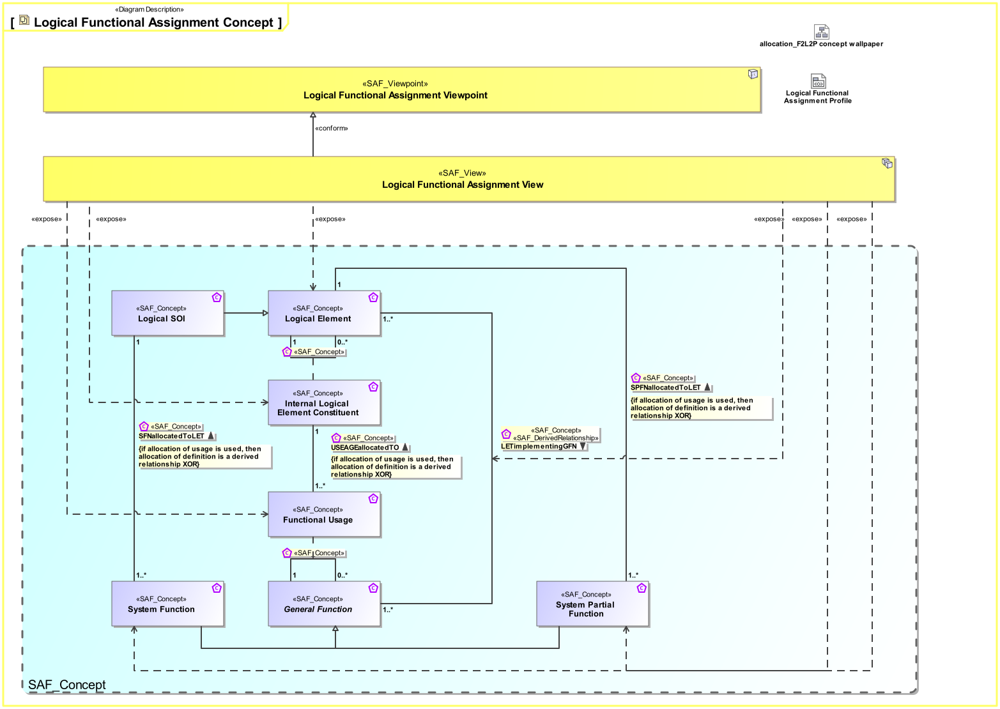
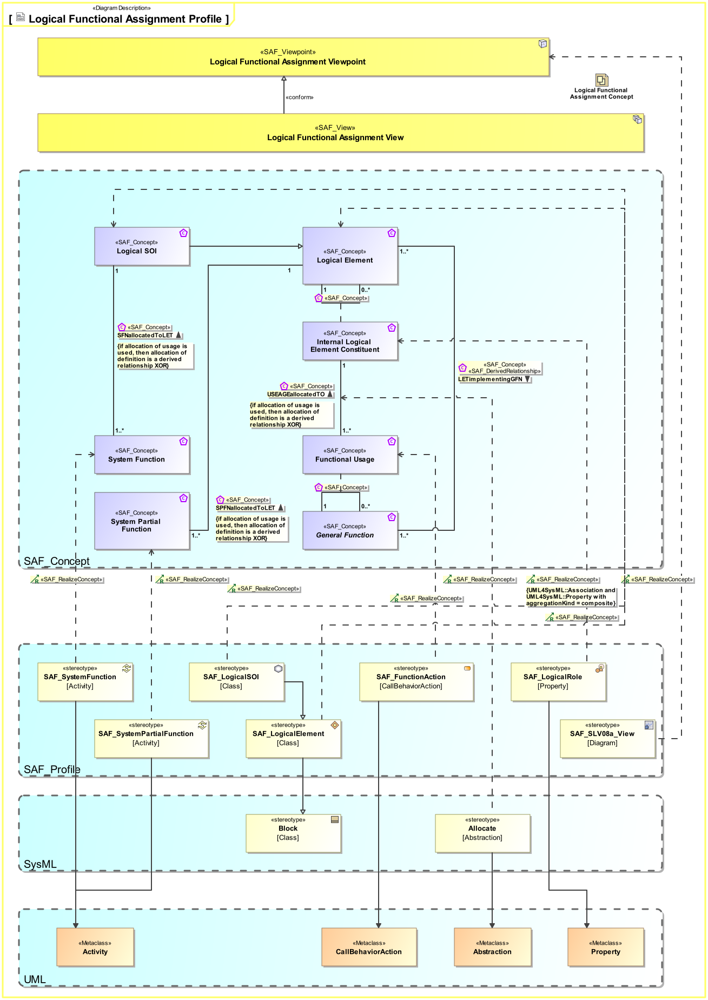

# SAF Development Documentation : Logical Functional Assignment Viewpoint
|**Domain**|**Aspect**|**Maturity**|
| --- | --- | --- |
|[Logical](../../domains.md#Domain-Logical)|[Mapping & Crossreference](../../aspects.md#Aspect-Mapping-&-Crossreference)|[released](../../using-saf/maturity.md#released)|
## Example

## Purpose
The Logical Functional Assignment Viewpoint specifies the assignment of the System Functions and the System Partial Functions to the Logical SOI and the Logical SOI Elements.
## Applicability
The Logical Function Allocation Viewpoint supports the "System Architecture Definition process" activities of the INCOSE SYSTEMS ENGINEERING HANDBOOK 2015  .
## Stakeholder
* [Hardware Developer](../../stakeholders.md#Hardware-Developer)
* [Software Developer](../../stakeholders.md#Software-Developer)
* [System Architect](../../stakeholders.md#System-Architect)
## Concern
* Which (system and system partial) functions are assigned to a logical item and logical item components?
Note: if allocation of usage is used, then allocation of definition is a derived relationship XOR.
## Presentation
A  Logical Functional Assignment Matrix featuring
* the call behavior action representing usage of System Functions and or System Partial Functions
* the part properties representing usage of Logical SOI Elements
* the allocation relationship between abovementioned elements

## Profile Model Reference
|Stereotype | realized Concept|
|---|---|
|Allocate [SysML Profile]|[USEAGEallocatedTO](../concept/concepts.md#USEAGEallocatedTO)|
|[SAF_FunctionAction](../../stereotypes.md#SAF_FunctionAction)|[Functional Usage](../concept/concepts.md#Functional-Usage)|
|[SAF_LogicalElement](../../stereotypes.md#SAF_LogicalElement)|[Logical Element](../concept/concepts.md#Logical-Element)|
|[SAF_LogicalRole](../../stereotypes.md#SAF_LogicalRole)|[Internal Logical Element Constituent](../concept/concepts.md#Internal-Logical-Element-Constituent)|
|[SAF_LogicalSOI](../../stereotypes.md#SAF_LogicalSOI)|[Logical SOI](../concept/concepts.md#Logical-SOI)|
|[SAF_SLV08a_View](../../stereotypes.md#SAF_SLV08a_View)|[Logical Functional Assignment Viewpoint](../concept/concepts.md#Logical-Functional-Assignment-Viewpoint)|
|[SAF_SystemFunction](../../stereotypes.md#SAF_SystemFunction)|[System Function](../concept/concepts.md#System-Function)|
|[SAF_SystemPartialFunction](../../stereotypes.md#SAF_SystemPartialFunction)|[System Partial Function](../concept/concepts.md#System-Partial-Function)|
## Input from other Viewpoints
### Required Viewpoints
* [Logical Structure Viewpoint](Logical-Structure-Viewpoint.md)
* [System Process Viewpoint](System-Process-Viewpoint.md)
* [System Functional Refinement Viewpoint](System-Functional-Refinement-Viewpoint.md)
### Recommended Viewpoints
* [System Domain Item Kind Viewpoint](System-Domain-Item-Kind-Viewpoint.md)
# Viewpoint Concept and Profile Diagrams
## Concept

## Profile

