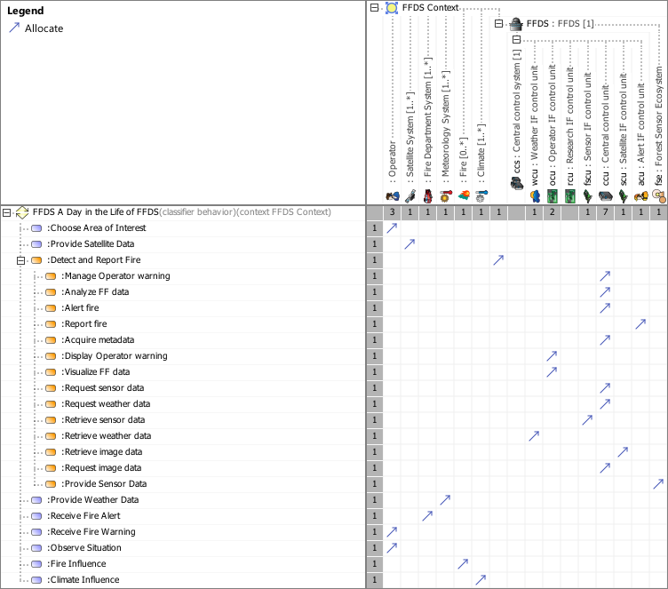

# SAF Development Documentation : Logical Functional Mapping Viewpoint
|**Domain**|**Aspect**|**Maturity**|
| --- | --- | --- |
|[Logical](../../domains.md#Domain-Logical)|[Traceability & Mapping](../../aspects.md#Aspect-Traceability-&-Mapping)|[released](../../using-saf/maturity.md#released)|
## Example

## Purpose
The Logical Functional Mapping Viewpoint captures the assignment of the System Functions and the System Partial Functions to the Logical SOI and the Logical SOI Elements.
## Applicability
The Logical Function Mapping Viewpoint supports the "System Architecture Definition process" activities of the INCOSE SYSTEMS ENGINEERING HANDBOOK 2015 [§ 4.4] and contributes to the System Architecture description.
## Stakeholder
* [Hardware Developer](../../stakeholders.md#Hardware-Developer)
* [Software Developer](../../stakeholders.md#Software-Developer)
* [System Architect](../../stakeholders.md#System-Architect)
## Concern
* Which (system and system partial) functions are assigned to a logical item and logical item components?
Note: if allocation of usage is used, then allocation of definition is a derived relationship XOR.
## Presentation
A dependency matrix featuring
* the call behavior action representing usage of System Functions or System Partial Functions,
* the part properties representing usage of Logical SOI Elements,
* the allocation relationship between above mentioned elements.

## Profile Model Reference
The following Stereotypes / Model Elements are used in the Viewpoint:
|Stereotype | realized Concept|
|---|---|
|Allocate [SysML Profile]|[USEAGEallocatedTO](../concept/concepts.md#USEAGEallocatedTO)|
|[SAF_FunctionAction](../../stereotypes.md#SAF_FunctionAction)|[General Functional Usage](../concept/concepts.md#General-Functional-Usage)|
|[SAF_LogicalElement](../../stereotypes.md#SAF_LogicalElement)|[Logical Element](../concept/concepts.md#Logical-Element)|
|[SAF_LogicalInternalRole](../../stereotypes.md#SAF_LogicalInternalRole)|[Internal Logical Element Constituent](../concept/concepts.md#Internal-Logical-Element-Constituent)|
|[SAF_LogicalSOI](../../stereotypes.md#SAF_LogicalSOI)|[Logical SOI](../concept/concepts.md#Logical-SOI)|
|[SAF_SLV08a_View](../../stereotypes.md#SAF_SLV08a_View)|[Logical Functional Mapping Viewpoint](../concept/concepts.md#Logical-Functional-Mapping-Viewpoint)|
|[SAF_SystemFunction](../../stereotypes.md#SAF_SystemFunction)|[System Function](../concept/concepts.md#System-Function)|
|[SAF_SystemPartialFunction](../../stereotypes.md#SAF_SystemPartialFunction)|[System Partial Function](../concept/concepts.md#System-Partial-Function)|
## Input from other Viewpoints
### Required Viewpoints
* [Logical Structure Viewpoint](Logical-Structure-Viewpoint.md)
* [System Process Viewpoint](System-Process-Viewpoint.md)
* [System Functional Refinement Viewpoint](System-Functional-Refinement-Viewpoint.md)
### Recommended Viewpoints
* [System Domain Item Kind Viewpoint](System-Domain-Item-Kind-Viewpoint.md)
# Viewpoint Concept and Profile Diagrams
## Concept

## Profile

