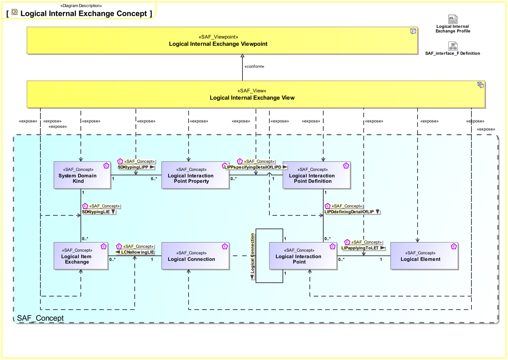
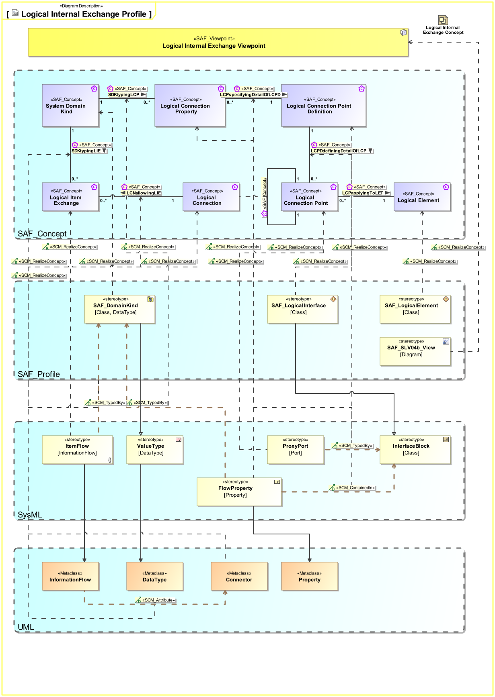

# SAF Development Documentation : Logical Internal Exchange Viewpoint
|**Domain**|**Aspect**|**Maturity**|
| --- | --- | --- |
|[Logical](../../domains.md#Domain-Logical)|[Interaction & Collaboration](../../aspects.md#Aspect-Interaction-&-Collaboration)|[released](../../using-saf/maturity.md#released)|
## Example

## Purpose
The Logical Internal Exchange Viewpoint serves for the identification and definition of interfaces of elements of the Logical System. Also, the delegation of System Element Interfaces to the Logical System Boundary Interfaces is covered.
The Logical Internal Exchange Viewpoint
* identifies System Element Interfaces on a Logical Level
* states to which other system elements the interfaces are connected to
* assigns interface specifications to interfaces
* defines the usage of interfaces, e.g., if only a subset of the interfaces is used 
* defines the delegation of System Element Interfaces to the Logical System Boundary Interfaces
## Applicability
The Logical Internal Exchange Viewpoint supports the "Architecture Definition Process" activities of the INCOSE SYSTEMS ENGINEERING HANDBOOK 2023 [§2.3.5.4] and contributes to the preliminary interface definition and system architecture description.
## Presentation
One or more IBDs featuring the SOI boundary, the logical elements of the SOI, the connectors for each identified SOI interface delegation to Logical SOI Elements, as well as those connectors between related interfaces of Logical SOI Elements. An interface is a connection resource for hooking on the Logical SOI Elements to other Logical SOI Elements. Item flows are defined for each exchange on the identified interface.
Note: Please use more than one IBD focused on different areas of interest to keep the view comprehensive.

## Stakeholder
* [Hardware Developer](../../stakeholders.md#Hardware-Developer)
* [IV&V Engineer](../../stakeholders.md#IV&V-Engineer)
* [Safety Expert](../../stakeholders.md#Safety-Expert)
* [Security Expert](../../stakeholders.md#Security-Expert)
* [Software Developer](../../stakeholders.md#Software-Developer)
* [System Architect](../../stakeholders.md#System-Architect)
## Concern
* [How do the logical system elements interact to provide the system functions?](../../concerns.md#_2021x_2_8710274_1674576758760_611640_23247)
* [What are the items exchanged between logical system elements during an interaction?](../../concerns.md#_2021x_2_8710274_1674576758991_165534_23433)
* [What items (energy, material, information, etc.) are exchanged within the system?](../../concerns.md#_2021x_2_8710274_1674576758825_79081_23317)
* [Which requirements apply to a logical interface?](../../concerns.md#_2021x_2_8710274_1674576758878_612030_23357)
## Profile Model Reference
The following Stereotypes / Model Elements are used in the Viewpoint:
|Stereotype | realized Concept|
|---|---|
|Attribute "realizingConnector" of InformationFlow referencing Connector|[LCNallowingLIE](../concept/concepts.md#LCNallowingLIE)|
|Connector [UML_Standard_Profile]|[Logical Connection](../concept/concepts.md#Logical-Connection)|
|FlowProperty contained in SAF_ConceptualInterfaceDefinition|[LCPPspecifyingDetailOfLCPD](../concept/concepts.md#LCPPspecifyingDetailOfLCPD)|
|FlowProperty typed by SAF_DomainKind|[SDKtypingLCPP](../concept/concepts.md#SDKtypingLCPP)|
|FlowProperty [SysML Profile]|[Logical Connection Point Property](../concept/concepts.md#Logical-Connection-Point-Property)|
|ItemFlow typed by SAF_DomainKind|[SDKtypingLIE](../concept/concepts.md#SDKtypingLIE)|
|ItemFlow [SysML Profile]|[Logical Item Exchange](../concept/concepts.md#Logical-Item-Exchange)|
|ProxyPort typed by SAF_ConceptualInterfaceDefinition|[LCPDdefiningDetailOfLCP](../concept/concepts.md#LCPDdefiningDetailOfLCP)|
|ProxyPort [SysML Profile]|[Logical Connection Point](../concept/concepts.md#Logical-Connection-Point)|
|[SAF_ConceptualInterfaceDefinition](../../stereotypes.md#SAF_ConceptualInterfaceDefinition)|[Logical Connection Point Definition](../concept/concepts.md#Logical-Connection-Point-Definition)|
|[SAF_DomainKind](../../stereotypes.md#SAF_DomainKind)|[System Domain Kind](../concept/concepts.md#System-Domain-Kind)|
|[SAF_LogicalElement](../../stereotypes.md#SAF_LogicalElement)|[Logical Element](../concept/concepts.md#Logical-Element)|
|[SAF_SLV04b_View](../../stereotypes.md#SAF_SLV04b_View)|[Logical Internal Exchange Viewpoint](../concept/concepts.md#Logical-Internal-Exchange-Viewpoint)|
## Input from other Viewpoints
### Required Viewpoints
* [System Domain Item Kind Viewpoint](System-Domain-Item-Kind-Viewpoint.md)
* [Logical Structure Viewpoint](Logical-Structure-Viewpoint.md)
### Recommended Viewpoints
* [System Process Viewpoint](System-Process-Viewpoint.md)
* [System Functional Refinement Viewpoint](System-Functional-Refinement-Viewpoint.md)
# Viewpoint Concept and Profile Diagrams
## Concept

## Profile

