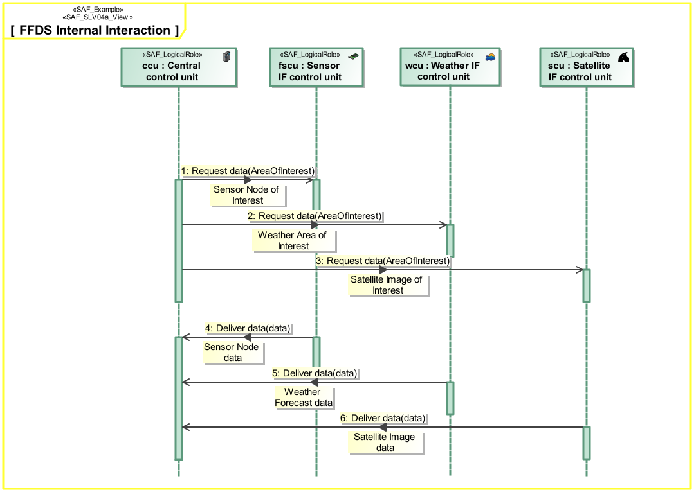

# SAF Development Documentation : Logical Internal Interaction Viewpoint
|**Domain**|**Aspect**|**Maturity**|
| --- | --- | --- |
|[Logical](../../domains.md#Domain-Logical)|[Interaction & Collaboration](../../aspects.md#Aspect-Interaction-&-Collaboration)|[released](../../using-saf/maturity.md#released)|
## Example

## Purpose
The Logical Internal Interaction Viewpoint describes System internal behavior based on the exchange between the Logical SOI Elements Usage. It depicts the sequence of interactions between the Logical SOI Elements and the Exchanged Domain Item Kinds needed to accomplish a System Partial Function.
## Applicability
The Logical Internal Interaction Viewpoint supports the "Develop Architecture Viewpoints", and the "Develop Models and Views of Candidate Architectures" activity included in the "Architecture Definition process" activities of the INCOSE SYSTEMS ENGINEERING HANDBOOK 2015 [§ 4.4] and contributes to the artifact "System Architecture Description".
## Stakeholder
* [Acquirer](../../stakeholders.md#Acquirer)
* [Customer](../../stakeholders.md#Customer)
* [Hardware Developer](../../stakeholders.md#Hardware-Developer)
* [IV&V Engineer](../../stakeholders.md#IV&V-Engineer)
* [Operator](../../stakeholders.md#Operator)
* [Regulation Authority](../../stakeholders.md#Regulation-Authority)
* [Safety Expert](../../stakeholders.md#Safety-Expert)
* [Security Expert](../../stakeholders.md#Security-Expert)
* [Software Developer](../../stakeholders.md#Software-Developer)
* [System Architect](../../stakeholders.md#System-Architect)
* [User](../../stakeholders.md#User)
## Concern
* How do internal system elements interact with each other to provide the system function or service?
* How does the system or a system element interact with the test environment?
* What additional information the system or a system element needs to generate to enable testing?
* What are the connections between the major system elements?
* What are the items exchanged between the logical system elements during the interaction?
* What is the necessary response time for an interface or a service?
* What kind of information is exchanged and processed within the system?
## Presentation
A sequence diagram featuring the flow of control between Internal Logical Elements of the SOI.
Note: This diagram depicts the sending and receiving of messages between the interacting entities called lifelines where time is represented along the vertical axis. The lifeline representatives are part properties typed by Logical System Elements.

## Profile Model Reference
|Stereotype | realized Concept|
|---|---|
|Interaction [UML_Standard_Profile]|[Internal Logical Interaction Scenario](../concept/concepts.md#Internal-Logical-Interaction-Scenario)|
|Lifeline [UML_Standard_Profile]|[Internal Logical Scenario Participation](../concept/concepts.md#Internal-Logical-Scenario-Participation)|
|Message [UML_Standard_Profile]|[Internal Logical Chronological Message](../concept/concepts.md#Internal-Logical-Chronological-Message)|
|[SAF_LogicalInternalRole](../../stereotypes.md#SAF_LogicalInternalRole)|[Internal Logical Element Constituent](../concept/concepts.md#Internal-Logical-Element-Constituent)|
|[SAF_SLV04a_View](../../stereotypes.md#SAF_SLV04a_View)|[Logical Internal Interaction Viewpoint](../concept/concepts.md#Logical-Internal-Interaction-Viewpoint)|
## Input from other Viewpoints
### Required Viewpoints
* [Logical Structure Viewpoint](Logical-Structure-Viewpoint.md)
### Recommended Viewpoints
* [System Process Viewpoint](System-Process-Viewpoint.md)
* [System Functional Refinement Viewpoint](System-Functional-Refinement-Viewpoint.md)
# Viewpoint Concept and Profile Diagrams
## Concept

## Profile

