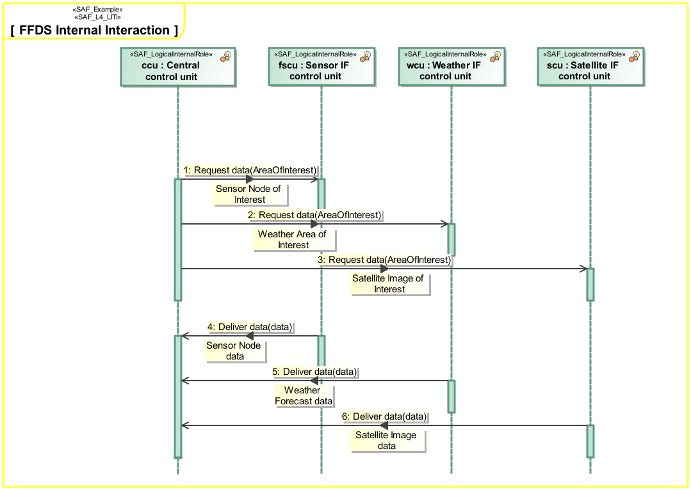
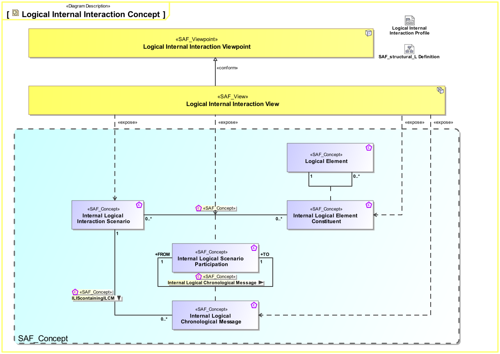
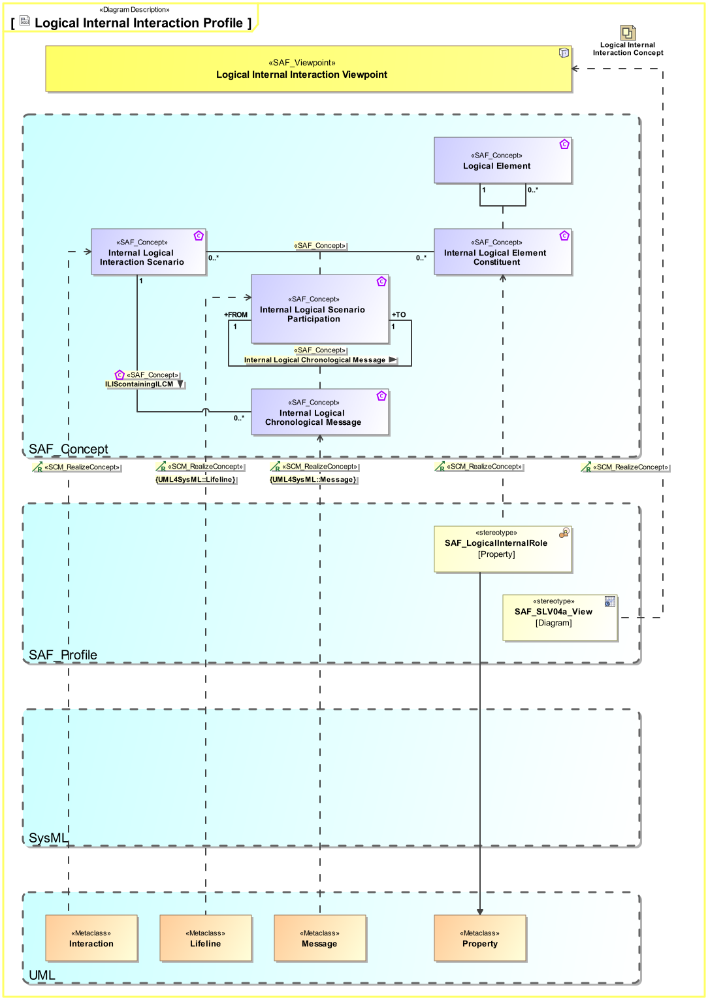

# SAF Development Documentation : **L4_LITI** Logical Internal Interaction Viewpoint
|**Domain**|**Aspect**|**Maturity**|
| --- | --- | --- |
|[Logical](../../domains.md#Domain-Logical)|[Interaction & Collaboration](../../aspects.md#Aspect-Interaction-&-Collaboration)|[released](../../using-saf/maturity.md#released)|
## Example

## Purpose
The Logical Internal Interaction Viewpoint describes System internal behavior based on the exchange between the Logical SOI Elements Usage. It depicts the sequence of interactions between the Logical SOI Elements and the exchanged Domain Item Kinds needed to accomplish a System Partial Function.
## Applicability
The Logical Internal Interaction Viewpoint supports the "Develop Architecture Viewpoints" and the "Develop Models and Views of Candidate Architectures" activity included in the "Architecture Definition process" activities of the INCOSE SYSTEMS ENGINEERING HANDBOOK 2015 [§ 4.4] and contributes to the System Architecture description.
## Presentation
A sequence diagram featuring the flow of control between Internal Logical Elements of the SOI.
Note: This diagram depicts the sending and receiving of messages between the interacting entities called lifelines where time is represented along the vertical axis. The lifeline representatives are part properties typed by Logical System Elements.

## Stakeholder
* [Acquirer](../../stakeholders.md#Acquirer)
* [Customer](../../stakeholders.md#Customer)
* [Hardware Developer](../../stakeholders.md#Hardware-Developer)
* [IV&V Engineer](../../stakeholders.md#IV&V-Engineer)
* [Operator](../../stakeholders.md#Operator)
* [Safety Expert](../../stakeholders.md#Safety-Expert)
* [Security Expert](../../stakeholders.md#Security-Expert)
* [Software Developer](../../stakeholders.md#Software-Developer)
* [System Architect](../../stakeholders.md#System-Architect)
* [User](../../stakeholders.md#User)
## Concern
* [How do the logical system elements interact to provide the system functions?](../../concerns.md#_2021x_2_8710274_1674576758760_611640_23247)
* [What are the items exchanged between logical system elements during an interaction?](../../concerns.md#_2021x_2_8710274_1674576758991_165534_23433)
* [What is the necessary response time for an interface or a service?](../../concerns.md#_2021x_2_8710274_1674576759095_626726_23511)
## Profile Model Reference
The following Stereotypes / Model Elements are used in the Viewpoint:
|Stereotype | realized Concept|
|---|---|
|Interaction [UML_Standard_Profile]|[Logical Interaction Scenario](../concept/concepts.md#Logical-Interaction-Scenario)|
|Lifeline [UML_Standard_Profile]|[Logical Scenario Participation](../concept/concepts.md#Logical-Scenario-Participation)|
|Message [UML_Standard_Profile]|[Logical Chronological Message](../concept/concepts.md#Logical-Chronological-Message)|
|[SAF_L4_LITI](../../stereotypes.md#SAF_L4_LITI)|[Logical Internal Interaction Viewpoint](../concept/concepts.md#Logical-Internal-Interaction-Viewpoint)|
|[SAF_LogicalElement](../../stereotypes.md#SAF_LogicalElement)|[Logical Element](../concept/concepts.md#Logical-Element)|
|SAF_LogicalInternalRole contained in SAF_LogicalElement|[Logical Element Role](../concept/concepts.md#Logical-Element-Role)|
## Input from other Viewpoints
### Required Viewpoints
* [Logical Structure Definition Viewpoint](Logical-Structure-Definition-Viewpoint.md)
### Recommended Viewpoints
* [System Process Viewpoint](System-Process-Viewpoint.md)
* [System Functional Refinement Viewpoint](System-Functional-Refinement-Viewpoint.md)
# Viewpoint Concept and Profile Diagrams
## Concept

## Profile

