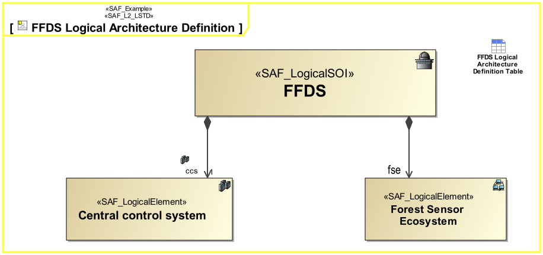
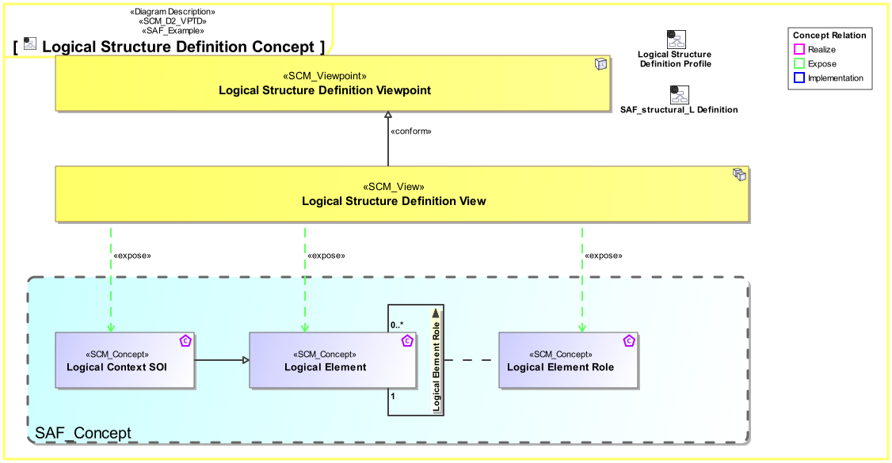
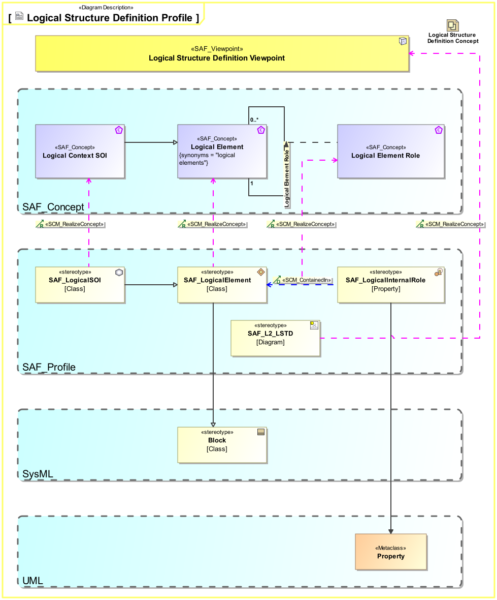

# SAF Development Documentation : **L2_LSTD** Logical Structure Definition Viewpoint
|**Domain**|**Aspect**|**Maturity**|
| --- | --- | --- |
|[Logical](../../domains.md#Domain-Logical)|[Taxonomy & Structure](../../aspects.md#Aspect-Taxonomy-&-Structure)|[released](../../using-saf/maturity.md#released)|
## Example

## Purpose
The Logical Structure Definition Viewpoint describes how the system is decomposed into a hierarchical structure of logical elements responsible for different system functions (divide & conquer principle). It covers related logical concepts and principles that support the logical operation of the system and is widely reusable among similar systems like product families, or product generations.
## Applicability
The Logical Structure Viewpoint supports the "System Architecture Definition Process" activities of the INCOSE SYSTEMS ENGINEERING HANDBOOK 2023 [§2.3.5.4] and contributes to the artifact "System Architecture Description".

Furthermore, the Logical Structure Viewpoint supports the "Allocation and Partitioning of System Functions to Logical Entities" activities.
## Presentation
A block definition diagram (BDD) featuring the logical system block and logical blocks for any kind of logical element the system is composed of. These elements are connected to the system block by means of aggregation relationships. 
Note: Multiple relationships to a kind of element are allowed meaning, that this kind of element is used in several roles.

## Stakeholder
* [System Architect](../../stakeholders.md#System-Architect)
## Concern
* [What is the logical breakdown of the system?](../../concerns.md#_2021x_2_8710274_1674576758828_494985_23322)
## Profile Model Reference
The following Stereotypes / Model Elements are used in the Viewpoint:
|Stereotype | realized Concept|
|---|---|
|[SAF_L2_LSTD](../../stereotypes.md#saf_l2_lstd)|[Logical Structure Definition Viewpoint](../concept/concepts.md#Logical-Structure-Definition-Viewpoint)|
|[SAF_LogicalElement](../../stereotypes.md#saf_logicalelement)|[Logical Element](../concept/concepts.md#Logical-Element)|
|SAF_LogicalInternalRole contained in SAF_LogicalElement|[Logical Element Role](../concept/concepts.md#Logical-Element-Role)|
|[SAF_LogicalSOI](../../stereotypes.md#saf_logicalsoi)|[Logical Context SOI](../concept/concepts.md#Logical-Context-SOI)|
## Input from other Viewpoints
### Required Viewpoints
* [System Functional Breakdown Structure Viewpoint](System-Functional-Breakdown-Structure-Viewpoint.md)
### Recommended Viewpoints
* [System Process Viewpoint](System-Process-Viewpoint.md)
# Viewpoint Concept and Profile Diagrams
## Concept

## Profile

