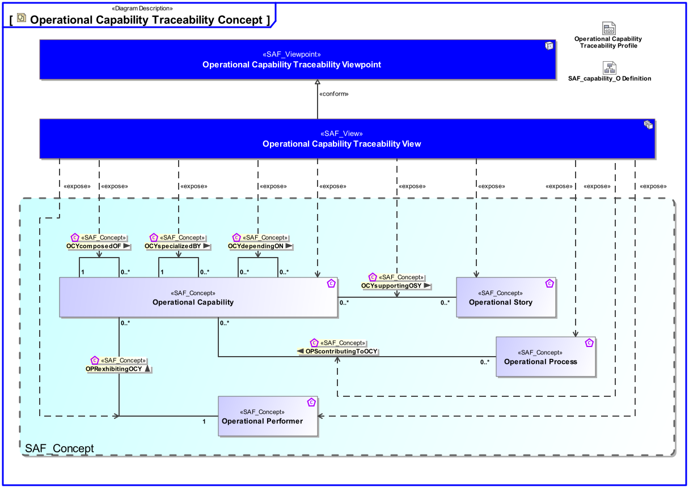
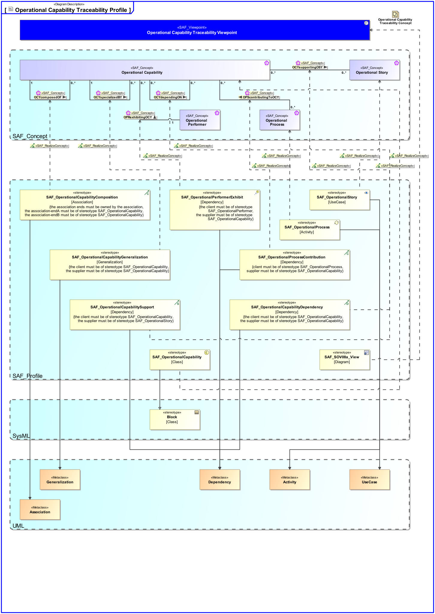

# SAF Development Documentation : Operational Capability Traceability Viewpoint
|**Domain**|**Aspect**|**Maturity**|
| --- | --- | --- |
|[Operational](../../domains.md#Domain-Operational)|[Mapping & Crossreference](../../aspects.md#Aspect-Mapping-&-Crossreference)|[released](../../using-saf/maturity.md#released)|
## Example
*none*
## Purpose
The Operational Capability Traceability Viewpoint describes the relationships of Operational Capabilities. The reasoning for Operational Capabilities as support for Operational Stories and contribution of Operational Processes to Capabilities is described.
## Applicability
The Operational Capability Traceability Viewpoint supports the "Business or Mission Analysis Process" activities of the INCOSE SYSTEMS ENGINEERING HANDBOOK 2015 [§ 4.1] and contributes to the definition of Operational Capabilities.
## Stakeholder
## Concern
* Show in a concise manner the relationships from operational capability to operational story, to operational activity, and to operational performer.
## Presentation
The relationships of Operational Capabilities to Operational Stories, and to Operational Process Activities are represented in a table.

## Profile Model Reference
|Stereotype | realized Concept|
|---|---|
|[SAF_OperationalCapability](../../stereotypes.md#SAF_OperationalCapability)|[Operational Capability](../concept/concepts.md#Operational-Capability)|
|[SAF_OperationalCapabilityComposition](../../stereotypes.md#SAF_OperationalCapabilityComposition)|[OCYcomposedOF](../concept/concepts.md#OCYcomposedOF)|
|[SAF_OperationalCapabilityDependency](../../stereotypes.md#SAF_OperationalCapabilityDependency)|[OCYdependingON](../concept/concepts.md#OCYdependingON)|
|[SAF_OperationalCapabilityGeneralization](../../stereotypes.md#SAF_OperationalCapabilityGeneralization)|[OCYspecializedBY](../concept/concepts.md#OCYspecializedBY)|
|[SAF_OperationalCapabilitySupport](../../stereotypes.md#SAF_OperationalCapabilitySupport)|[OCYsupportingOSY](../concept/concepts.md#OCYsupportingOSY)|
|[SAF_OperationalPerformerExhibit](../../stereotypes.md#SAF_OperationalPerformerExhibit)|[OPRexhibitingOCY](../concept/concepts.md#OPRexhibitingOCY)|
|[SAF_OperationalProcess](../../stereotypes.md#SAF_OperationalProcess)|[Operational Process](../concept/concepts.md#Operational-Process)|
|[SAF_OperationalProcessContribution](../../stereotypes.md#SAF_OperationalProcessContribution)|[OPScontributingToOCY](../concept/concepts.md#OPScontributingToOCY)|
|[SAF_OperationalStory](../../stereotypes.md#SAF_OperationalStory)|[Operational Story](../concept/concepts.md#Operational-Story)|
|[SAF_SOV08a_View](../../stereotypes.md#SAF_SOV08a_View)|[Operational Capability Traceability Viewpoint](../concept/concepts.md#Operational-Capability-Traceability-Viewpoint)|
## Input from other Viewpoints
### Required Viewpoints
* [Operational Capability Viewpoint](Operational-Capability-Viewpoint.md)
### Recommended Viewpoints
* [Operational Story Viewpoint](Operational-Story-Viewpoint.md)
* [Operational Process Viewpoint](Operational-Process-Viewpoint.md)
# Viewpoint Concept and Profile Diagrams
## Concept

## Profile

