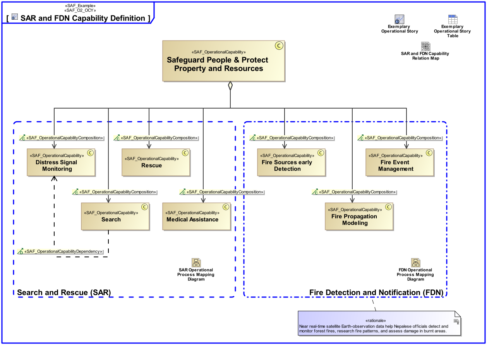

# SAF Development Documentation : Operational Capability Viewpoint
|**Domain**|**Aspect**|**Maturity**|
| --- | --- | --- |
|[Operational](../../domains.md#Domain-Operational)|[Taxonomy & Structure](../../aspects.md#Aspect-Taxonomy-&-Structure)|[released](../../using-saf/maturity.md#released)|
## Example

## Purpose
The Operational Capability Viewpoint defines a taxonomy of Capabilities from a Stakeholder’s perspective including composition, specialization, and dependency relationships between Operational Capabilities.
## Applicability
The Operational Capability Viewpoint supports the "Business or Mission Analysis Process" activities of the INCOSE SYSTEMS ENGINEERING HANDBOOK 2015 [§ 4.1] defining Capabilities at an operational level (e.g., business or mission profile, and operational scenarios). The Operational Capability Viewpoint contributes to the problem or opportunity statement.
## Presentation
A block definition diagram (BDD) featuring Operational Capabilities, their composition, specialization, and dependency relationships.

## Stakeholder
* [Acquirer](../../stakeholders.md#Acquirer)
* [Customer](../../stakeholders.md#Customer)
* [Portfolio Manager](../../stakeholders.md#Portfolio-Manager)
* [System Architect](../../stakeholders.md#System-Architect)
## Concern
* [What operational capabilities are defined?](../../concerns.md#_2021x_2_8710274_1674479775616_727128_23367)
* [What operational capabilities are required for each phase and mode of operation?](../../concerns.md#_2021x_2_8710274_1674576759229_963784_23628)
## Profile Model Reference
The following Stereotypes / Model Elements are used in the Viewpoint:
|Stereotype | realized Concept|
|---|---|
|[SAF_OperationalCapabilityComposition](../../stereotypes.md#SAF_OperationalCapabilityComposition)|[OCYcomposedOF](../concept/concepts.md#OCYcomposedOF)|
|[SAF_OperationalCapabilityDependency](../../stereotypes.md#SAF_OperationalCapabilityDependency)|[OCYdependingON](../concept/concepts.md#OCYdependingON)|
|[SAF_OperationalCapabilityGeneralization](../../stereotypes.md#SAF_OperationalCapabilityGeneralization)|[OCYspecializedBY](../concept/concepts.md#OCYspecializedBY)|
|[SAF_OperationalCapability](../../stereotypes.md#SAF_OperationalCapability)|[Operational Capability](../concept/concepts.md#Operational-Capability)|
|[SAF_SOV02c_View](../../stereotypes.md#SAF_SOV02c_View)|[Operational Capability Viewpoint](../concept/concepts.md#Operational-Capability-Viewpoint)|
## Input from other Viewpoints
### Required Viewpoints
*none*
### Recommended Viewpoints
* [Operational Story Viewpoint](Operational-Story-Viewpoint.md)
* [Operational Process Viewpoint](Operational-Process-Viewpoint.md)
# Viewpoint Concept and Profile Diagrams
## Concept

## Profile

