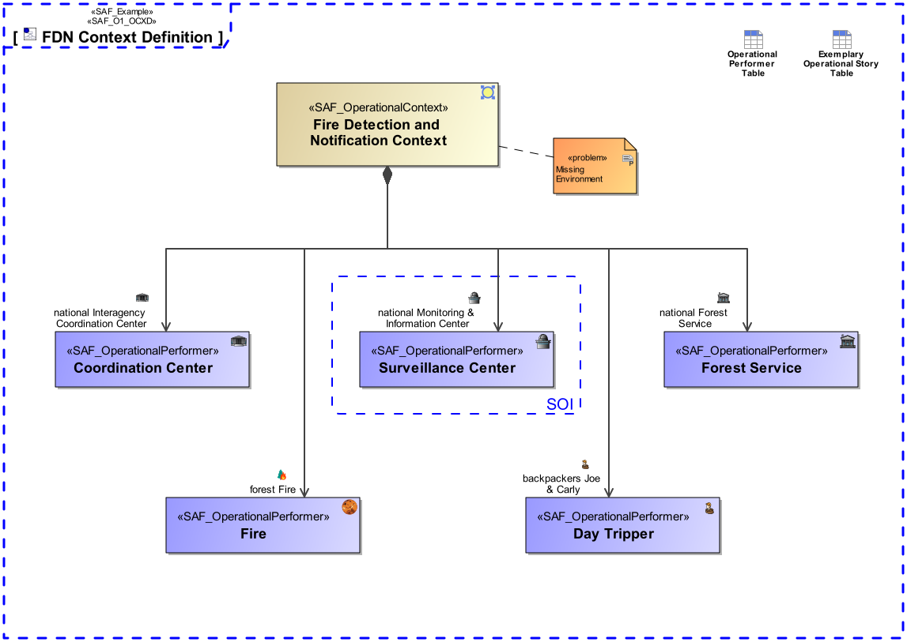
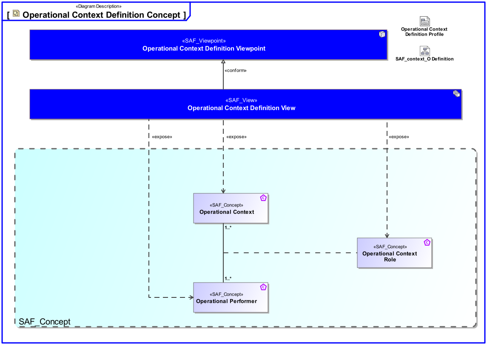
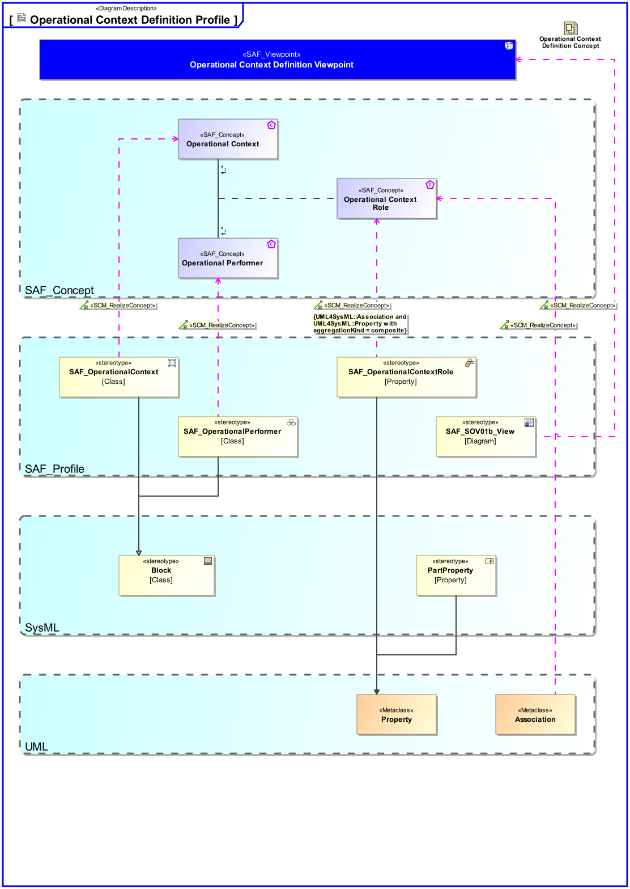

# SAF Development Documentation : Operational Context Definition Viewpoint
|**Domain**|**Aspect**|**Maturity**|
| --- | --- | --- |
|[Operational](../../domains.md#Domain-Operational)|[Context & Exchange](../../aspects.md#Aspect-Context-&-Exchange)|[released](../../using-saf/maturity.md#released)|
## Example

## Purpose
The Operational Context Definition Viewpoint provides the Operational Contexts, and the involved Operational Performers necessary to support a specific set of Operational Capabilities.
## Applicability
The Operational Context Definition Viewpoint supports the "Business or Mission Analysis Process" activities of the INCOSE SYSTEMS ENGINEERING HANDBOOK 2015 [§ 4.1] and contributes to both the problem or opportunity statement, and the Major Stakeholder Identification.
## Presentation
A block definition diagram (BDD) featuring the identified Operational Performers playing a role in the Operational Context being addressed.

## Stakeholder
* [Acquirer](../../stakeholders.md#Acquirer)
* [Customer](../../stakeholders.md#Customer)
* [Supplier](../../stakeholders.md#Supplier)
* [System Architect](../../stakeholders.md#System-Architect)
## Concern
* What is the operational context to achieve an operational story?
* What performers or resources are necessary to operate the intended solution?
* Who are the (Major) Stakeholders involved in the intended solution?
## Profile Model Reference
The following Stereotypes / Model Elements are used in the Viewpoint:
|Stereotype | realized Concept|
|---|---|
|Association [UML_Standard_Profile]|[Operational Context Performer Constituent](../concept/concepts.md#Operational-Context-Performer-Constituent)|
|[SAF_OperationalContext](../../stereotypes.md#SAF_OperationalContext)|[Operational Context](../concept/concepts.md#Operational-Context)|
|[SAF_OperationalPerformer](../../stereotypes.md#SAF_OperationalPerformer)|[Operational Performer](../concept/concepts.md#Operational-Performer)|
|[SAF_OperationalPerformerRole](../../stereotypes.md#SAF_OperationalPerformerRole)|[Operational Context Performer Constituent](../concept/concepts.md#Operational-Context-Performer-Constituent)|
|[SAF_SOV01b_View](../../stereotypes.md#SAF_SOV01b_View)|[Operational Context Definition Viewpoint](../concept/concepts.md#Operational-Context-Definition-Viewpoint)|
## Input from other Viewpoints
### Required Viewpoints
* [Operational Performer Viewpoint](Operational-Performer-Viewpoint.md)
### Recommended Viewpoints
*none*
# Viewpoint Concept and Profile Diagrams
## Concept

## Profile

