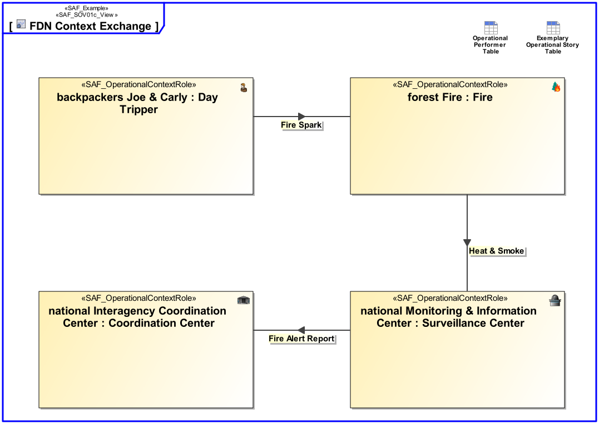
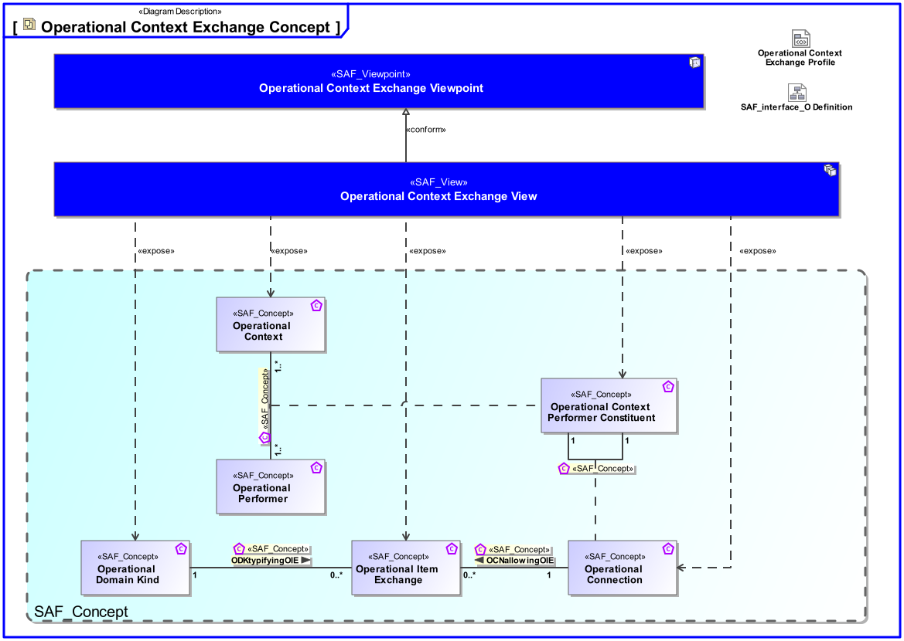
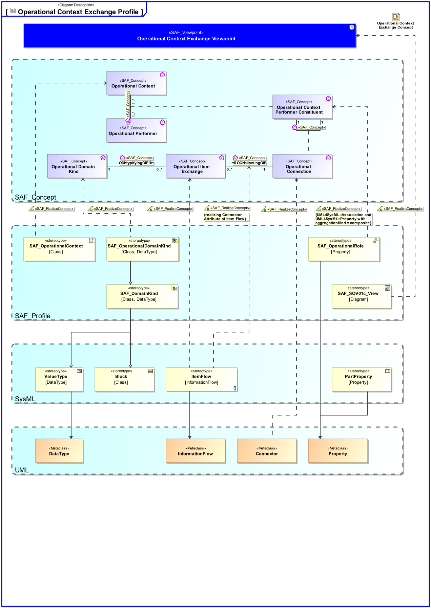

# SAF Development Documentation : Operational Context Exchange Viewpoint
|**Domain**|**Aspect**|**Maturity**|
| --- | --- | --- |
|[Operational](../../domains.md#Domain-Operational)|[Context & Exchange](../../aspects.md#Aspect-Context-&-Exchange)|[released](../../using-saf/maturity.md#released)|
## Example

## Purpose
The Operational Context Exchange Viewpoint provides the Operational Exchange between Operational Performers of information, systems, personnel, energy, etc.
## Applicability
The Operational Context Exchange Viewpoint supports the "Business or Mission Analysis Process" activities of the INCOSE SYSTEMS ENGINEERING HANDBOOK 2015 [§ 4.1] and contributes to the problem or opportunity statement.
## Presentation
An internal block diagram (IBD) - associated to the Operational Context - featuring the interconnected Operational Performers in their respective Operational Role, and the Operational Item Exchange per Operational Connection.

A tabular format listing [tbd].

## Stakeholder
* [Acquirer](../../stakeholders.md#Acquirer)
* [Customer](../../stakeholders.md#Customer)
* [Safety Expert](../../stakeholders.md#Safety-Expert)
* [Security Expert](../../stakeholders.md#Security-Expert)
* [System Architect](../../stakeholders.md#System-Architect)
## Concern
* [What operational exchanges do operational performers need to consume or provide?](../../concerns.md#_2021x_2_8710274_1674576758910_672482_23380)
## Profile Model Reference
The following Stereotypes / Model Elements are used in the Viewpoint:
|Stereotype | realized Concept|
|---|---|
|Connector [UML_Standard_Profile]|[Operational Connection](../concept/concepts.md#Operational-Connection)|
|ItemFlow [SysML Profile]|[OCNallowingOIE](../concept/concepts.md#OCNallowingOIE)|
|ItemFlow [SysML Profile]|[Operational Item Exchange](../concept/concepts.md#Operational-Item-Exchange)|
|[SAF_OperationalContext](../../stereotypes.md#SAF_OperationalContext)|[Operational Context](../concept/concepts.md#Operational-Context)|
|[SAF_OperationalContextRole](../../stereotypes.md#SAF_OperationalContextRole)|[Operational Context Performer Constituent](../concept/concepts.md#Operational-Context-Performer-Constituent)|
|[SAF_OperationalDomainKind](../../stereotypes.md#SAF_OperationalDomainKind)|[Operational Domain Kind](../concept/concepts.md#Operational-Domain-Kind)|
|[SAF_SOV01c_View](../../stereotypes.md#SAF_SOV01c_View)|[Operational Context Exchange Viewpoint](../concept/concepts.md#Operational-Context-Exchange-Viewpoint)|
## Input from other Viewpoints
### Required Viewpoints
* [Operational Context Definition Viewpoint](Operational-Context-Definition-Viewpoint.md)
* [Operational Domain Item Kind Viewpoint](Operational-Domain-Item-Kind-Viewpoint.md)
### Recommended Viewpoints
* [Operational Story Viewpoint](Operational-Story-Viewpoint.md)
# Viewpoint Concept and Profile Diagrams
## Concept

## Profile

