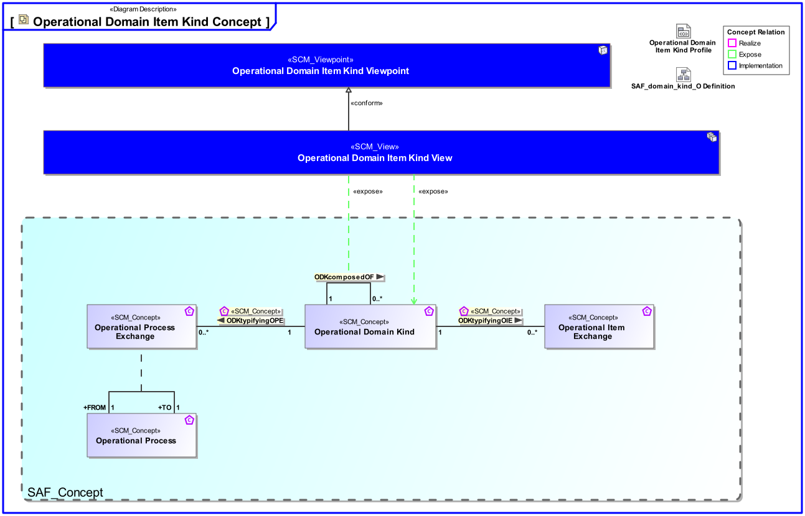
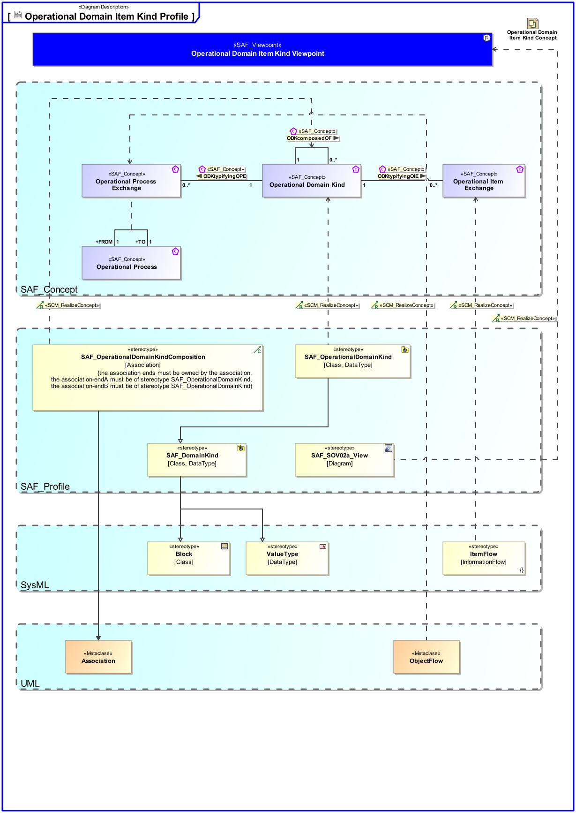

# SAF Development Documentation : Operational Domain Item Kind Viewpoint
|**Domain**|**Aspect**|**Maturity**|
| --- | --- | --- |
|[Operational](../../domains.md#Domain-Operational)|[Taxonomy & Structure](../../aspects.md#Aspect-Taxonomy-&-Structure)|[released](../../using-saf/maturity.md#released)|
## Example

## Purpose
The Operational Domain Item Kind Viewpoint captures enterprise wide concepts and collects type definitions for any exchanged item of the Operational Domain. Its purpose is to define these item types and their relationships.
## Applicability
The Operational Domain Item Kind Viewpoint supports the "Business or Mission Analysis Process" activities of the INCOSE SYSTEMS ENGINEERING HANDBOOK 2015 [§ 4.1] and contributes to the problem or opportunity statement.
## Stakeholder
* [Acquirer](../../stakeholders.md#Acquirer)
* [Customer](../../stakeholders.md#Customer)
* [Regulation Authority](../../stakeholders.md#Regulation-Authority)
* [Security Expert](../../stakeholders.md#Security-Expert)
* [Software Developer](../../stakeholders.md#Software-Developer)
* [System Architect](../../stakeholders.md#System-Architect)
## Concern
* Why types of exchange can exist between Operational Performers (i.e., flows of information, people, material, or energy)?
## Presentation
A block definition diagram (BDD) featuring Operational Domain Item Kinds and their relationships in terms of generalization, composition, or general association.
Note: Operational Domain Item Kinds are managed in the domain knowledge package of the Enterprise. Operational Domain Item Kinds shall be value types or blocks. 

## Profile Model Reference
The following Stereotypes / Model Elements are used in the Viewpoint:
|Stereotype | realized Concept|
|---|---|
|ItemFlow [SysML Profile]|[Operational Item Exchange](../concept/concepts.md#Operational-Item-Exchange)|
|ObjectFlow [UML_Standard_Profile]|[Operational Process Exchange](../concept/concepts.md#Operational-Process-Exchange)|
|[SAF_OperationalDomainKind](../../stereotypes.md#SAF_OperationalDomainKind)|[Operational Domain Kind](../concept/concepts.md#Operational-Domain-Kind)|
|[SAF_OperationalDomainKindComposition](../../stereotypes.md#SAF_OperationalDomainKindComposition)|[ODKcomposedOF](../concept/concepts.md#ODKcomposedOF)|
|[SAF_SOV02a_View](../../stereotypes.md#SAF_SOV02a_View)|[Operational Domain Item Kind Viewpoint](../concept/concepts.md#Operational-Domain-Item-Kind-Viewpoint)|
## Input from other Viewpoints
### Required Viewpoints
*none*
### Recommended Viewpoints
* [Operational Story Viewpoint](Operational-Story-Viewpoint.md)
# Viewpoint Concept and Profile Diagrams
## Concept

## Profile

