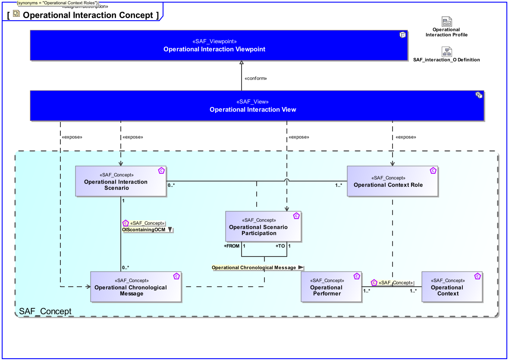

# SAF Development Documentation : Operational Interaction Viewpoint
|**Domain**|**Aspect**|**Maturity**|
| --- | --- | --- |
|[Operational](../../domains.md#Domain-Operational)|[Interaction & Collaboration](../../aspects.md#Aspect-Interaction-&-Collaboration)|[under construction](../../using-saf/maturity.md#under-construction)|
## Example
*none*
## Purpose
The Operational Interaction Viewpoint describes single threads of interaction between Operational Performers in an Operational Context on an operational domain level. 
Note: The Operational Interaction Viewpoint may refine an Operational Story.
## Applicability
The Operational Interaction Viewpoint supports the "Business or Mission Analysis Process" and the "Stakeholder Needs and Requirements Definition Process" activities of the INCOSE SYSTEMS ENGINEERING HANDBOOK 2015 [§ 4.1, § 4.2] and contributes to the definition of operational scenarios.
## Presentation
A sequence diagram featuring the flow of control between Operational Performers of an Operational Context to achieve one outcome of an Operational Story. 
Note: This diagram depicts the sending and receiving of messages between the interacting entities called lifelines where time is represented along the vertical axis. The lifelines representatives are part properties typed by Operational Performers.

## Stakeholder
* [Acquirer](../../stakeholders.md#Acquirer)
* [Customer](../../stakeholders.md#Customer)
* [System Architect](../../stakeholders.md#System-Architect)
## Concern
* What possible threads of operational process activities have to be carried out to achieve the operational story main and alternative goals?
## Profile Model Reference
The following Stereotypes / Model Elements are used in the Viewpoint:
|Stereotype | realized Concept|
|---|---|
|Interaction [UML_Standard_Profile]|[Operational Interaction Scenario](../concept/concepts.md#Operational-Interaction-Scenario)|
|Lifeline [UML_Standard_Profile]|[Operational Scenario Participant](../concept/concepts.md#Operational-Scenario-Participant)|
|Message [UML_Standard_Profile]|[Operational Chronological Message](../concept/concepts.md#Operational-Chronological-Message)|
|[SAF_OperationalContextRole](../../stereotypes.md#SAF_OperationalContextRole)|[Operational Context Performer Constituent](../concept/concepts.md#Operational-Context-Performer-Constituent)|
|[SAF_SOV04a_View](../../stereotypes.md#SAF_SOV04a_View)|[Operational Interaction Viewpoint](../concept/concepts.md#Operational-Interaction-Viewpoint)|
## Input from other Viewpoints
### Required Viewpoints
* [Operational Context Definition Viewpoint](Operational-Context-Definition-Viewpoint.md)
### Recommended Viewpoints
*none*
# Viewpoint Concept and Profile Diagrams
## Concept

## Profile

