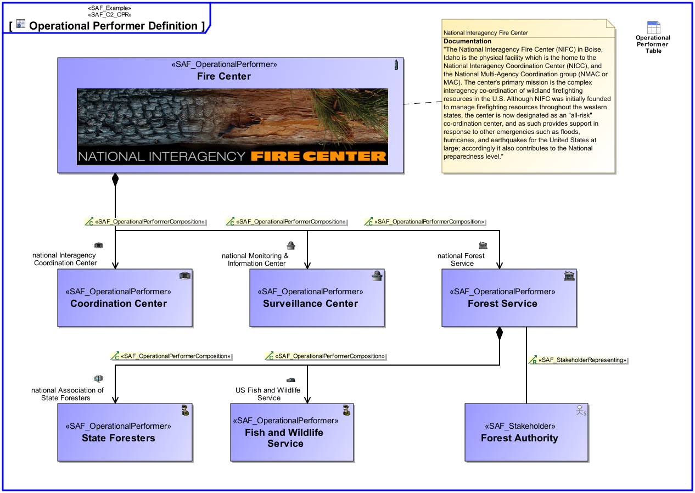
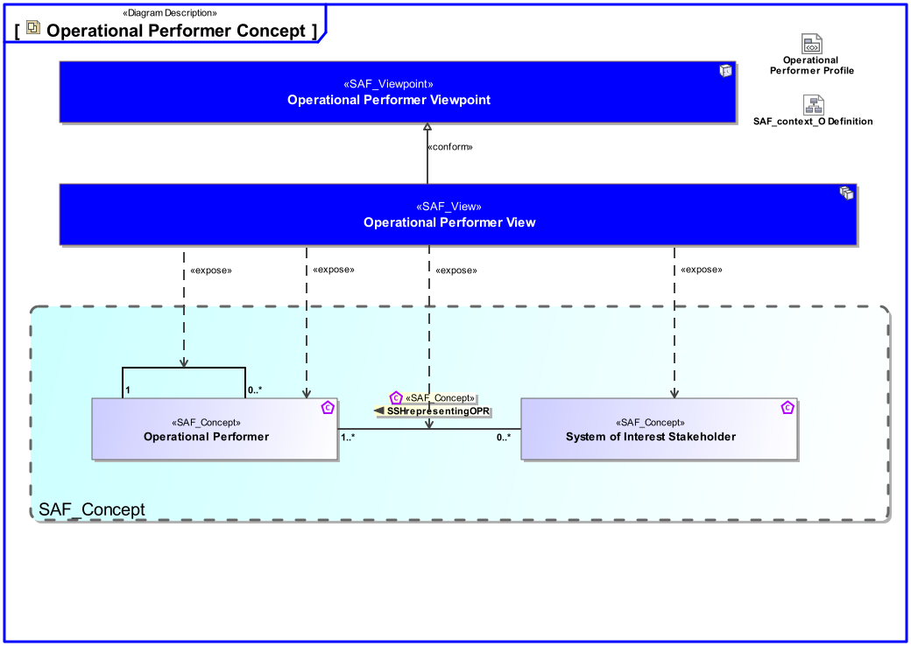

# SAF Development Documentation : **O2_OPRF** Operational Performer Viewpoint
|**Domain**|**Aspect**|**Maturity**|
| --- | --- | --- |
|[Operational](../../domains.md#Domain-Operational)|[Taxonomy & Structure](../../aspects.md#Aspect-Taxonomy-&-Structure)|[released](../../using-saf/maturity.md#released)|
## Example

## Purpose
The Operational Performer Viewpoint represents the taxonomy of the identified Operational Performers, if existing and relevant for the understanding of the operation of the intended solution. 
## Applicability
The Operational Performer Viewpoint supports the "Business or Mission Analysis Process" activities of the INCOSE SYSTEMS ENGINEERING HANDBOOK 2015 [§ 4.1] and contributes to the problem or opportunity statement.
## Presentation
A block definition diagram (BDD) featuring Operational Performers. and their relations in terms of decomposition or generalization at a level of detail required for problem understanding and analysis. 
Note: Identified Stakeholders are related to Operational Performers if appropriate.

## Stakeholder
* [Acquirer](../../stakeholders.md#Acquirer)
* [Customer](../../stakeholders.md#Customer)
* [System Architect](../../stakeholders.md#System-Architect)
## Concern
* [What are the relationships between the partys involved in the operation of the intended solution?](../../concerns.md#_2021x_2_8710274_1674576759040_585536_23465)
* [What partys of the organization, enterprise, or operational entity are needed to achieve an intended operational capability?](../../concerns.md#_2021x_2_8710274_1674576759028_333016_23460)
## Profile Model Reference
The following Stereotypes / Model Elements are used in the Viewpoint:
|Stereotype | realized Concept|
|---|---|
|[SAF_O2_OPRF](../../stereotypes.md#SAF_O2_OPRF)|[Operational Performer Viewpoint](../concept/concepts.md#Operational-Performer-Viewpoint)|
|[SAF_OperationalPerformerComposition](../../stereotypes.md#SAF_OperationalPerformerComposition)|[OPRcomposedOF](../concept/concepts.md#OPRcomposedOF)|
|[SAF_OperationalPerformer](../../stereotypes.md#SAF_OperationalPerformer)|[Operational Performer](../concept/concepts.md#Operational-Performer)|
|[SAF_StakeholderRepresenting](../../stereotypes.md#SAF_StakeholderRepresenting)|[SSHrepresentingOPR](../concept/concepts.md#SSHrepresentingOPR)|
|[SAF_Stakeholder](../../stereotypes.md#SAF_Stakeholder)|[System of Interest Stakeholder](../concept/concepts.md#System-of-Interest-Stakeholder)|
## Input from other Viewpoints
### Required Viewpoints
*none*
### Recommended Viewpoints
*none*
# Viewpoint Concept and Profile Diagrams
## Concept

## Profile

