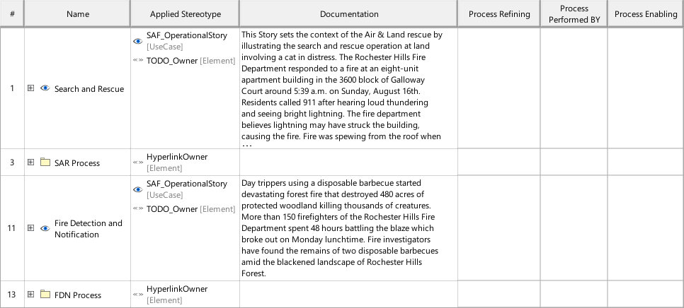

# SAF Development Documentation : Operational Process Mapping Viewpoint
|**Domain**|**Aspect**|**Maturity**|
| --- | --- | --- |
|[Operational](../../domains.md#Domain-Operational)|[Traceability & Mapping](../../aspects.md#Aspect-Traceability-&-Mapping)|[released](../../using-saf/maturity.md#released)|
## Example

## Purpose
The Operational Process Mapping Viewpoint describes the relationships of Operational Processes. The reasoning for Operational Processes from Operational Stories and their contribution to Capabilities is described. The assignment of Operational Processes to Operational Performers is captured.
## Applicability
The Operational Process Mapping Viewpoint supports the "Business or Mission Analysis Process" activities of the INCOSE SYSTEMS ENGINEERING HANDBOOK 2015 [§ 4.1] and contributes to the definition of operational scenarios.
## Stakeholder
* [Acquirer](../../stakeholders.md#Acquirer)
* [Customer](../../stakeholders.md#Customer)
* [Portfolio Manager](../../stakeholders.md#Portfolio-Manager)
* [System Architect](../../stakeholders.md#System-Architect)
## Concern
* Show in a concise manner the relationships from operational process to operational story and to operational performer.
## Presentation
A tabular format listing the relationships of Operational Process Activities to Operational Capabilities, Operational Stories, and Operational Performers.

## Profile Model Reference
The following Stereotypes / Model Elements are used in the Viewpoint:
|Stereotype | realized Concept|
|---|---|
|[SAF_OperationalCapability](../../stereotypes.md#SAF_OperationalCapability)|[Operational Capability](../concept/concepts.md#Operational-Capability)|
|[SAF_OperationalPerformer](../../stereotypes.md#SAF_OperationalPerformer)|[Operational Performer](../concept/concepts.md#Operational-Performer)|
|[SAF_OperationalProcess](../../stereotypes.md#SAF_OperationalProcess)|[Operational Process](../concept/concepts.md#Operational-Process)|
|[SAF_OperationalProcessEnabling](../../stereotypes.md#SAF_OperationalProcessEnabling)|[OPSenablingOCY](../concept/concepts.md#OPSenablingOCY)|
|[SAF_OperationalProcessRefinement](../../stereotypes.md#SAF_OperationalProcessRefinement)|[OPSrefiningOSY](../concept/concepts.md#OPSrefiningOSY)|
|[SAF_OperationalStory](../../stereotypes.md#SAF_OperationalStory)|[Operational Story](../concept/concepts.md#Operational-Story)|
|[SAF_SOV08b_View](../../stereotypes.md#SAF_SOV08b_View)|[Operational Process Mapping Viewpoint](../concept/concepts.md#Operational-Process-Mapping-Viewpoint)|
## Input from other Viewpoints
### Required Viewpoints
* [Operational Process Viewpoint](Operational-Process-Viewpoint.md)
### Recommended Viewpoints
* [Operational Context Definition Viewpoint](Operational-Context-Definition-Viewpoint.md)
* [Operational Domain Item Kind Viewpoint](Operational-Domain-Item-Kind-Viewpoint.md)
# Viewpoint Concept and Profile Diagrams
## Concept

## Profile

