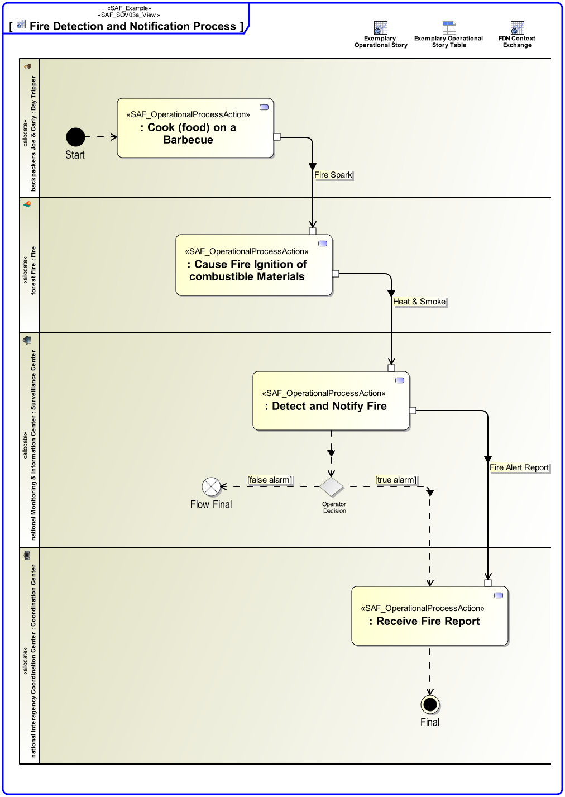

# SAF Development Documentation : Operational Process Viewpoint
|**Domain**|**Aspect**|**Maturity**|
| --- | --- | --- |
|[Operational](../../domains.md#Domain-Operational)|[Process & Behavior](../../aspects.md#Aspect-Process-&-Behavior)|[released](../../using-saf/maturity.md#released)|
## Example

## Purpose
The Operational Process Viewpoint describes the Operational Processes related to a specific Operational Story, the sequence of execution, and their Operational Exchanges, including information, materials, natural resources, etc. The assignment of Operational Processes to Operational Performers is captured.
## Applicability
The Operational Process Viewpoint supports the "Business or Mission Analysis Process" and the "Stakeholder Needs and Requirements Definition Process" activities of the INCOSE SYSTEMS ENGINEERING HANDBOOK 2015 [§ 4.1, § 4.2] and contributes to the definition of operational scenarios.
## Presentation
An activity diagram featuring the ordered execution of Operational Process Actions. Operational Processes may be linked in terms of control flow and/or data flow visualizing the Operational Exchanges needed. 
Note: Operational Process Actions are assigned to Operational Roles and therefore in a more general manner to Operational Performers.

## Stakeholder
* [Acquirer](../../stakeholders.md#Acquirer)
* [Customer](../../stakeholders.md#Customer)
* [System Architect](../../stakeholders.md#System-Architect)
## Concern
* What operational process activities shall be executed during the execution of an operational story?
* Which operational activity shall be executed by which operational performer in the operational story?
## Profile Model Reference
The following Stereotypes / Model Elements are used in the Viewpoint:
|Stereotype | realized Concept|
|---|---|
|Allocate [SysML Profile]|[OPRperformingOPSU](../concept/concepts.md#OPRperformingOPSU)|
|ControlFlow [UML_Standard_Profile]|[controlledAFTER](../concept/concepts.md#controlledAFTER)|
|InputPin [UML_Standard_Profile]|[TO](../concept/concepts.md#TO)|
|ObjectFlow [UML_Standard_Profile]|[Operational Process Exchange](../concept/concepts.md#Operational-Process-Exchange)|
|OutputPin [UML_Standard_Profile]|[FROM](../concept/concepts.md#FROM)|
|[SAF_OperationalDomainKind](../../stereotypes.md#SAF_OperationalDomainKind)|[Operational Domain Kind](../concept/concepts.md#Operational-Domain-Kind)|
|[SAF_OperationalPerformer](../../stereotypes.md#SAF_OperationalPerformer)|[Operational Performer](../concept/concepts.md#Operational-Performer)|
|[SAF_OperationalProcess](../../stereotypes.md#SAF_OperationalProcess)|[Operational Process](../concept/concepts.md#Operational-Process)|
|[SAF_OperationalProcessAction](../../stereotypes.md#SAF_OperationalProcessAction)|[Operational Process Usage](../concept/concepts.md#Operational-Process-Usage)|
|[SAF_OperationalRole](../../stereotypes.md#SAF_OperationalRole)|[Operational Context Performer Constituent](../concept/concepts.md#Operational-Context-Performer-Constituent)|
|[SAF_SOV03a_View](../../stereotypes.md#SAF_SOV03a_View)|[Operational Process Viewpoint](../concept/concepts.md#Operational-Process-Viewpoint)|
## Input from other Viewpoints
### Required Viewpoints
*none*
### Recommended Viewpoints
* [Operational Context Definition Viewpoint](Operational-Context-Definition-Viewpoint.md)
* [Operational Domain Item Kind Viewpoint](Operational-Domain-Item-Kind-Viewpoint.md)
# Viewpoint Concept and Profile Diagrams
## Concept

## Profile

