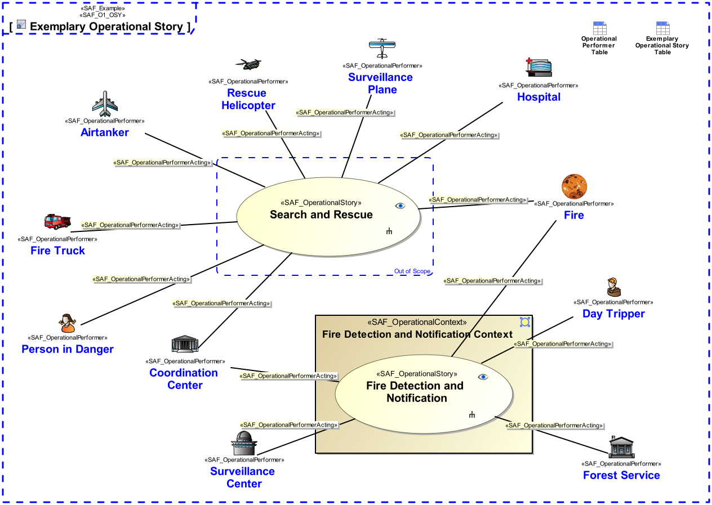

# SAF Development Documentation : **O1_OSY** Operational Story Viewpoint
|**Domain**|**Aspect**|**Maturity**|
| --- | --- | --- |
|[Operational](../../domains.md#Domain-Operational)|[Context & Exchange](../../aspects.md#Aspect-Context-&-Exchange)|[released](../../using-saf/maturity.md#released)|
## Example

## Purpose
The Operational Story Viewpoint
* captures operational stories and their relation to operational performers, thus enables storytelling
* illustrates the operational background from the Stakeholder perspective
* serves as starting point to identify Stakeholders and/or context elements
* fosters the communication among different Stakeholders
## Applicability
The Operational Story Viewpoint supports the "Business or Mission Analysis Process" activities of the INCOSE SYSTEMS ENGINEERING HANDBOOK 2023 [§2.3.5.1] and contributes to the problem or opportunity statement.
## Presentation
A use case diagram featuring model elements representing operational stories, and operational performers involved in the mission. 
Note: Illustrations, drawings, sketches, etc., and/or descriptions in free text may provide a comprehensive understanding of the operational mission.

## Stakeholder
* [Acquirer](../../stakeholders.md#Acquirer)
* [Customer](../../stakeholders.md#Customer)
* [System Architect](../../stakeholders.md#System-Architect)
## Concern
* [Which is the operational scenario, i.e., course of action, for the mission and the context in which the system of systems solution will exist?](../../concerns.md#_2021x_2_8710274_1674576758881_297740_23364)
## Profile Model Reference
The following Stereotypes / Model Elements are used in the Viewpoint:
|Stereotype | realized Concept|
|---|---|
|Attribute "subject" of UseCase referencing SAF_OperationalContext|[OSYtakingPlaceInOCT](../concept/concepts.md#OSYtakingPlaceInOCT)|
|[SAF_O1_OSY](../../stereotypes.md#SAF_O1_OSY)|[Operational Story Viewpoint](../concept/concepts.md#Operational-Story-Viewpoint)|
|[SAF_OperationalContext](../../stereotypes.md#SAF_OperationalContext)|[Operational Context](../concept/concepts.md#Operational-Context)|
|[SAF_OperationalPerformerActing](../../stereotypes.md#SAF_OperationalPerformerActing)|[OPRactingInOSY](../concept/concepts.md#OPRactingInOSY)|
|[SAF_OperationalPerformer](../../stereotypes.md#SAF_OperationalPerformer)|[Operational Performer](../concept/concepts.md#Operational-Performer)|
|[SAF_OperationalSketch](../../stereotypes.md#SAF_OperationalSketch)|[Operational Sketch](../concept/concepts.md#Operational-Sketch)|
|[SAF_OperationalStory](../../stereotypes.md#SAF_OperationalStory)|[Operational Story](../concept/concepts.md#Operational-Story)|
## Input from other Viewpoints
### Required Viewpoints
* [Operational Performer Viewpoint](Operational-Performer-Viewpoint.md)
### Recommended Viewpoints
*none*
# Viewpoint Concept and Profile Diagrams
## Concept

## Profile

