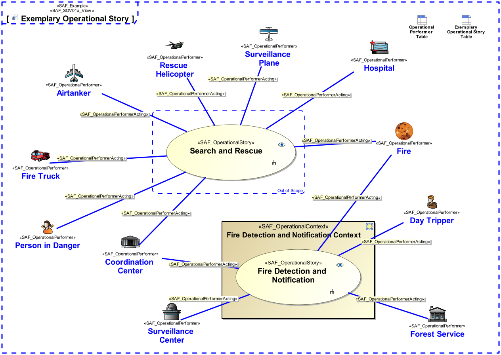
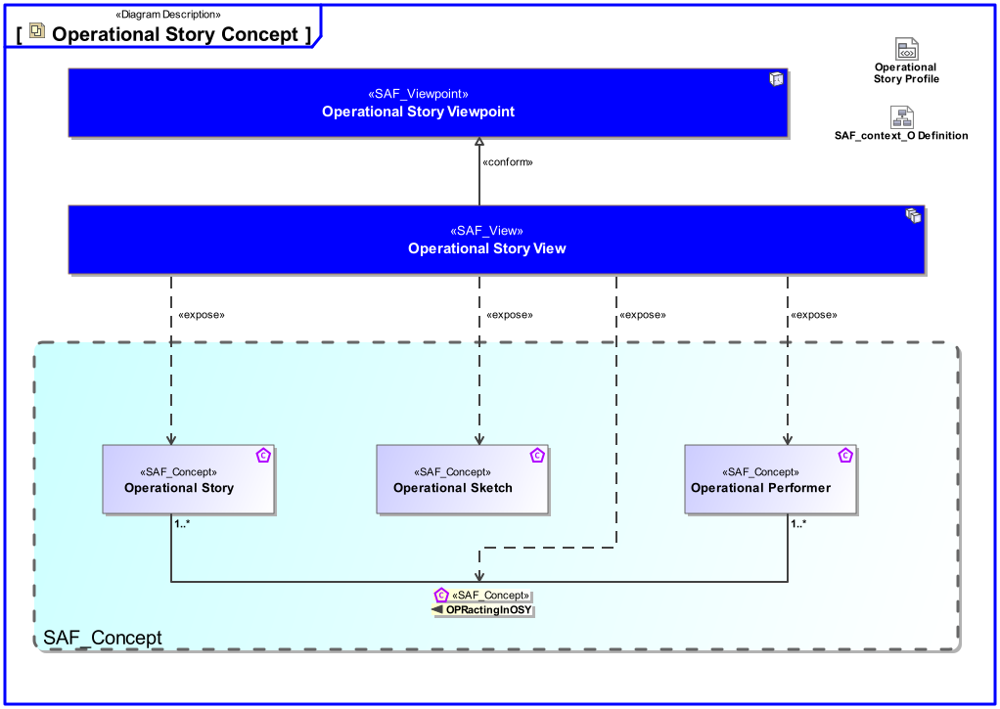

# SAF Development Documentation : Operational Story Viewpoint
|**Domain**|**Aspect**|**Maturity**|
| --- | --- | --- |
|[Operational](../../domains.md#Domain-Operational)|[Context & Exchange](../../aspects.md#Aspect-Context-&-Exchange)|[released](../../using-saf/maturity.md#released)|
## Example

## Purpose
The Operational Story Viewpoint
* captures Operational Stories and their relation to Operational Performers, thus enables storytelling
* illustrates the operational background from the Stakeholder’s perspective
* serves as starting point to identify Stakeholders and/or context elements
* fosters the communication among different Stakeholders
## Applicability
The Operational Story Viewpoint supports the "Business or Mission Analysis Process" activities of the INCOSE SYSTEMS ENGINEERING HANDBOOK 2015 [§ 4.1] and contributes to the problem or opportunity statement.
## Stakeholder
* [Acquirer](../../stakeholders.md#Acquirer)
* [Customer](../../stakeholders.md#Customer)
* [System Architect](../../stakeholders.md#System-Architect)
## Concern
* What are the operational scenarios (operational stories) relevant to the system?
* Which is the operational scenario, i.e., course of action, for the mission and the context in which the system of systems solution will exist?
## Presentation
A use case diagram featuring model elements representing Operational Stories, and Operational Performers involved in the mission. 
Note: Illustrations (drawings, sketches, etc.), and/or descriptions in free text may provide a comprehensive understanding of the operational background.

## Profile Model Reference
The following Stereotypes / Model Elements are used in the Viewpoint:
|Stereotype | realized Concept|
|---|---|
|[SAF_OperationalPerformer](../../stereotypes.md#SAF_OperationalPerformer)|[Operational Performer](../concept/concepts.md#Operational-Performer)|
|[SAF_OperationalPerformerActing](../../stereotypes.md#SAF_OperationalPerformerActing)|[OPRactingInOSY](../concept/concepts.md#OPRactingInOSY)|
|[SAF_OperationalSketch](../../stereotypes.md#SAF_OperationalSketch)|[Operational Sketch](../concept/concepts.md#Operational-Sketch)|
|[SAF_OperationalStory](../../stereotypes.md#SAF_OperationalStory)|[Operational Story](../concept/concepts.md#Operational-Story)|
|[SAF_SOV01a_View](../../stereotypes.md#SAF_SOV01a_View)|[Operational Story Viewpoint](../concept/concepts.md#Operational-Story-Viewpoint)|
## Input from other Viewpoints
### Required Viewpoints
* [Operational Performer Viewpoint](Operational-Performer-Viewpoint.md)
### Recommended Viewpoints
*none*
# Viewpoint Concept and Profile Diagrams
## Concept

## Profile

