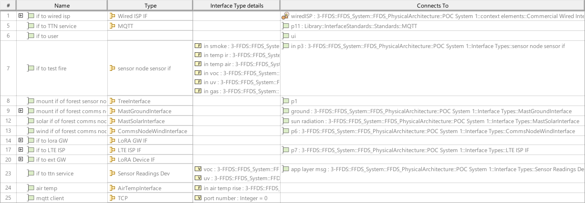
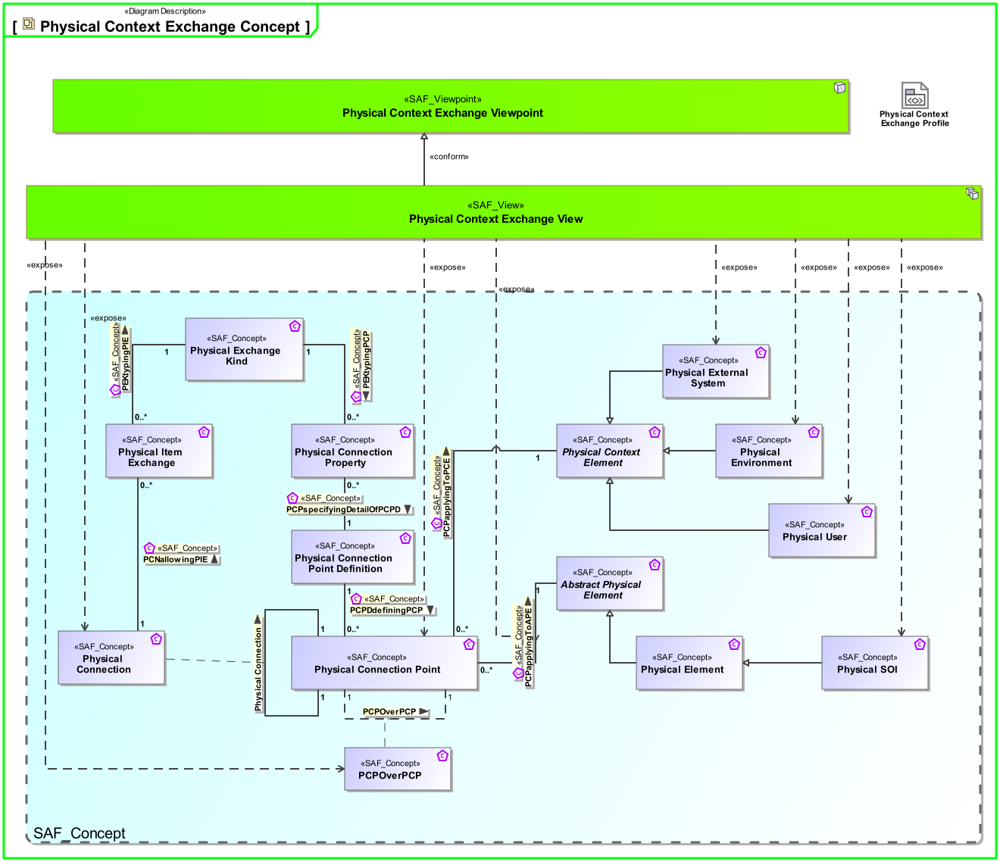
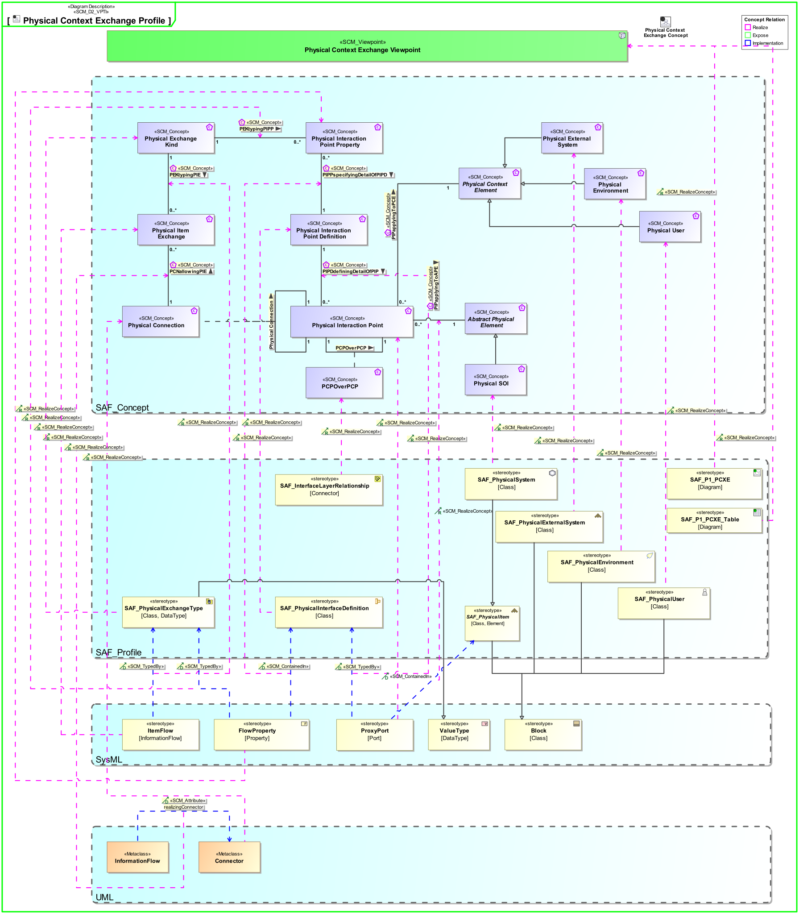

# SAF Development Documentation : Physical Context Exchange Viewpoint
|**Domain**|**Aspect**|**Maturity**|
| --- | --- | --- |
|[Physical](../../domains.md#Domain-Physical)|[Context & Exchange](../../aspects.md#Aspect-Context-&-Exchange)|[released](../../using-saf/maturity.md#released)|
## Example

## Purpose
The Physical Context Exchange Viewpoint focuses on the identification of the physical interfaces with external entities and relevant documentation. It is used to capture interface design requirements, applicable standards, protocols and format specifications, that are agreed upon the interfaces.
## Applicability

The Physical Context Exchange Viewpoint supports the "Create system design" activity included in "Design Definition Process" activities of the INCOSE SYSTEMS ENGINEERING HANDBOOK 2023 [§ 2.3.5.5] and contributes to the artifacts "System Design Description" and "System Interface Definition".

Furthermore, the viewpoint supports the "Interface Management" approach of the INCOSE SYSTEMS ENGINEERING HANDBOOK 2023 [§3.2.4].
## Presentation
A) For each given context, an internal block diagram (IBD is used to identify the physical interfaces, the item flows, that are exchanged on that interfaces, and related documentation.
Note: To understand the interfaces, a mapping of protocol layers may be depicted.

B) A tabular format providing a list of all the defined external interfaces and the applicable documentation
* context element kind (environment, external entity, physical user, etc.)
* context element role name
* port name and reference to port type
* reference to context element type

C) A tabular format listing the applicable standards, protocols and formats for the item flows exchanged via the identified interfaces.

## Stakeholder
* [Acquirer](../../stakeholders.md#Acquirer)
* [Customer](../../stakeholders.md#Customer)
* [Hardware Developer](../../stakeholders.md#Hardware-Developer)
* [IV&V Engineer](../../stakeholders.md#IV&V-Engineer)
* [Mechanic Developer](../../stakeholders.md#Mechanic-Developer)
* [Safety Expert](../../stakeholders.md#Safety-Expert)
* [Security Expert](../../stakeholders.md#Security-Expert)
* [Software Developer](../../stakeholders.md#Software-Developer)
* [Supplier](../../stakeholders.md#Supplier)
* [System Architect](../../stakeholders.md#System-Architect)
## Concern
* [Which are the external physical entities the system interacts with in the given context?](../../concerns.md#_2021x_2_8710274_1674576758710_759449_23186)
* [Which are the protocols for exchanging items on a specific interface?](../../concerns.md#_2021x_2_8710274_1674576759247_884832_23642)
* [Which kind of physical items (energy, material, information, etc.) are exchanged between the system and external entities?](../../concerns.md#_2021x_2_8710274_1674576758698_132348_23172)
* [Which kind of physical items (energy, material, information, etc.) are used on an interface of a physical architecture element?](../../concerns.md#_2021x_2_8710274_1674576758561_575110_23056)
* [Which standards, protocols, and format specifications are associated with a specific interface?](../../concerns.md#_2021x_2_8710274_1674576758891_215548_23373)
## Profile Model Reference
The following Stereotypes / Model Elements are used in the Viewpoint:
|Stereotype | realized Concept|
|---|---|
|Attribute "realizingConnector" of InformationFlow referencing Connector|[PCNallowingPIE](../concept/concepts.md#PCNallowingPIE)|
|Connector [UML_Standard_Profile]|[Physical Connection](../concept/concepts.md#Physical-Connection)|
|FlowProperty contained in SAF_PhysicalInterfaceDefinition|[PCPPspecifyingDetailOfPCPD](../concept/concepts.md#PCPPspecifyingDetailOfPCPD)|
|FlowProperty typed by SAF_PhysicalExchangeType|[PEKtypingPCPP](../concept/concepts.md#PEKtypingPCPP)|
|FlowProperty [SysML Profile]|[Physical Connection Point Property](../concept/concepts.md#Physical-Connection-Point-Property)|
|ItemFlow typed by SAF_PhysicalExchangeType|[PEKtypingPIE](../concept/concepts.md#PEKtypingPIE)|
|ItemFlow [SysML Profile]|[Physical Item Exchange](../concept/concepts.md#Physical-Item-Exchange)|
|ProxyPort typed by SAF_PhysicalInterfaceDefinition|[PCPDdefiningDetailOfPCP](../concept/concepts.md#PCPDdefiningDetailOfPCP)|
|ProxyPort [SysML Profile]|[Physical Connection Point](../concept/concepts.md#Physical-Connection-Point)|
|[SAF_PhysicalEnvironment](../../stereotypes.md#SAF_PhysicalEnvironment)|[Physical Environment](../concept/concepts.md#Physical-Environment)|
|[SAF_PhysicalExchangeType](../../stereotypes.md#SAF_PhysicalExchangeType)|[Physical Exchange Kind](../concept/concepts.md#Physical-Exchange-Kind)|
|[SAF_PhysicalExternalSystem](../../stereotypes.md#SAF_PhysicalExternalSystem)|[Physical External System](../concept/concepts.md#Physical-External-System)|
|[SAF_PhysicalInterfaceDefinition](../../stereotypes.md#SAF_PhysicalInterfaceDefinition)|[Physical Connection Point Definition](../concept/concepts.md#Physical-Connection-Point-Definition)|
|[SAF_PhysicalSystem](../../stereotypes.md#SAF_PhysicalSystem)|[Physical SOI](../concept/concepts.md#Physical-SOI)|
|[SAF_PhysicalUser](../../stereotypes.md#SAF_PhysicalUser)|[Physical User](../concept/concepts.md#Physical-User)|
|[SAF_ProtocolLayerRelationship](../../stereotypes.md#SAF_ProtocolLayerRelationship)|[PCPOverPCP](../concept/concepts.md#PCPOverPCP)|
|[SAF_SPV01c_View](../../stereotypes.md#SAF_SPV01c_View)|[Physical Context Exchange Viewpoint](../concept/concepts.md#Physical-Context-Exchange-Viewpoint)|
## Input from other Viewpoints
### Required Viewpoints
* [Physical Context Definition Viewpoint](Physical-Context-Definition-Viewpoint.md)
### Recommended Viewpoints
*none*
# Viewpoint Concept and Profile Diagrams
## Concept

## Profile

