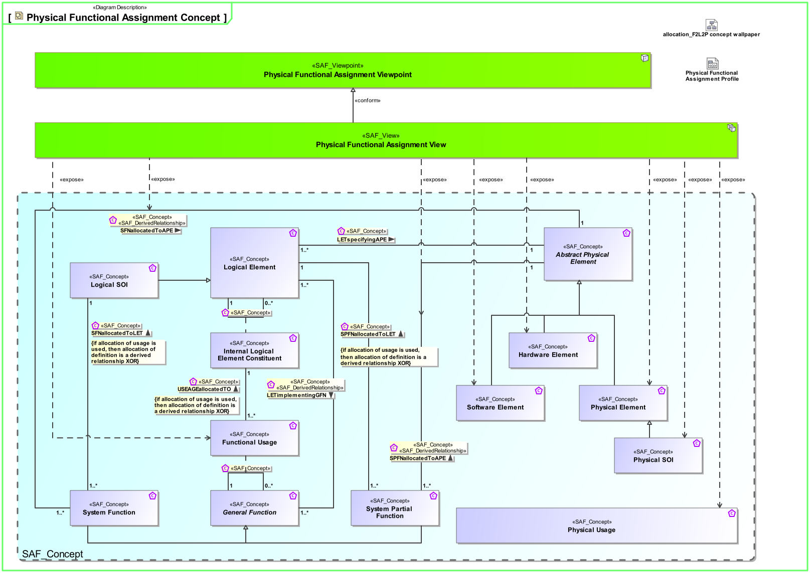
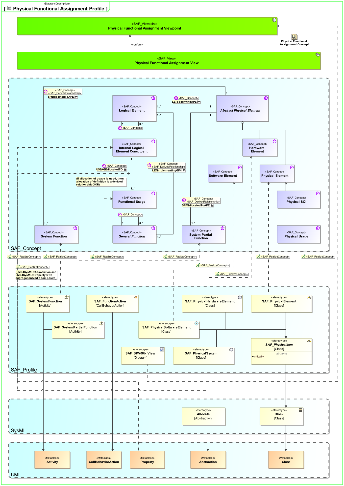

# SAF Development Documentation : Physical Functional Assignment Viewpoint
|**Domain**|**Aspect**|**Maturity**|
| --- | --- | --- |
|[Physical](../../domains.md#Domain-Physical)|[Mapping & Crossreference](../../aspects.md#Aspect-Mapping-&-Crossreference)|[under construction](../../using-saf/maturity.md#under-construction)|
## Example
*none*
## Purpose
The Physical Functional Assignment Viewpoint analyses the assignment of the System Functions and the System Partial Functions to the Physical SOI Elements.
## Applicability
The Physical Functional Assignment Viewpoint supports the "System Architecture Definition process" activities of the INCOSE SYSTEMS ENGINEERING HANDBOOK 2015  .
## Stakeholder
* [Hardware Developer](../../stakeholders.md#Hardware-Developer)
* [Software Developer](../../stakeholders.md#Software-Developer)
* [System Architect](../../stakeholders.md#System-Architect)
## Concern
* What is the allocation of functions to the physical architecture?
* Which functions and services need to be implemented in SW?
* Which functions need to be realized by HW?
## Presentation
A  Physical Functional Assignment Matrix featuring
* the call behavior action representing usage of System Functions
*  Physical SOI Elements 
or Physical SOI
* a derived relationship

## Profile Model Reference
|Stereotype | realized Concept|
|---|---|
|Allocate [SysML Profile]|[USEAGEallocatedTO](../concept/concepts.md#USEAGEallocatedTO)|
|Property [UML_Standard_Profile]|[Internal Logical Element Constituent](../concept/concepts.md#Internal-Logical-Element-Constituent)|
|[SAF_FunctionAction](../../stereotypes.md#SAF_FunctionAction)|[Functional Usage](../concept/concepts.md#Functional-Usage)|
|[SAF_PhysicalElement](../../stereotypes.md#SAF_PhysicalElement)|[Physical Element](../concept/concepts.md#Physical-Element)|
|[SAF_PhysicalHardwareElement](../../stereotypes.md#SAF_PhysicalHardwareElement)|[Hardware Element](../concept/concepts.md#Hardware-Element)|
|[SAF_PhysicalSoftwareElement](../../stereotypes.md#SAF_PhysicalSoftwareElement)|[Software Element](../concept/concepts.md#Software-Element)|
|[SAF_SPV08b_View](../../stereotypes.md#SAF_SPV08b_View)|[Physical Functional Assignment Viewpoint](../concept/concepts.md#Physical-Functional-Assignment-Viewpoint)|
|[SAF_SystemFunction](../../stereotypes.md#SAF_SystemFunction)|[System Function](../concept/concepts.md#System-Function)|
|[SAF_SystemPartialFunction](../../stereotypes.md#SAF_SystemPartialFunction)|[System Partial Function](../concept/concepts.md#System-Partial-Function)|
## Input from other Viewpoints
### Required Viewpoints
* [Physical Structure Viewpoint](Physical-Structure-Viewpoint.md)
* [Logical Functional Assignment Viewpoint](Logical-Functional-Assignment-Viewpoint.md)
* [Logical Structure Viewpoint](Logical-Structure-Viewpoint.md)
### Recommended Viewpoints
* [System Process Viewpoint](System-Process-Viewpoint.md)
* [System Functional Refinement Viewpoint](System-Functional-Refinement-Viewpoint.md)
# Viewpoint Concept and Profile Diagrams
## Concept

## Profile

