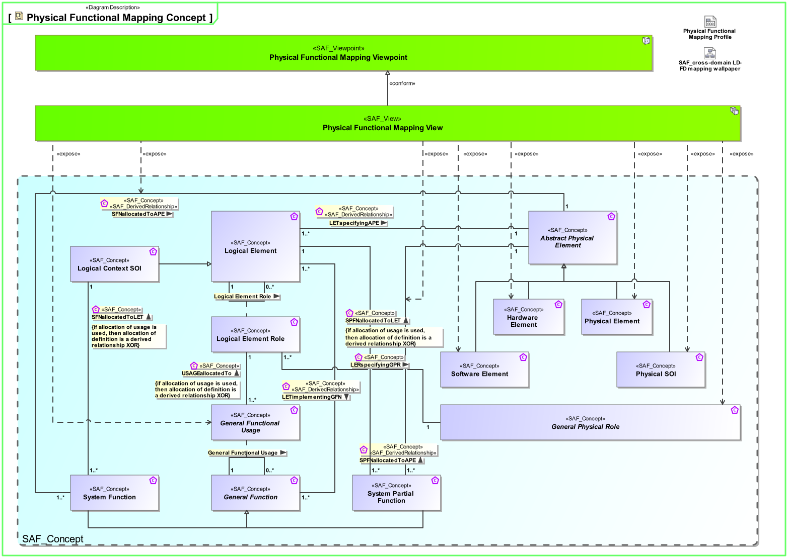
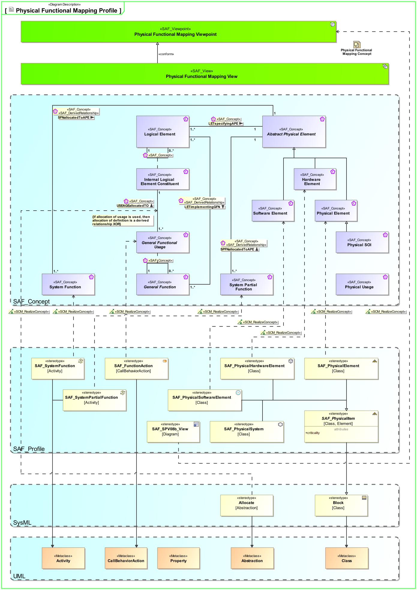

# SAF Development Documentation : **P8_PFUM** Physical Functional Mapping Viewpoint
|**Domain**|**Aspect**|**Maturity**|
| --- | --- | --- |
|[Physical](../../domains.md#Domain-Physical)|[Traceability & Mapping](../../aspects.md#Aspect-Traceability-&-Mapping)|[released](../../using-saf/maturity.md#released)|
## Example

## Purpose
The Physical Functional Mapping Viewpoint supports the analysis of the assigment of system functions and system partial functions to physical system elements. The result shall be computed from the assigment of functions to logial system elements and the assignment of logical system elements to physical system elements
## Applicability
The Physical Functional Mapping Viewpoint supports the “Design Definition Process” activities of the INCOSE SYSTEMS ENGINEERING HANDBOOK 2023 [§2.3.5.5] and contributes to the artifact "Traceability Mapping".

Furthermore, the Physical Functional Mapping Viewpoint supports the "Allocation and Partitioning of Functional Entities to Physical Entities" activities.
## Presentation
A FBS_to_PBS mapping matrix featuring
* Functional Breakdown Structure (FBS)
* Physical Breakdown Structure (PBS)
* mapping (it is a derived relationship) from system functions and system partial functions to physical SOI elements

## Stakeholder
* [Hardware Developer](../../stakeholders.md#Hardware-Developer)
* [IV&V Engineer](../../stakeholders.md#IV&V-Engineer)
* [Mechanic Developer](../../stakeholders.md#Mechanic-Developer)
* [Software Developer](../../stakeholders.md#Software-Developer)
* [System Architect](../../stakeholders.md#System-Architect)
## Concern
* [What is the mapping of functions to the physical SOI physical architecture?](../../concerns.md#_2021x_2_8710274_1674576758941_524652_23399)
* [Which system funcions need to be tested in IV&V activities?](../../concerns.md#_2021x_2_8710274_1698399553646_852568_33150)
## Profile Model Reference
The following Stereotypes / Model Elements are used in the Viewpoint:
|Stereotype | realized Concept|
|---|---|
|Allocate [SysML Profile]|[USAGEallocatedTo](../concept/concepts.md#USAGEallocatedTo)|
|Attribute "function" of SAF_PhysicalItem referencing SAF_SystemFunction|[SFNallocatedToAPE](../concept/concepts.md#SFNallocatedToAPE)|
|Attribute "function" of SAF_PhysicalItem referencing SAF_SystemFunction|[SPFNallocatedToAPE](../concept/concepts.md#SPFNallocatedToAPE)|
|[SAF_P8_PFUM_Matrix](../../stereotypes.md#saf_p8_pfum_matrix)|[Physical Functional Mapping Viewpoint](../concept/concepts.md#Physical-Functional-Mapping-Viewpoint)|
|[SAF_PhysicalElement](../../stereotypes.md#saf_physicalelement)|[Physical Element](../concept/concepts.md#Physical-Element)|
|[SAF_PhysicalHardwareElement](../../stereotypes.md#saf_physicalhardwareelement)|[Hardware Element](../concept/concepts.md#Hardware-Element)|
|[SAF_PhysicalSoftwareElement](../../stereotypes.md#saf_physicalsoftwareelement)|[Software Element](../concept/concepts.md#Software-Element)|
|[SAF_SystemFunction](../../stereotypes.md#saf_systemfunction)|[System Function](../concept/concepts.md#System-Function)|
|[SAF_SystemPartialFunction](../../stereotypes.md#saf_systempartialfunction)|[System Partial Function](../concept/concepts.md#System-Partial-Function)|
## Input from other Viewpoints
### Required Viewpoints
* [Logical Structure Definition Viewpoint](Logical-Structure-Definition-Viewpoint.md)
* [Physical Structure Definition Viewpoint](Physical-Structure-Definition-Viewpoint.md)
* [Logical Functional Mapping Viewpoint](Logical-Functional-Mapping-Viewpoint.md)
### Recommended Viewpoints
* [System Functional Breakdown Structure Viewpoint](System-Functional-Breakdown-Structure-Viewpoint.md)
# Viewpoint Concept and Profile Diagrams
## Concept

## Profile

