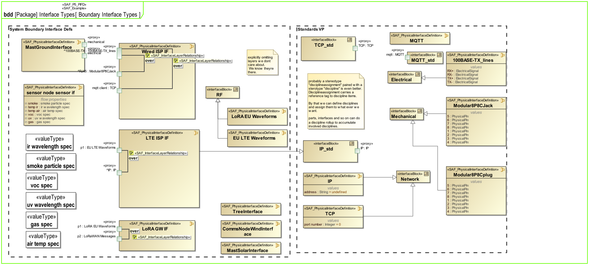
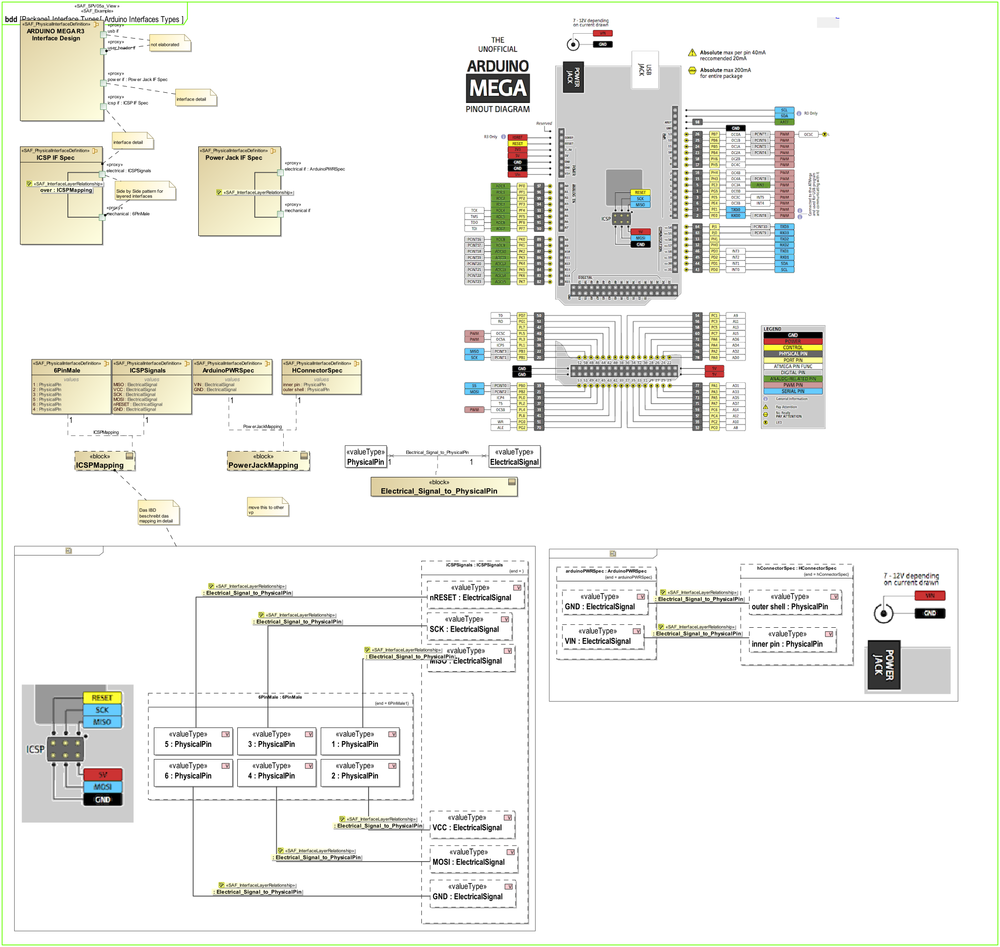
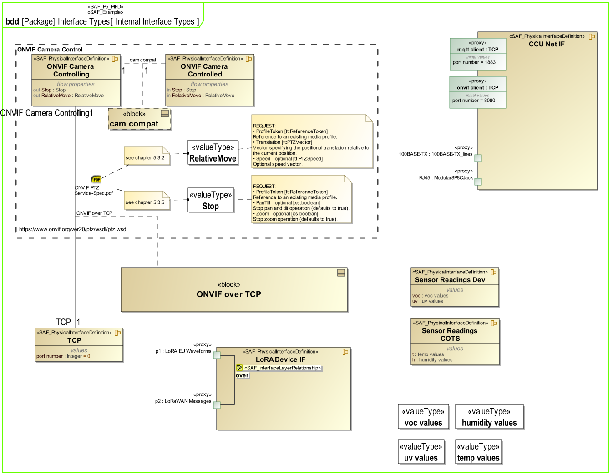
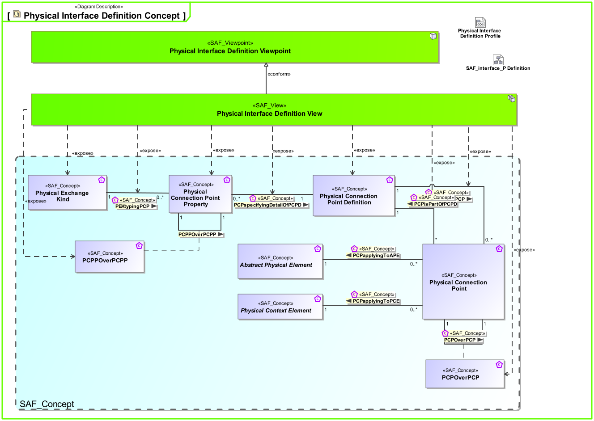
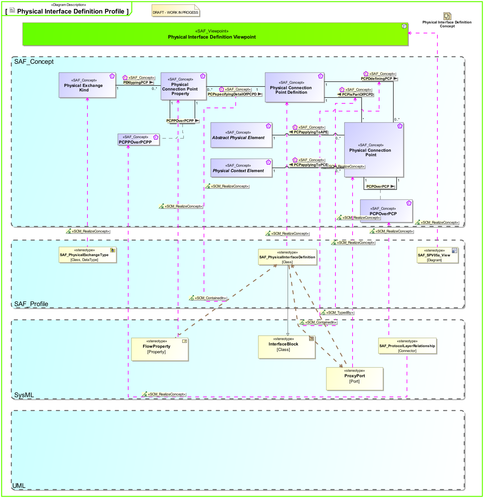

# SAF Development Documentation : Physical Interface Definition Viewpoint
|**Domain**|**Aspect**|**Maturity**|
| --- | --- | --- |
|[Physical](../../domains.md#Domain-Physical)|[Interface](../../aspects.md#Aspect-Interface)|[under construction](../../using-saf/maturity.md#under-construction)|
## Example

## Purpose
preliminary text - work in progess
The Physical Interface Definition Viewpoint provides definitions for physical interfaces. These definitions are may be reused on different interfaces.
## Applicability
The Physical Interface Definition Viewpoint supports the "Create System Design " activity included in "Design Definition Process" activities of the INCOSE SYSTEMS ENGINEERING HANDBOOK 2023 [§ 2.3.5.5] and contributes to the System Interface definition.

It also supports the "Interface Management" method of the INCOSE SYSTEMS ENGINEERING HANDBOOK 2023 [§ 3.2.4].
## Stakeholder
System Architect  
Hardware Developer  
## Concern
What types of physical interface definitions (electrical/hydraulic/mechanical/optical/RF/... connectors) are required/present in the system/product?  
`Rationale`: The **System Architect** needs to have the physical interface definitions ready for typisation of connectors (ports) of the system/product.

What properties and metadata does a connector convey in terms of supplier, part number, ingress protection class for water and dust, KPIs...)  
`Rationale`: The **System Architect/Hardware Develper** needs to have the physical interface definitions with KPIs for the selection process and entering them into the BOM.

What physical connection points (pins) does a connector provide?  
`Rationale`: The **System Architect** needs to align the external interfaces with the customer (system level above)

What electrical/optical/RF signals (information) does a connector transfer?  
`Rationale`: The **System Architect** needs to know what signal types are transferred through a physical interface type and to align with internal and external stakeholders.

What energy (electrical, hydraulic, force, heat,...) does a connector transfer?  
`Rationale`: The **System Architect** needs to know what energy types are transferred through a physical interface type and to align with internal and external stakeholders.

What matter (liquid, gas, pieces) does a connector transfer?  
`Rationale`: The **System Architect** needs to know what matter types are transferred through a physical interface type and to align with internal and external stakeholders.

Which electrical signals, energy and/or matter transfers are mapped to what physical connection point?  
`Rationale`: The **System Architect** needs to assure completeness in the mapping and therefore realization of required signal/energy and matter transfer through a physical interface.  
`Rationale`: The **Hardware Developer** needs to know the mapping of required signal/energy to the individual physical connection points for the implementation and detailed design activities.  
*(Note: A physical connection point can realize multiple signal, energy and matter types at once!)*

What connector types are compatible to each other?  
`Rationale`: The **System Architect** needs to be able to assure the compatibility between later on assigned physicical interface types of internal and to external interfaces.
Mengengerüst purchasing (BOM)

## Presentation
A block definition diagram (BDD) featuring Physical Interface blocks with ports and flow properties. Compatibility between Physical Interface blocks is expressed by associations and association blocks. Physical Interface blocks may be specialisations of others (use of Generalisation).
Note: When ports are used these shall be proxy ports and be typed by interface blocks.

A tabular format listing Physical Interface blocks, their ports, and flow properties.

## Stakeholder
* [Hardware Developer](../../stakeholders.md#Hardware-Developer)
* [Safety Expert](../../stakeholders.md#Safety-Expert)
* [Security Expert](../../stakeholders.md#Security-Expert)
* [Software Developer](../../stakeholders.md#Software-Developer)
* [System Architect](../../stakeholders.md#System-Architect)
## Concern
* Which design level data / energy / material definitions have to be known by the SOI and used by the SOI?
## Profile Model Reference
The following Stereotypes / Model Elements are used in the Viewpoint:
|Stereotype | realized Concept|
|---|---|
|FlowProperty contained in SAF_PhysicalInterfaceDefinition|[PCPPspecifyingDetailOfPCPD](../concept/concepts.md#PCPPspecifyingDetailOfPCPD)|
|FlowProperty [SysML Profile]|[Physical Connection Point Property](../concept/concepts.md#Physical-Connection-Point-Property)|
|ProxyPort typed by SAF_PhysicalInterfaceDefinition|[PCPDdefiningDetailOfPCP](../concept/concepts.md#PCPDdefiningDetailOfPCP)|
|ProxyPort [SysML Profile]|[Physical Connection Point](../concept/concepts.md#Physical-Connection-Point)|
|[SAF_PhysicalExchangeType](../../stereotypes.md#SAF_PhysicalExchangeType)|[Physical Exchange Kind](../concept/concepts.md#Physical-Exchange-Kind)|
|SAF_PhysicalInterfaceDefinition contained in ProxyPort|[PCPisPartOfPCPD](../concept/concepts.md#PCPisPartOfPCPD)|
|[SAF_PhysicalInterfaceDefinition](../../stereotypes.md#SAF_PhysicalInterfaceDefinition)|[Physical Connection Point Definition](../concept/concepts.md#Physical-Connection-Point-Definition)|
|[SAF_ProtocolLayerRelationship](../../stereotypes.md#SAF_ProtocolLayerRelationship)|[PCPOverPCP](../concept/concepts.md#PCPOverPCP)|
|[SAF_ProtocolLayerRelationship](../../stereotypes.md#SAF_ProtocolLayerRelationship)|[PCPPOverPCPP](../concept/concepts.md#PCPPOverPCPP)|
|[SAF_SPV05a_View](../../stereotypes.md#SAF_SPV05a_View)|[Physical Interface Definition Viewpoint](../concept/concepts.md#Physical-Interface-Definition-Viewpoint)|
## Input from other Viewpoints
### Required Viewpoints
*none*
### Recommended Viewpoints
*none*
# Viewpoint Concept and Profile Diagrams
## Concept

## Profile

