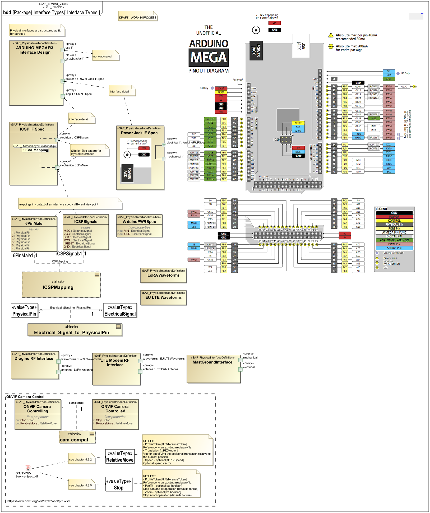

# SAF Development Documentation : Physical Interface Definition Viewpoint
|**Domain**|**Aspect**|**Maturity**|
| --- | --- | --- |
|[Physical](../../domains.md#Domain-Physical)|[Interface](../../aspects.md#Aspect-Interface)|[under construction](../../using-saf/maturity.md#under-construction)|
## Example

## Purpose
preliminary text - work in progess
The Physical Interface Definition Viewpoint provides definitions for physical interfaces. These definitions are may be reused on different interfaces.
## Applicability
The System Interface Definition Viewpoint supports the "Create System Design " activity included in "Design Definition Process" activities of the INCOSE SYSTEMS ENGINEERING HANDBOOK 2023 [§ 2.3.5.5] and contributes to the System Interface definition.

It also supports the "Interface Management" method of the INCOSE SYSTEMS ENGINEERING HANDBOOK 2023 [§ 3.2.4].
## Stakeholder
## Concern
## Presentation
A block definition diagram (BDD) featuring Physical Interface blocks with ports, and flow properties.
Note: When ports are used these shall be proxy ports and be typed by interface blocks.

A tabular format listing Physical Interface blocks, their ports, and flow properties.

## Profile Model Reference
The following Stereotypes / Model Elements are used in the Viewpoint:
|Stereotype | realized Concept|
|---|---|
|FlowProperty [SysML Profile]|[Physical Connection Property](../concept/concepts.md#Physical-Connection-Property)|
|ProxyPort [SysML Profile]|[Physical Connection Point](../concept/concepts.md#Physical-Connection-Point)|
|[SAF_PhysicalExchangeType](../../stereotypes.md#SAF_PhysicalExchangeType)|[Physical Exchange Kind](../concept/concepts.md#Physical-Exchange-Kind)|
|[SAF_PhysicalInterfaceDefinition](../../stereotypes.md#SAF_PhysicalInterfaceDefinition)|[Physical Connection Point Definition](../concept/concepts.md#Physical-Connection-Point-Definition)|
|[SAF_SPV05a_View](../../stereotypes.md#SAF_SPV05a_View)|[Physical Interface Definition Viewpoint](../concept/concepts.md#Physical-Interface-Definition-Viewpoint)|
## Input from other Viewpoints
### Required Viewpoints
*none*
### Recommended Viewpoints
*none*
# Viewpoint Concept and Profile Diagrams
## Concept

## Profile

