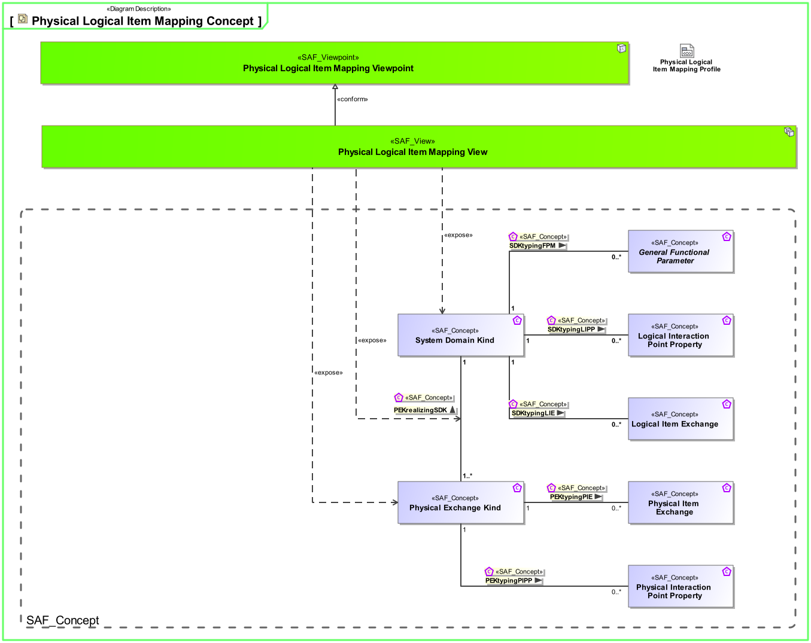
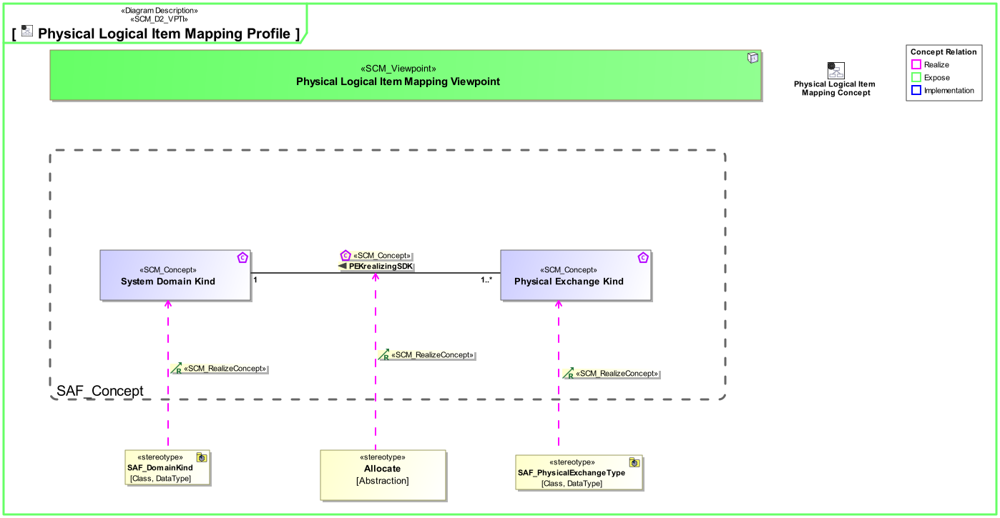

# SAF Development Documentation : **P8_PLIM** Physical Logical Item Mapping Viewpoint
|**Domain**|**Aspect**|**Maturity**|
| --- | --- | --- |
|[Physical](../../domains.md#Domain-Physical)|[Traceability & Mapping](../../aspects.md#Aspect-Traceability-&-Mapping)|[proposed](../../using-saf/maturity.md#proposed)|
## Example
*none*
## Purpose
The Physical Logical Item Mapping Viewpoint specifies the assignment of the System Domain Kinds to Physical Exchange Kinds.
## Applicability
The Physical Logical Item Mapping Viewpoint supports [tbd].
## Presentation
A  Physical To Logical Assigment Matrix featuring
* System Domain Kinds
* Physical Exchange Kinds
* Allocation relationship between them

## Stakeholder
## Concern
## Profile Model Reference
The following Stereotypes / Model Elements are used in the Viewpoint:
|Stereotype | realized Concept|
|---|---|
|Allocate [SysML Profile]|[PEKrealizingSDK](../concept/concepts.md#PEKrealizingSDK)|
|FlowProperty [SysML Profile]|[Logical Interaction Point Property](../concept/concepts.md#Logical-Interaction-Point-Property)|
|FlowProperty [SysML Profile]|[Physical Interaction Point Property](../concept/concepts.md#Physical-Interaction-Point-Property)|
|ItemFlow [SysML Profile]|[Logical Item Exchange](../concept/concepts.md#Logical-Item-Exchange)|
|ItemFlow [SysML Profile]|[Physical Item Exchange](../concept/concepts.md#Physical-Item-Exchange)|
|Parameter [UML_Standard_Profile]|[General Functional Parameter](../concept/concepts.md#General-Functional-Parameter)|
|[SAF_DomainKind](../../stereotypes.md#SAF_DomainKind)|[System Domain Kind](../concept/concepts.md#System-Domain-Kind)|
|[SAF_PhysicalExchangeType](../../stereotypes.md#SAF_PhysicalExchangeType)|[Physical Exchange Kind](../concept/concepts.md#Physical-Exchange-Kind)|
## Input from other Viewpoints
### Required Viewpoints
*none*
### Recommended Viewpoints
*none*
# Viewpoint Concept and Profile Diagrams
## Concept

## Profile

