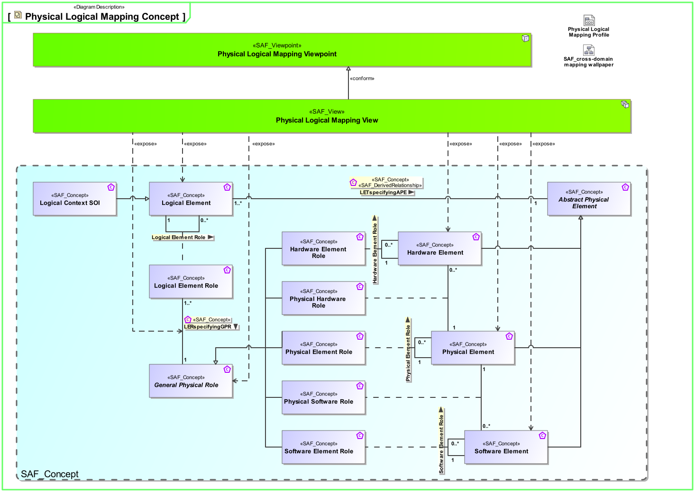
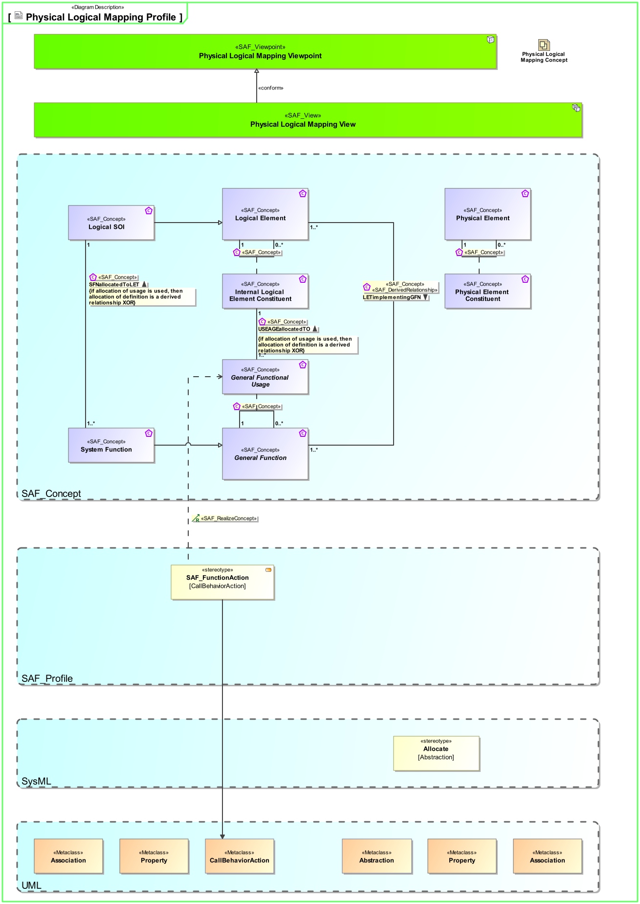

# SAF Development Documentation : Physical Logical Mapping Viewpoint
|**Domain**|**Aspect**|**Maturity**|
| --- | --- | --- |
|[Physical](../../domains.md#Domain-Physical)|[Traceability & Mapping](../../aspects.md#Aspect-Traceability-&-Mapping)|[released](../../using-saf/maturity.md#released)|
## Example

## Purpose
The Physical Logical Mapping Viewpoint specifies the assignment of the Logical System Elements to the Physical System Elements.
## Applicability
The Physical Functional Mapping Viewpoint supports the "System Architecture Definition process" activities of the INCOSE SYSTEMS ENGINEERING HANDBOOK 2015  .
## Presentation
A  Physical To Logical Assigment Matrix featuring
* Logical Elements roles
* Physical Elements roles
* allocation relationships from logical elements roles to physical elements roles

## Stakeholder
* [Hardware Developer](../../stakeholders.md#Hardware-Developer)
* [IV&V Engineer](../../stakeholders.md#IV&V-Engineer)
* [Mechanic Developer](../../stakeholders.md#Mechanic-Developer)
* [Software Developer](../../stakeholders.md#Software-Developer)
* [System Architect](../../stakeholders.md#System-Architect)
## Concern
* [Which conceptual Logical Elements are allocated to Physical Elements in the physical architecture](../../concerns.md#_2021x_2_8710274_1698399385413_529894_33129)
## Profile Model Reference
The following Stereotypes / Model Elements are used in the Viewpoint:
|Stereotype | realized Concept|
|---|---|
|Allocate [SysML Profile]|[ILERspecifyingAPR](../concept/concepts.md#ILERspecifyingAPR)|
|Attribute "logical_element" of SAF_PhysicalItem referencing SAF_LogicalElement|[LETspecifyingAPE](../concept/concepts.md#LETspecifyingAPE)|
|[SAF_LogicalElement](../../stereotypes.md#SAF_LogicalElement)|[Logical Element](../concept/concepts.md#Logical-Element)|
|SAF_LogicalInternalRole contained in SAF_LogicalElement|[Internal Logical Element Role](../concept/concepts.md#Internal-Logical-Element-Role)|
|SAF_PhysicalInternalRole contained in SAF_PhysicalItem|[Physical Hardware Role](../concept/concepts.md#Physical-Hardware-Role)|
|SAF_PhysicalInternalRole contained in SAF_PhysicalItem|[Hardware Element Role](../concept/concepts.md#Hardware-Element-Role)|
|SAF_PhysicalInternalRole contained in SAF_PhysicalItem|[Software Element Role](../concept/concepts.md#Software-Element-Role)|
|SAF_PhysicalInternalRole contained in SAF_PhysicalItem|[Physical Element Role](../concept/concepts.md#Physical-Element-Role)|
|SAF_PhysicalInternalRole contained in SAF_PhysicalItem|[Physical Software Role](../concept/concepts.md#Physical-Software-Role)|
|[SAF_PhysicalInternalRole](../../stereotypes.md#SAF_PhysicalInternalRole)|[General Physical Role](../concept/concepts.md#General-Physical-Role)|
|[SAF_SPV08a_View](../../stereotypes.md#SAF_SPV08a_View)|[Physical Logical Mapping Viewpoint](../concept/concepts.md#Physical-Logical-Mapping-Viewpoint)|
## Input from other Viewpoints
### Required Viewpoints
* [Logical Functional Mapping Viewpoint](Logical-Functional-Mapping-Viewpoint.md)
* [Logical Structure Viewpoint](Logical-Structure-Viewpoint.md)
* [Physical Structure Viewpoint](Physical-Structure-Viewpoint.md)
### Recommended Viewpoints
*none*
# Viewpoint Concept and Profile Diagrams
## Concept

## Profile

