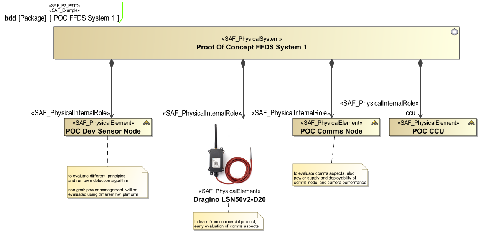
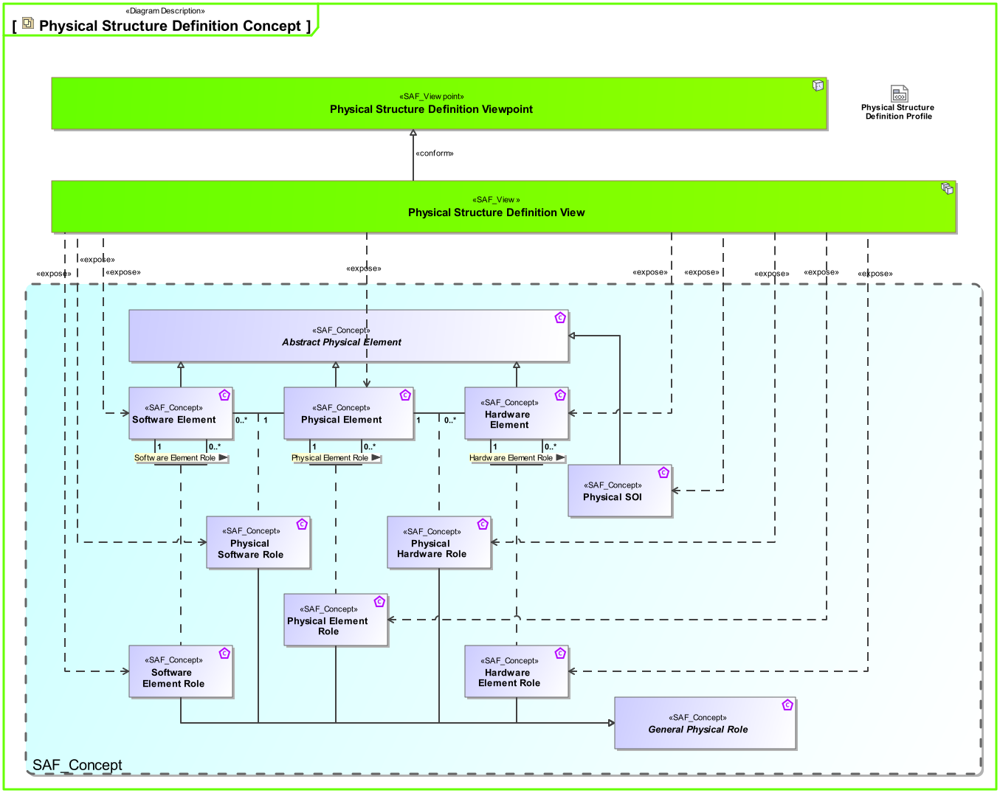
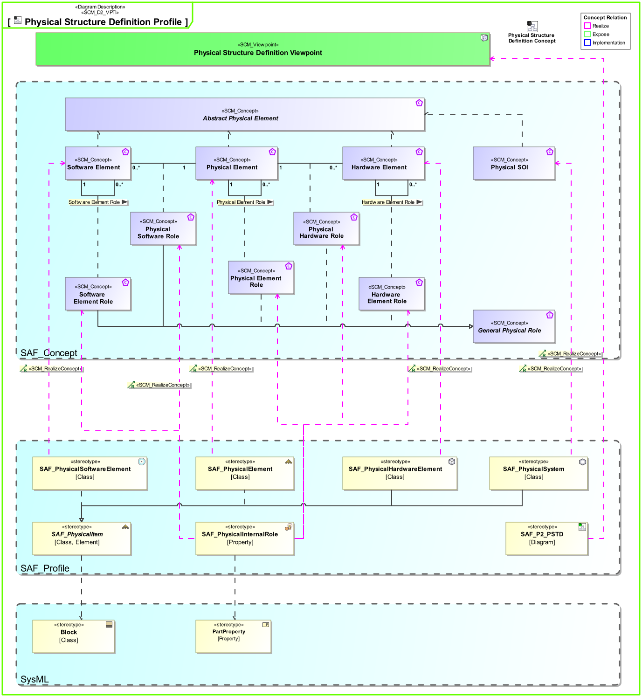

# SAF Development Documentation : **P2_PSTD** Physical Structure Definition Viewpoint
|**Domain**|**Aspect**|**Maturity**|
| --- | --- | --- |
|[Physical](../../domains.md#Domain-Physical)|[Taxonomy & Structure](../../aspects.md#Aspect-Taxonomy-&-Structure)|[released](../../using-saf/maturity.md#released)|
## Example

## Purpose
The Physical Structure Viewpoint is used to model the internal structure of the SOI and to identify the internal system elements making up the SOI. The SOI breakdown structure identifies system elements and finally at the implementation level hardware, software, and mechanics. The SOI breakdown structure determines items that are reused and make-or-buy (COTS) items. The Physical Structure Viewpoint is elaborated for each candidate physical SOI architecture. It provides the basis for further assessment of the architecture candidates by identifying the system elements in each candidate solution.
## Applicability
The Physical Structure Viewpoint supports the “Design Definition Process” activities of the INCOSE SYSTEMS ENGINEERING HANDBOOK 2023 [§2.3.5.5] and contributes to the artifact "System Design Description". 

Furthermore, the Physical Structure Viewpoint supports the "Allocation and Partitioning of Logical Entities to Physical Entities" activities of the INCOSE SYSTEMS ENGINEERING HANDBOOK 2015 [§4.4.2.7].
## Presentation
A block definition diagram (BDD) featuring the physical system block and physical blocks for any kind of physical element, HW or SW elements, the system is composed of. These elements are connected to the system block by means of aggregation relationships. 
Note: Multiple relationships to a kind of element are allowed meaning, that this kind of element is used in several roles.

## Stakeholder
* [IV&V Engineer](../../stakeholders.md#IV&V-Engineer)
* [Safety Expert](../../stakeholders.md#Safety-Expert)
* [Security Expert](../../stakeholders.md#Security-Expert)
* [System Architect](../../stakeholders.md#System-Architect)
## Concern
* [What is the physical breakdown of the system?](../../concerns.md#_2021x_2_8710274_1674576759117_113432_23531)
## Profile Model Reference
The following Stereotypes / Model Elements are used in the Viewpoint:
|Stereotype | realized Concept|
|---|---|
|[SAF_P2_PSTD](../../stereotypes.md#SAF_P2_PSTD)|[Physical Structure Definition Viewpoint](../concept/concepts.md#Physical-Structure-Definition-Viewpoint)|
|[SAF_PhysicalElement](../../stereotypes.md#SAF_PhysicalElement)|[Physical Element](../concept/concepts.md#Physical-Element)|
|[SAF_PhysicalHardwareElement](../../stereotypes.md#SAF_PhysicalHardwareElement)|[Hardware Element](../concept/concepts.md#Hardware-Element)|
|SAF_PhysicalInternalRole contained in SAF_PhysicalItem|[Hardware Element Role](../concept/concepts.md#Hardware-Element-Role)|
|SAF_PhysicalInternalRole contained in SAF_PhysicalItem|[Physical Element Role](../concept/concepts.md#Physical-Element-Role)|
|SAF_PhysicalInternalRole contained in SAF_PhysicalItem|[Physical Hardware Role](../concept/concepts.md#Physical-Hardware-Role)|
|SAF_PhysicalInternalRole contained in SAF_PhysicalItem|[Physical Software Role](../concept/concepts.md#Physical-Software-Role)|
|SAF_PhysicalInternalRole contained in SAF_PhysicalItem|[Software Element Role](../concept/concepts.md#Software-Element-Role)|
|[SAF_PhysicalSoftwareElement](../../stereotypes.md#SAF_PhysicalSoftwareElement)|[Software Element](../concept/concepts.md#Software-Element)|
|[SAF_PhysicalSystem](../../stereotypes.md#SAF_PhysicalSystem)|[Physical SOI](../concept/concepts.md#Physical-SOI)|
## Input from other Viewpoints
### Required Viewpoints
*none*
### Recommended Viewpoints
*none*
# Viewpoint Concept and Profile Diagrams
## Concept

## Profile

