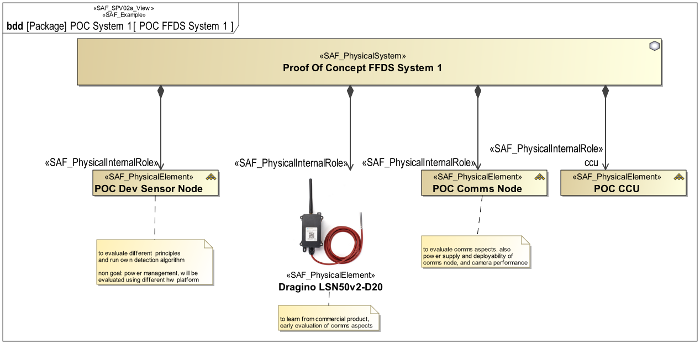

# SAF Development Documentation : Physical Structure Viewpoint
|**Domain**|**Aspect**|**Maturity**|
| --- | --- | --- |
|[Physical](../../domains.md#Domain-Physical)|[Taxonomy & Structure](../../aspects.md#Aspect-Taxonomy-&-Structure)|[released](../../using-saf/maturity.md#released)|
## Example

## Purpose
The Physical Structure Viewpoint is used to model the internal structure of the SOI and to identify the internal system elements making up the SOI. The SOI breakdown structure identifies system elements and finally on implementation level hardware, software, mechanics. The SOI breakdown structure determines items that are reused and make or buy (COTS) items. The Physical Structure Viewpoint is elaborated for each candidate physical SOI architecture. It provides the basis for further assessment of the architecture candidates by identifying the system elements in each candidate solution.

## Applicability
The Physical Structure Viewpoint supports the "Allocation and Partitioning of Logical Entities to Physical Entities" activities of the INCOSE SYSTEMS ENGINEERING HANDBOOK 2015 [§ 4.4.2.7]. The Physical Structure Viewpoint presents the product breakdown structure of a technical solution for the SOI providing all the identified external interface(s), a structure capable to implement the functionality identified in the logical Viewpoint(s).

The Physical Physical Structure Viewpoint supports the “Design Definition Process” activities of the INCOSE SYSTEMS ENGINEERING HANDBOOK 2023 [§ 2.3.5.5]. and contributes to the artifact "System Design Description".
 
The Viewpoint is used to identify system elements of the physical architecture.

## Presentation
## Stakeholder
* [IV&V Engineer](../../stakeholders.md#IV&V-Engineer)
* [Safety Expert](../../stakeholders.md#Safety-Expert)
* [Security Expert](../../stakeholders.md#Security-Expert)
* [System Architect](../../stakeholders.md#System-Architect)
## Concern
* What is the physical breakdown of the system?
## Profile Model Reference
The following Stereotypes / Model Elements are used in the Viewpoint:
|Stereotype | realized Concept|
|---|---|
|[SAF_PhysicalElement](../../stereotypes.md#SAF_PhysicalElement)|[Physical Element](../concept/concepts.md#Physical-Element)|
|[SAF_PhysicalHardwareElement](../../stereotypes.md#SAF_PhysicalHardwareElement)|[Hardware Element](../concept/concepts.md#Hardware-Element)|
|[SAF_PhysicalInternalRole](../../stereotypes.md#SAF_PhysicalInternalRole)|[Hardware Element Constituent](../concept/concepts.md#Hardware-Element-Constituent)|
|[SAF_PhysicalInternalRole](../../stereotypes.md#SAF_PhysicalInternalRole)|[Physical Element Constituent](../concept/concepts.md#Physical-Element-Constituent)|
|[SAF_PhysicalInternalRole](../../stereotypes.md#SAF_PhysicalInternalRole)|[Physical Hardware Constituent](../concept/concepts.md#Physical-Hardware-Constituent)|
|[SAF_PhysicalInternalRole](../../stereotypes.md#SAF_PhysicalInternalRole)|[Physical Software Constituent](../concept/concepts.md#Physical-Software-Constituent)|
|[SAF_PhysicalInternalRole](../../stereotypes.md#SAF_PhysicalInternalRole)|[Software Element Constituent](../concept/concepts.md#Software-Element-Constituent)|
|[SAF_PhysicalSoftwareElement](../../stereotypes.md#SAF_PhysicalSoftwareElement)|[Software Element](../concept/concepts.md#Software-Element)|
|[SAF_PhysicalSystem](../../stereotypes.md#SAF_PhysicalSystem)|[Physical SOI](../concept/concepts.md#Physical-SOI)|
|[SAF_SPV02a_View](../../stereotypes.md#SAF_SPV02a_View)|[Physical Structure Viewpoint](../concept/concepts.md#Physical-Structure-Viewpoint)|
## Input from other Viewpoints
### Required Viewpoints
*none*
### Recommended Viewpoints
*none*
# Viewpoint Concept and Profile Diagrams
## Concept

## Profile

