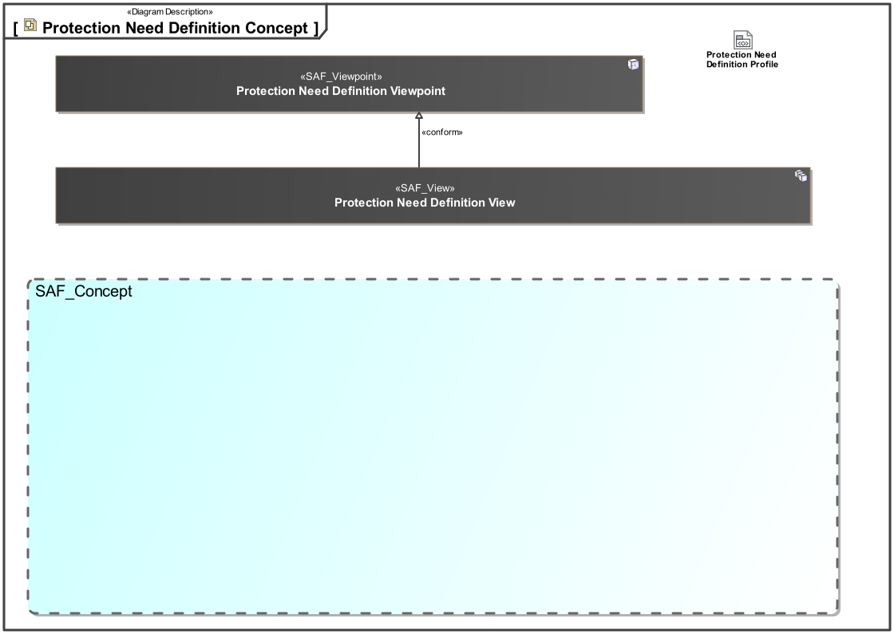
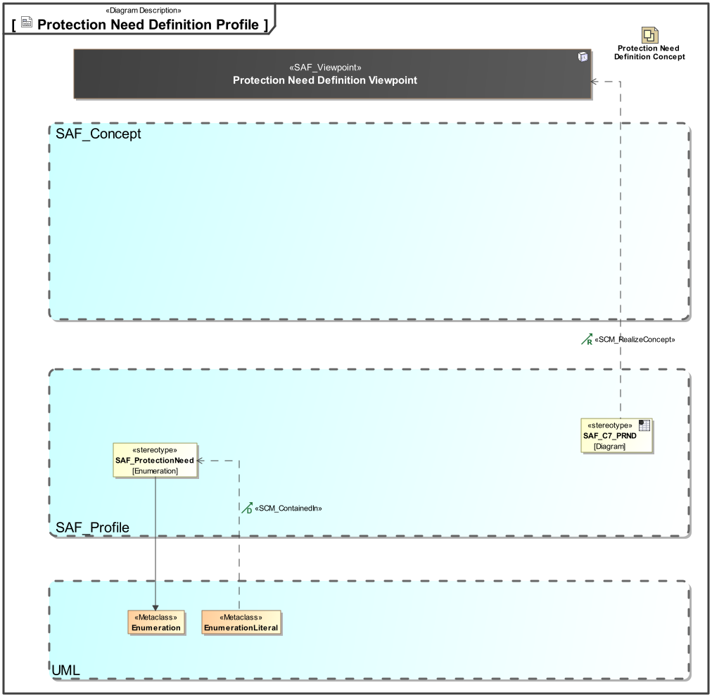

# SAF Development Documentation : **C2_TRMD** Protection Need Definition Viewpoint
|**Domain**|**Aspect**|**Maturity**|
| --- | --- | --- |
|[Common](../../domains.md#Domain-Common)|[Taxonomy & Structure](../../aspects.md#Aspect-Taxonomy-&-Structure)|[proposed](../../using-saf/maturity.md#proposed)|
## Example
*none*
## Purpose
The Protection Nee Definition Viewpoint supports the definition of protection needs used to assign to Domain Items in order to define security classifications.
## Applicability
The Common Terms Definition Viewpoint supports the ....[tbd] activity part of the...  [tbd]... activities of the INCOSE SYSTEMS ENGINEERING HANDBOOK 2023 [§ tbd ].
## Presentation
A table format listing  terms ...[tbd].

A table format listing abbreviations and relationship to standards if applicable... [tbd].

## Stakeholder
* [Security Expert](../../stakeholders.md#Security-Expert)
* [System Architect](../../stakeholders.md#System-Architect)
## Concern
* [what is the protection need of information](../../concerns.md#_2024x_26f0132_1715865876648_409885_16315)
* [what is the security level of information handled by the system or system elements](../../concerns.md#_2024x_26f0132_1715866272828_61432_16469)
## Profile Model Reference
The following Stereotypes / Model Elements are used in the Viewpoint:
|Stereotype | realized Concept|
|---|---|
|EnumerationLiteral contained in SAF_ProtectionNeed|[PNCdefinesPRN](../concept/concepts.md#PNCdefinesPRN)|
|EnumerationLiteral contained in SAF_ProtectionNeed|[PRBhigherThanPRN](../concept/concepts.md#PRBhigherThanPRN)|
|EnumerationLiteral contained in SAF_ProtectionNeed|[Protection Need](../concept/concepts.md#Protection-Need)|
|[SAF_C7_PRND](../../stereotypes.md#SAF_C7_PRND)|[Protection Need Definition Viewpoint](../concept/concepts.md#Protection-Need-Definition-Viewpoint)|
|[SAF_ProtectionNeed](../../stereotypes.md#SAF_ProtectionNeed)|[Protection Need Category](../concept/concepts.md#Protection-Need-Category)|
## Input from other Viewpoints
### Required Viewpoints
* [System Domain Item Kind Viewpoint](System-Domain-Item-Kind-Viewpoint.md)
### Recommended Viewpoints
* [Operational Domain Item Kind Viewpoint](Operational-Domain-Item-Kind-Viewpoint.md)
# Viewpoint Concept and Profile Diagrams
## Concept

## Profile

