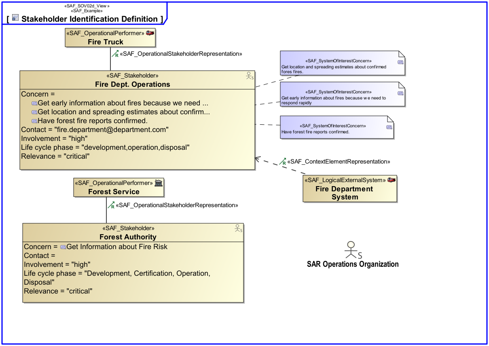
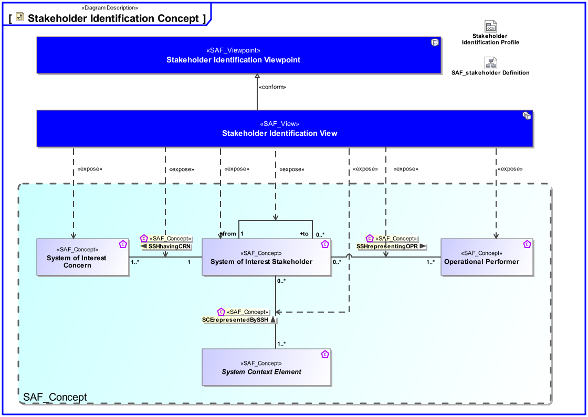
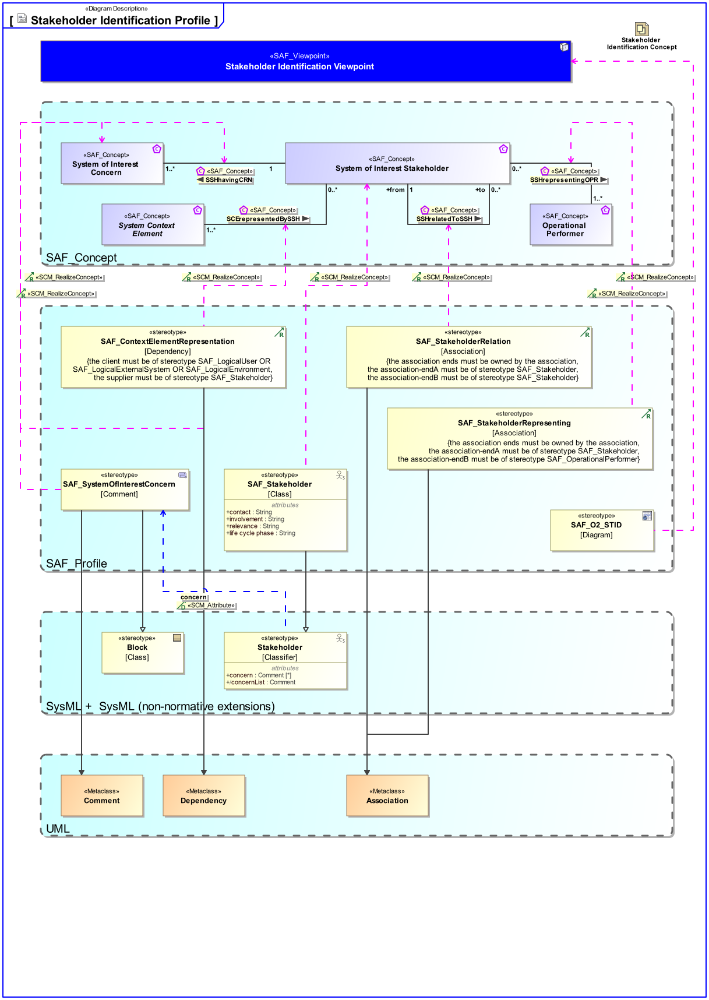

# SAF Development Documentation : Stakeholder Identification Viewpoint
|**Domain**|**Aspect**|**Maturity**|
| --- | --- | --- |
|[Operational](../../domains.md#Domain-Operational)|[Taxonomy & Structure](../../aspects.md#Aspect-Taxonomy-&-Structure)|[released](../../using-saf/maturity.md#released)|
## Example

## Purpose
The Stakeholder Identification Viewpoint of the operational domain strives to identify Stakeholders, whose needs shall be considered during the operation of the intended solution and the execution of the operational processes to support the identified operational capabilities. 
A Stakeholder identification is distinguishing which parties are classified as Stakeholders in a project, either because they can influence the project or because they are directly affected by the result. A Stakeholder analysis is a process of analyzing individuals, teams, or organizations throughout the project life cycle, grouping them according to their levels of participation, interest, and influence in the project, and determining how best to involve and communicate with each of these Stakeholder groups throughout. During the realization of the Intended Solution additional Stakeholders shall be identified having additional needs and requirements, e.g., regarding production of system elements or certain technologies.
## Applicability
The Stakeholder Identification Viewpoint supports the "Business or Mission Analysis Process" and the "Stakeholder Needs and Requirements Definition Process" activities of the INCOSE SYSTEMS ENGINEERING HANDBOOK 2023 [§2.3.5.1, §2.3.5.2] and contributes to the major Stakeholder identification.
## Presentation
A block definition diagram (BDD) depicting the identified, analysed, and classified Stakeholders and their relations to the Intended Solution.

## Stakeholder
* [Acquirer](../../stakeholders.md#Acquirer)
* [Hardware Developer](../../stakeholders.md#Hardware-Developer)
* [Project Manager](../../stakeholders.md#Project-Manager)
* [Software Developer](../../stakeholders.md#Software-Developer)
* [Supplier](../../stakeholders.md#Supplier)
* [System Architect](../../stakeholders.md#System-Architect)
## Concern
* [In which phases of the life cycle is a Stakeholder involved in the project?](../../concerns.md#_2021x_2_8710274_1674576758728_957718_23218)
* [What concerns and rationals does a Stakeholder have?](../../concerns.md#_2021x_2_8710274_1674576759190_739382_23597)
* [What relevant relations and influences exist between Stakeholders?](../../concerns.md#_2021x_2_8710274_1674576759059_36560_23481)
* [Which Stakeholders are relevant to the system and might impose requirements?](../../concerns.md#_2021x_2_8710274_1674576758881_572143_23359)
* [Which external entities (external systems, environments, etc.) does a Stakeholder represent?](../../concerns.md#_2021x_2_8710274_1674576758668_120660_23139)
* [Who are the (Major) Stakeholders involved in the intended solution?](../../concerns.md#_2021x_2_8710274_1674576759083_315449_23499)
## Profile Model Reference
The following Stereotypes / Model Elements are used in the Viewpoint:
|Stereotype | realized Concept|
|---|---|
|Attribute "concern" of Stakeholder referencing SAF_SystemOfInterestConcern|[SSHhavingCRN](../concept/concepts.md#SSHhavingCRN)|
|[SAF_ContextElementRepresentation](../../stereotypes.md#SAF_ContextElementRepresentation)|[SCErepresentedBySSH](../concept/concepts.md#SCErepresentedBySSH)|
|[SAF_OperationalStakeholderRepresentation](../../stereotypes.md#SAF_OperationalStakeholderRepresentation)|[SSHrepresentingOPR](../concept/concepts.md#SSHrepresentingOPR)|
|[SAF_SOV02d_View](../../stereotypes.md#SAF_SOV02d_View)|[Stakeholder Identification Viewpoint](../concept/concepts.md#Stakeholder-Identification-Viewpoint)|
|[SAF_StakeholderRelation](../../stereotypes.md#SAF_StakeholderRelation)|[SSHrelatedToSSH](../concept/concepts.md#SSHrelatedToSSH)|
|[SAF_Stakeholder](../../stereotypes.md#SAF_Stakeholder)|[System of Interest Stakeholder](../concept/concepts.md#System-of-Interest-Stakeholder)|
|[SAF_SystemOfInterestConcern](../../stereotypes.md#SAF_SystemOfInterestConcern)|[System of Interest Concern](../concept/concepts.md#System-of-Interest-Concern)|
## Input from other Viewpoints
### Required Viewpoints
*none*
### Recommended Viewpoints
* [Operational Story Viewpoint](Operational-Story-Viewpoint.md)
* [Operational Performer Viewpoint](Operational-Performer-Viewpoint.md)
# Viewpoint Concept and Profile Diagrams
## Concept

## Profile

