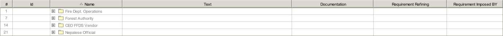
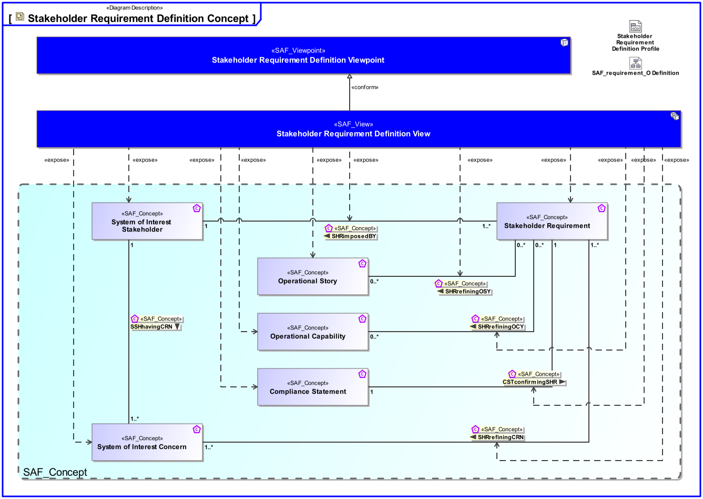
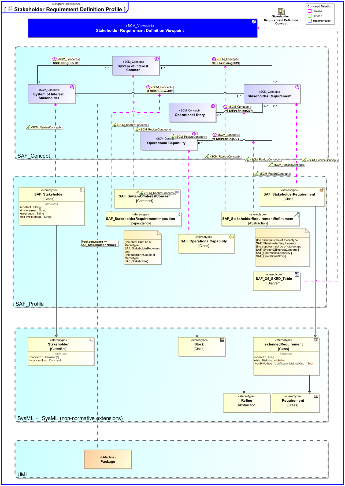

# SAF Development Documentation : **O6_SKRD** Stakeholder Requirement Definition Viewpoint
|**Domain**|**Aspect**|**Maturity**|
| --- | --- | --- |
|[Operational](../../domains.md#Domain-Operational)|[Requirement](../../aspects.md#Aspect-Requirement)|[released](../../using-saf/maturity.md#released)|
## Example

## Purpose
The Stakeholder Requirement Definition Viewpoint specifies all capabilities, functions and properties, that the intended solution shall possess or expose from the perspective of the Stakeholders. The Stakeholder Requirement Definition Viewpoint also captures constraints for the system to be developed from stakeholders perspective.
## Applicability
The Stakeholder Requirement Viewpoint supports the "Stakeholder Needs and Requirements Definition Process" activities of the INCOSE SYSTEMS ENGINEERING HANDBOOK 2015 [§ 4.2] and contributes to the identification of solution constraints.
## Presentation
A tabular format lisiting
* unique requirement ID, text, and attributes,
* traceability reference to justifying model artefacts, e.g. operational stories, operational capabilities, identified concerns of stakeholders, and compliance statements
Note: Stakeholder Requirements are to be structured in a way that the Stakeholder behind the Requirement is identifiable. When appropriate, the relationships between identified Stakeholder Requirements are and the justifying model artefacts, Operational Story, Operational Capability, Operational Performer, Operational Process, and Operational Exchange are presented.
* "One Requirement Package for each Stakeholder" is a best-practice modeling rule. A package contains the Requirements specific for one Stakeholder.
* Even if different Stakeholders may have intersecting interests and / or concerns resulting in a similar set of Requirements, each Stakeholder shall have its own set managed in a dedicated Requirement Package. Requirements must not be shared due to their different life cycles. Resolving duplications and conflicts is subject of the requirement analysis resulting in an agreed and consolidated set of System Requirements.

## Stakeholder
* [Acquirer](../../stakeholders.md#Acquirer)
* [Customer](../../stakeholders.md#Customer)
* [System Architect](../../stakeholders.md#System-Architect)
## Concern
* [What are the normal and extreme environmental conditions for normal operation, for not operational, for storage, and for transport?](../../concerns.md#_2021x_2_8710274_1674576758810_143872_23303)
* [What are the requirements of environmental conditions imposed on the system?](../../concerns.md#_2021x_2_8710274_1674576758798_122991_23285)
* [What are the requirements that a Stakeholder imposes on the system?](../../concerns.md#_2021x_2_8710274_1674576758774_361095_23253)
* [What defines a valid solution towards the customer?](../../concerns.md#_2021x_2_8710274_1674576758818_166273_23310)
* [What is the range of acceptable system performance, i.e. the critical, top-level performance requirements derived from the operational needs?](../../concerns.md#_2021x_2_8710274_1674576759042_480392_23467)
## Profile Model Reference
The following Stereotypes / Model Elements are used in the Viewpoint:
|Stereotype | realized Concept|
|---|---|
|Package [UML_Standard_Profile]|[SHRimposedBY](../concept/concepts.md#SHRimposedBY)|
|[SAF_O6_SKRD_Table](../../stereotypes.md#saf_o6_skrd_table)|[Stakeholder Requirement Definition Viewpoint](../concept/concepts.md#Stakeholder-Requirement-Definition-Viewpoint)|
|[SAF_OperationalCapability](../../stereotypes.md#saf_operationalcapability)|[Operational Capability](../concept/concepts.md#Operational-Capability)|
|[SAF_StakeholderRequirementImposition](../../stereotypes.md#saf_stakeholderrequirementimposition)|[SHRimposedBY](../concept/concepts.md#SHRimposedBY)|
|[SAF_StakeholderRequirementRefinement](../../stereotypes.md#saf_stakeholderrequirementrefinement)|[SHRrefiningCRN](../concept/concepts.md#SHRrefiningCRN)|
|[SAF_StakeholderRequirementRefinement](../../stereotypes.md#saf_stakeholderrequirementrefinement)|[SHRrefiningOCY](../concept/concepts.md#SHRrefiningOCY)|
|[SAF_StakeholderRequirementRefinement](../../stereotypes.md#saf_stakeholderrequirementrefinement)|[SHRrefiningOSY](../concept/concepts.md#SHRrefiningOSY)|
|[SAF_StakeholderRequirement](../../stereotypes.md#saf_stakeholderrequirement)|[Stakeholder Requirement](../concept/concepts.md#Stakeholder-Requirement)|
|[SAF_Stakeholder](../../stereotypes.md#saf_stakeholder)|[System of Interest Stakeholder](../concept/concepts.md#System-of-Interest-Stakeholder)|
|[SAF_SystemOfInterestConcern](../../stereotypes.md#saf_systemofinterestconcern)|[System of Interest Concern](../concept/concepts.md#System-of-Interest-Concern)|
## Input from other Viewpoints
### Required Viewpoints
* [Stakeholder Identification Viewpoint](Stakeholder-Identification-Viewpoint.md)
### Recommended Viewpoints
* [Operational Story Viewpoint](Operational-Story-Viewpoint.md)
* [Operational Performer Viewpoint](Operational-Performer-Viewpoint.md)
# Viewpoint Concept and Profile Diagrams
## Concept

## Profile

