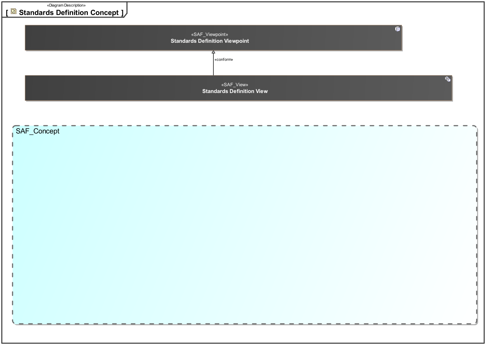
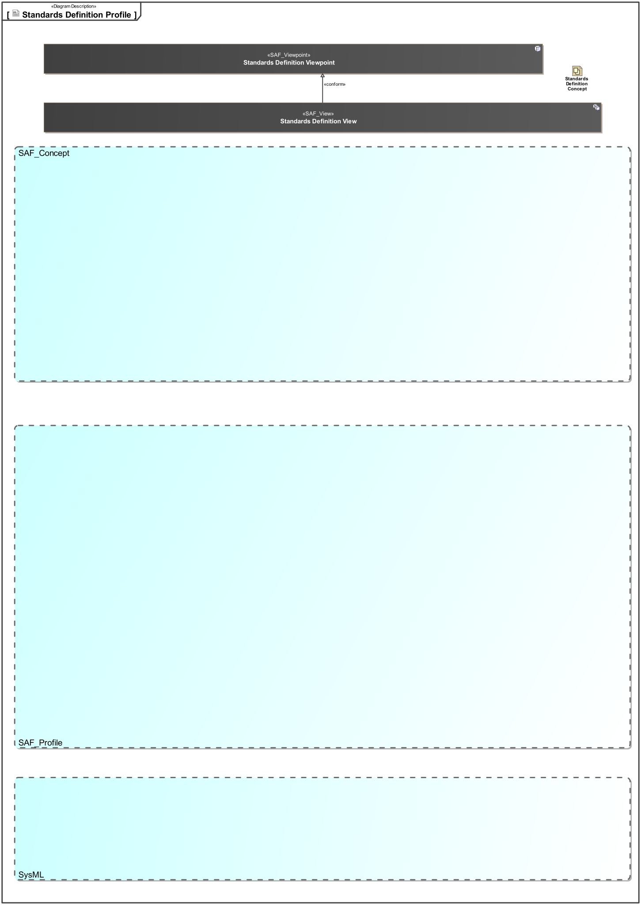

# SAF Development Documentation : Standards Definition Viewpoint
|**Domain**|**Aspect**|**Maturity**|
| --- | --- | --- |
|[Common](../../domains.md#Domain-Common)|[Taxonomy & Structure](../../aspects.md#Aspect-Taxonomy-&-Structure)|[proposed](../../using-saf/maturity.md#proposed)|
## Example
*none*
## Purpose
The Standards Definition Viewpoint supports [tbd].
## Applicability
The..
## Stakeholder
## Concern
## Presentation
The..

## Profile Model Reference
|Stereotype | realized Concept|
|---|---|
## Input from other Viewpoints
### Required Viewpoints
*none*
### Recommended Viewpoints
*none*
# Viewpoint Concept and Profile Diagrams
## Concept

## Profile

