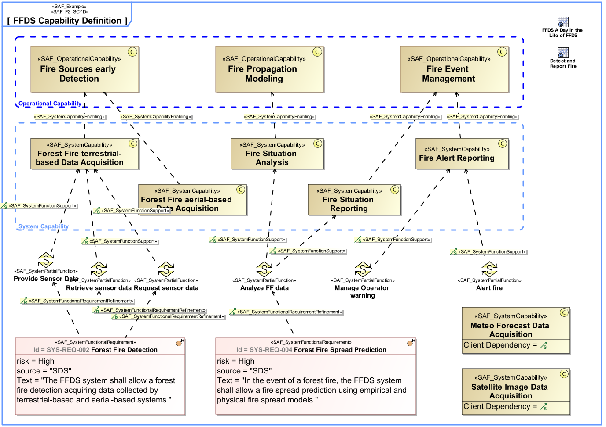
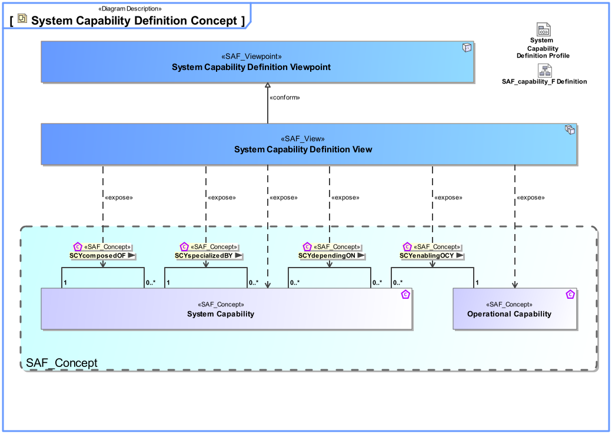
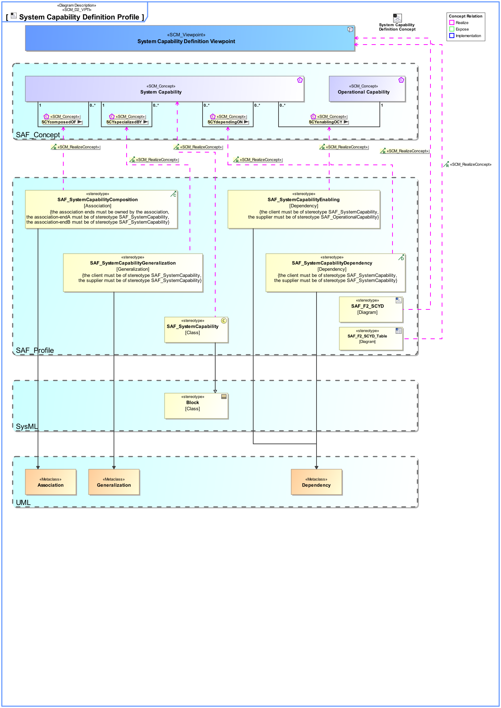

# SAF Development Documentation : **F2_SCYD** System Capability Definition Viewpoint
|**Domain**|**Aspect**|**Maturity**|
| --- | --- | --- |
|[Functional](../../domains.md#Domain-Functional)|[Taxonomy & Structure](../../aspects.md#Aspect-Taxonomy-&-Structure)|[released](../../using-saf/maturity.md#released)|
## Example

## Purpose
The System Capability Definition Viewpoint defines a taxonomy of Capabilities including composition, specialization, and dependency relationships between System Capabilities.
Note: Connecting capabilities to requirements creates a linkage between two different types of conceptual problem description that helps manage the complexity of the system. At a high level of abstraction, capabilities allow an system architect to plan phases of the system evolution without the need to bear details in mind. Those details will not be lost if they are captured as requirements and traced to a corresponding capability. There is one key difference between capabilities and requirements: Requirements come from different sources, sponsored by different stakeholders, and are usually captured at different levels of abstraction. In contrast, capabilities should always represent a coherent and consolidated view of the system.
## Applicability
The System Capability Viewpoint supports the "Stakeholder Needs and Requirements Definition Process" and "System Requirements Definition Process" activities of the INCOSE SYSTEMS ENGINEERING HANDBOOK 2015 [§4.2 & §4.3] and contributes to the identification of System Functions, and definition of System Requirements.
## Presentation
A block definition diagram (BDD) featuring System Capabilities, their composition, specialization, and dependency relationships.
Note: The relationship to operational capabilities shall be shown if applicable.

A tabular format listing System Capabilities, their composition, specialisation, and dependency relationships, as well as relations to operational capabilities.

## Stakeholder
* [Acquirer](../../stakeholders.md#Acquirer)
* [Supplier](../../stakeholders.md#Supplier)
* [System Architect](../../stakeholders.md#System-Architect)
## Concern
* [What are the capabilities that are supported by the system?](../../concerns.md#_2021x_2_8710274_1674576759126_506455_23537)
## Profile Model Reference
The following Stereotypes / Model Elements are used in the Viewpoint:
|Stereotype | realized Concept|
|---|---|
|[SAF_F2_SCYD](../../stereotypes.md#SAF_F2_SCYD)|[System Capability Definition Viewpoint](../concept/concepts.md#System-Capability-Definition-Viewpoint)|
|[SAF_F2_SCYD_Table](../../stereotypes.md#SAF_F2_SCYD_Table)|[System Capability Definition Viewpoint](../concept/concepts.md#System-Capability-Definition-Viewpoint)|
|[SAF_SystemCapabilityComposition](../../stereotypes.md#SAF_SystemCapabilityComposition)|[SCYcomposedOF](../concept/concepts.md#SCYcomposedOF)|
|[SAF_SystemCapabilityDependency](../../stereotypes.md#SAF_SystemCapabilityDependency)|[SCYdependingON](../concept/concepts.md#SCYdependingON)|
|[SAF_SystemCapabilityEnabling](../../stereotypes.md#SAF_SystemCapabilityEnabling)|[SCYenablingOCY](../concept/concepts.md#SCYenablingOCY)|
|[SAF_SystemCapabilityGeneralization](../../stereotypes.md#SAF_SystemCapabilityGeneralization)|[SCYspecializedBY](../concept/concepts.md#SCYspecializedBY)|
|[SAF_SystemCapability](../../stereotypes.md#SAF_SystemCapability)|[System Capability](../concept/concepts.md#System-Capability)|
## Input from other Viewpoints
### Required Viewpoints
*none*
### Recommended Viewpoints
* [Operational Capability Definition Viewpoint](Operational-Capability-Definition-Viewpoint.md)
* [System Use Case Viewpoint](System-Use-Case-Viewpoint.md)
* [System Process Viewpoint](System-Process-Viewpoint.md)
# Viewpoint Concept and Profile Diagrams
## Concept

## Profile

