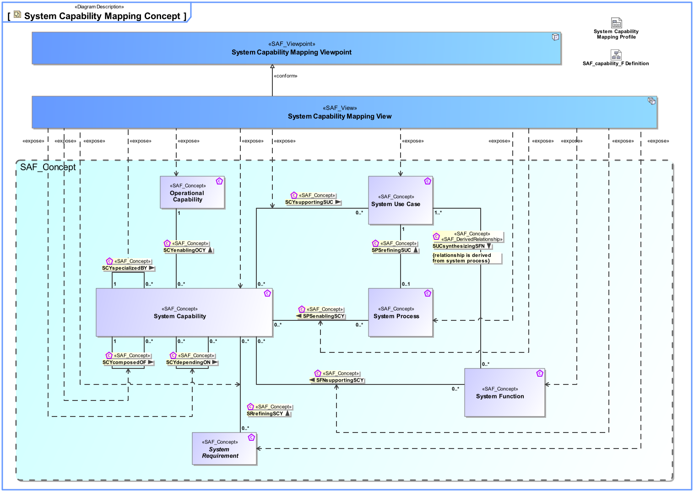
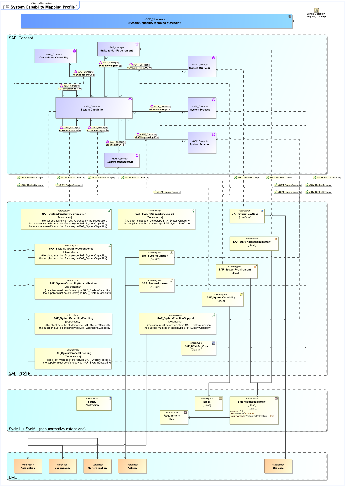

# SAF Development Documentation : **F8_SCYM** System Capability Mapping Viewpoint
|**Domain**|**Aspect**|**Maturity**|
| --- | --- | --- |
|[Functional](../../domains.md#Domain-Functional)|[Traceability & Mapping](../../aspects.md#Aspect-Traceability-&-Mapping)|[released](../../using-saf/maturity.md#released)|
## Example

## Purpose
The System Capability Mapping Viewpoint describes the relationships of System Capabilities. The reasoning for System Capabilities as support for System Use Cases and the contribution of System Processes to Capabilities are described. Furthermore, the mapping of System Capabilities to Operational Capabilities are identified.
## Applicability
The System Capability Mapping Viewpoint supports the "Stakeholder Needs and Requirements Definition Process" and "System Requirements Definition Process" activities of the INCOSE SYSTEMS ENGINEERING HANDBOOK 2015 [§4.2 & §4.3] and contributes to the identification of System Functions, and definition of System Requirements.
## Presentation
A tabular format listing the relationships of System Capabilities to Operational Capabilities, System Use Cases, System Process Activities, and System Requirements.

## Stakeholder
## Concern
## Profile Model Reference
The following Stereotypes / Model Elements are used in the Viewpoint:
|Stereotype | realized Concept|
|---|---|
|[SAF_F8_SCYM_Table](../../stereotypes.md#saf_f8_scym_table)|[System Capability Mapping Viewpoint](../concept/concepts.md#System-Capability-Mapping-Viewpoint)|
|[SAF_StakeholderRequirement](../../stereotypes.md#saf_stakeholderrequirement)|[Stakeholder Requirement](../concept/concepts.md#Stakeholder-Requirement)|
|[SAF_SystemCapabilityComposition](../../stereotypes.md#saf_systemcapabilitycomposition)|[SCYcomposedOF](../concept/concepts.md#SCYcomposedOF)|
|[SAF_SystemCapabilityDependency](../../stereotypes.md#saf_systemcapabilitydependency)|[SCYdependingON](../concept/concepts.md#SCYdependingON)|
|[SAF_SystemCapabilityEnabling](../../stereotypes.md#saf_systemcapabilityenabling)|[SCYenablingOCY](../concept/concepts.md#SCYenablingOCY)|
|[SAF_SystemCapabilityGeneralization](../../stereotypes.md#saf_systemcapabilitygeneralization)|[SCYspecializedBY](../concept/concepts.md#SCYspecializedBY)|
|[SAF_SystemCapabilitySupport](../../stereotypes.md#saf_systemcapabilitysupport)|[SCYsupportingSUC](../concept/concepts.md#SCYsupportingSUC)|
|[SAF_SystemCapability](../../stereotypes.md#saf_systemcapability)|[System Capability](../concept/concepts.md#System-Capability)|
|[SAF_SystemFunctionSupport](../../stereotypes.md#saf_systemfunctionsupport)|[SFNsupportingSCY](../concept/concepts.md#SFNsupportingSCY)|
|[SAF_SystemFunction](../../stereotypes.md#saf_systemfunction)|[System Function](../concept/concepts.md#System-Function)|
|[SAF_SystemProcessEnabling](../../stereotypes.md#saf_systemprocessenabling)|[SPSenablingSCY](../concept/concepts.md#SPSenablingSCY)|
|[SAF_SystemProcess](../../stereotypes.md#saf_systemprocess)|[System Process](../concept/concepts.md#System-Process)|
|[SAF_SystemRequirement](../../stereotypes.md#saf_systemrequirement)|[System Requirement](../concept/concepts.md#System-Requirement)|
|[SAF_SystemUseCase](../../stereotypes.md#saf_systemusecase)|[System Use Case](../concept/concepts.md#System-Use-Case)|
## Input from other Viewpoints
### Required Viewpoints
* [System Capability Definition Viewpoint](System-Capability-Definition-Viewpoint.md)
### Recommended Viewpoints
* [Operational Capability Definition Viewpoint](Operational-Capability-Definition-Viewpoint.md)
* [System Use Case Viewpoint](System-Use-Case-Viewpoint.md)
* [System Process Viewpoint](System-Process-Viewpoint.md)
# Viewpoint Concept and Profile Diagrams
## Concept

## Profile

