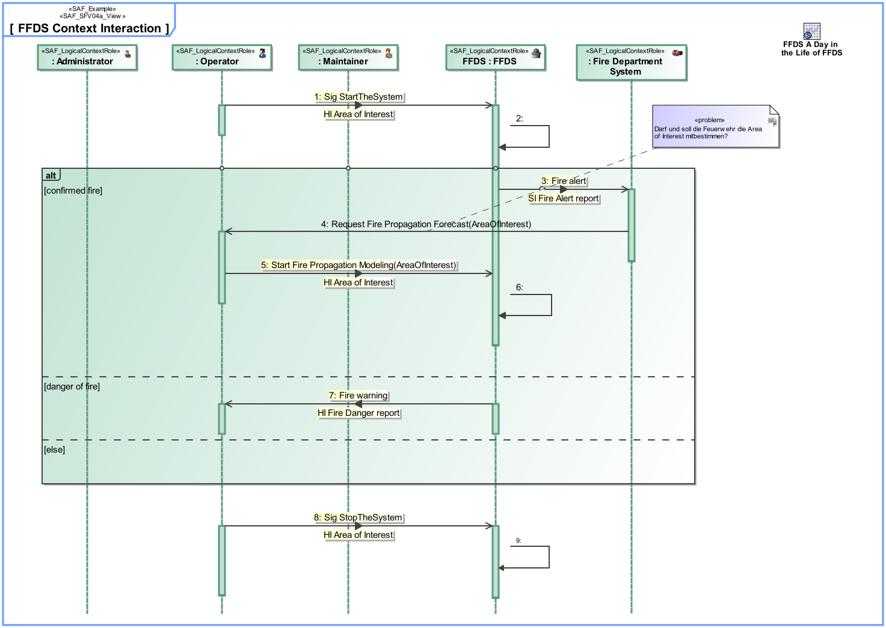

# SAF Development Documentation : System Context Interaction Viewpoint
|**Domain**|**Aspect**|**Maturity**|
| --- | --- | --- |
|[Functional](../../domains.md#Domain-Functional)|[Interaction & Collaboration](../../aspects.md#Aspect-Interaction-&-Collaboration)|[released](../../using-saf/maturity.md#released)|
## Example

## Purpose
The System Context Interaction Viewpoint describes the System external behavior based on the exchange between Logical SOI and Logical Context Elements Usage within a specific System Context. It depicts the sequence of interactions between the Logical SOI, the Context Elements and the Exchanged Domain Item Kinds needed to accomplish a given System Process. 
Note: The System Context Interaction Viewpoint may refine a System Use Case.
## Applicability
The System Context Interaction Viewpoint supports the "Prepare for Requirement Definition" activity included in "System Requirements Definition Process" activities of the INCOSE SYSTEMS ENGINEERING HANDBOOK 2015 [§ 4.3] and contributes to the identification of expected interactions with systems external to the SOI.
## Presentation
A sequence diagram featuring the flow of control between SOI and Context Elements Roles of a System Context to achieve one outcome of a System Use Case. 
Note: This diagram depicts the sending and receiving of messages between the interacting entities called lifelines, where time is represented along the vertical axis. The lifelines representatives are part properties typed by a System Context Elements.

## Stakeholder
* [Acquirer](../../stakeholders.md#Acquirer)
* [Customer](../../stakeholders.md#Customer)
* [Hardware Developer](../../stakeholders.md#Hardware-Developer)
* [IV&V Engineer](../../stakeholders.md#IV&V-Engineer)
* [Operator](../../stakeholders.md#Operator)
* [Regulation Authority](../../stakeholders.md#Regulation-Authority)
* [Safety Expert](../../stakeholders.md#Safety-Expert)
* [Security Expert](../../stakeholders.md#Security-Expert)
* [Software Developer](../../stakeholders.md#Software-Developer)
* [System Architect](../../stakeholders.md#System-Architect)
* [User](../../stakeholders.md#User)
## Concern
* How does the system or a system element interact with the test environment?
* How is the system being used or utilized and interacting with other external systems to satisfy user needs?
* What additional information the system or a system element needs to generate to enable testing?
* What are the items exchanged at the boundary of the system with external entities?
* What is the necessary response time for an interface or a service?
* What is the sequence of interactions among the system and context elements
* Which users does the system support? What the system has to accomplish for these users?
## Profile Model Reference
The following Stereotypes / Model Elements are used in the Viewpoint:
|Stereotype | realized Concept|
|---|---|
|Interaction [UML_Standard_Profile]|[Context Logical Interaction Scenario](../concept/concepts.md#Context-Logical-Interaction-Scenario)|
|Lifeline [UML_Standard_Profile]|[Context Logical Scenario Participation](../concept/concepts.md#Context-Logical-Scenario-Participation)|
|Message [UML_Standard_Profile]|[Context Logical Chronological Message](../concept/concepts.md#Context-Logical-Chronological-Message)|
|[SAF_LogicalContextRole](../../stereotypes.md#SAF_LogicalContextRole)|[Logical Context Element Constituent](../concept/concepts.md#Logical-Context-Element-Constituent)|
|[SAF_LogicalContextRole](../../stereotypes.md#SAF_LogicalContextRole)|[Logical SOI Constituent](../concept/concepts.md#Logical-SOI-Constituent)|
|[SAF_SFV04a_View](../../stereotypes.md#SAF_SFV04a_View)|[System Context Interaction Viewpoint](../concept/concepts.md#System-Context-Interaction-Viewpoint)|
## Input from other Viewpoints
### Required Viewpoints
* [System Context Definition Viewpoint](System-Context-Definition-Viewpoint.md)
### Recommended Viewpoints
* [Operational Context Definition Viewpoint](Operational-Context-Definition-Viewpoint.md)
# Viewpoint Concept and Profile Diagrams
## Concept

## Profile

