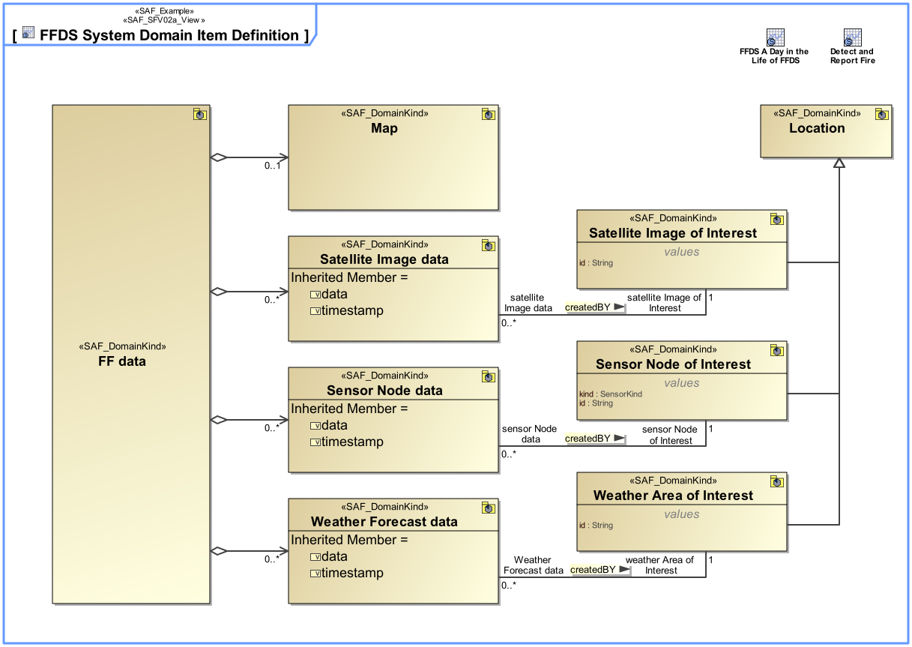
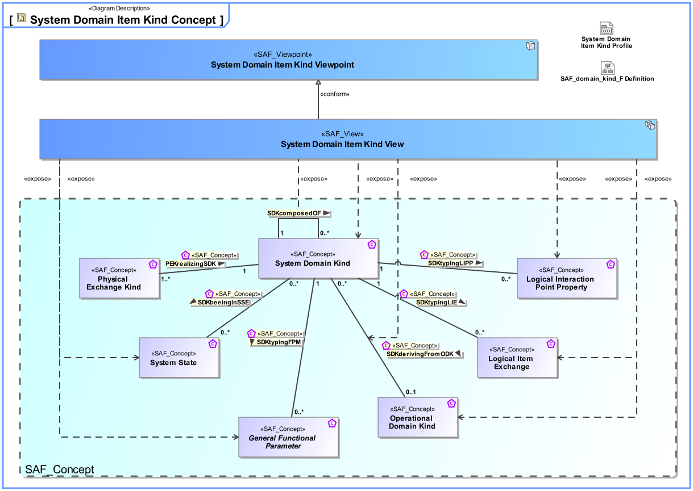
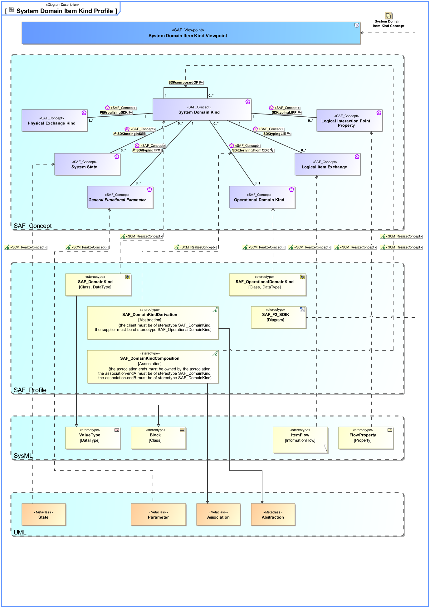

# SAF Development Documentation : System Domain Item Kind Viewpoint
|**Domain**|**Aspect**|**Maturity**|
| --- | --- | --- |
|[Functional](../../domains.md#Domain-Functional)|[Taxonomy & Structure](../../aspects.md#Aspect-Taxonomy-&-Structure)|[released](../../using-saf/maturity.md#released)|
## Example

## Purpose
The System Domain Item Kind Viewpoint captures system wide concepts and collects type definitions for any exchanged item, e.g., information, material, or energy, of the Functional and Logical domain. Its purpose is to define these item types and their relationships. Furthermore, the System Domain Item Kind Viewpoint specifies the data types, entity types, related value types, and units that are used by the SOI.
Note: Domain Item Kinds are used as types of function input and output in the Functional Domain, and for types of interfaces in the Logical Domain. They specify what is to be exchanged but not how.
## Applicability
The System Domain Item Kind Viewpoint supports the "System Requirements Definition Process" activities of the INCOSE SYSTEMS ENGINEERING HANDBOOK 2015 [§4.3] and contributes to the System Function, and the System Interface definition.
## Presentation
A block definition diagram (BDD) featuring Domain Item Kinds and their relationships in terms of generalization, composition, or general association. 
Note: Domain Item Kinds are managed in the domain knowledge package of the SOI, the Domain Item Kinds are visible and usable to all sub elements of the SOI. Domain Item Kinds shall be value types or blocks. 

A tabular format listing the Domain Item Kinds, and their relationships.

## Stakeholder
* [Acquirer](../../stakeholders.md#Acquirer)
* [Customer](../../stakeholders.md#Customer)
* [Safety Expert](../../stakeholders.md#Safety-Expert)
* [Security Expert](../../stakeholders.md#Security-Expert)
* [System Architect](../../stakeholders.md#System-Architect)
## Concern
* Wich data types, entity types, related value types, and units have to be known to the SOI and used by the SOI?
## Profile Model Reference
The following Stereotypes / Model Elements are used in the Viewpoint:
|Stereotype | realized Concept|
|---|---|
|FlowProperty [SysML Profile]|[Logical Connection Property](../concept/concepts.md#Logical-Connection-Property)|
|ItemFlow [SysML Profile]|[Logical Item Exchange](../concept/concepts.md#Logical-Item-Exchange)|
|Parameter [UML_Standard_Profile]|[General Functional Parameter](../concept/concepts.md#General-Functional-Parameter)|
|[SAF_DomainKind](../../stereotypes.md#SAF_DomainKind)|[System Domain Kind](../concept/concepts.md#System-Domain-Kind)|
|[SAF_DomainKindComposition](../../stereotypes.md#SAF_DomainKindComposition)|[SDKcomposedOF](../concept/concepts.md#SDKcomposedOF)|
|[SAF_DomainKindDerivation](../../stereotypes.md#SAF_DomainKindDerivation)|[SDKderivingFromODK](../concept/concepts.md#SDKderivingFromODK)|
|[SAF_OperationalDomainKind](../../stereotypes.md#SAF_OperationalDomainKind)|[Operational Domain Kind](../concept/concepts.md#Operational-Domain-Kind)|
|[SAF_SFV02a_View](../../stereotypes.md#SAF_SFV02a_View)|[System Domain Item Kind Viewpoint](../concept/concepts.md#System-Domain-Item-Kind-Viewpoint)|
|State [UML_Standard_Profile]|[System State](../concept/concepts.md#System-State)|
## Input from other Viewpoints
### Required Viewpoints
*none*
### Recommended Viewpoints
* [Operational Domain Item Kind Viewpoint](Operational-Domain-Item-Kind-Viewpoint.md)
# Viewpoint Concept and Profile Diagrams
## Concept

## Profile

