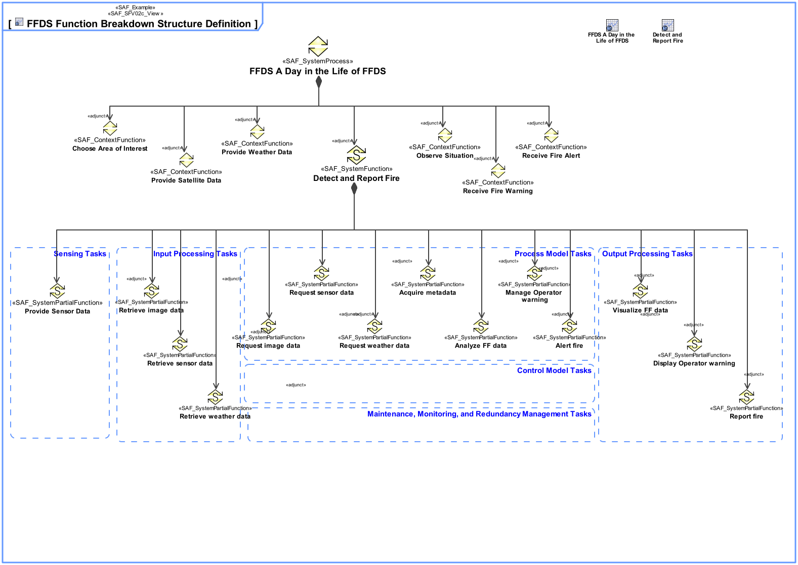
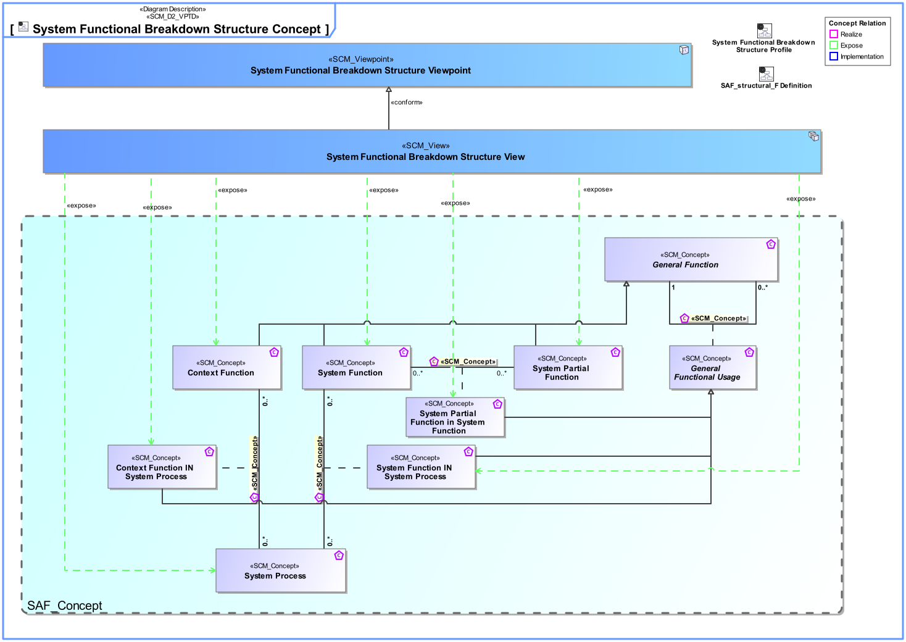
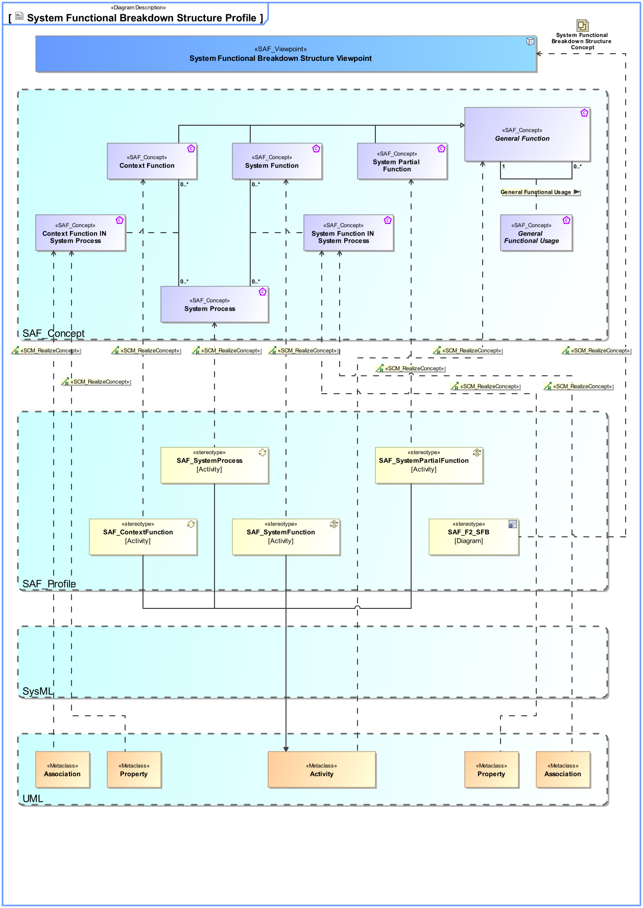

# SAF Development Documentation : System Functional Breakdown Structure Viewpoint
|**Domain**|**Aspect**|**Maturity**|
| --- | --- | --- |
|[Functional](../../domains.md#Domain-Functional)|[Taxonomy & Structure](../../aspects.md#Aspect-Taxonomy-&-Structure)|[released](../../using-saf/maturity.md#released)|
## Example

## Purpose
The System Functional Breakdown Structure Viewpoint defines the structured, modular breakdown of the SOI beginning with System Processes, over identified System Functions further refined down to System Partial Functions. The reuse of System Functions, and System Partial Functions over Function Trees of the SOI is facilitated. Unlike a Work Breakdown Structure (WBS), the Functional Breakdown Structure (FBS) is a function-oriented tree, not a product-oriented one.
## Applicability
The System Functional Breakdown Strcuture Viewpoint supports the "System Requirements Definition Process" activities of the INCOSE SYSTEMS ENGINEERING HANDBOOK 2015 [§4.3] and contributes to the System Function Definition.
## Stakeholder
* [Acquirer](../../stakeholders.md#Acquirer)
* [Customer](../../stakeholders.md#Customer)
* [Hardware Developer](../../stakeholders.md#Hardware-Developer)
* [IV&V Engineer](../../stakeholders.md#IV&V-Engineer)
* [Project Manager](../../stakeholders.md#Project-Manager)
* [Safety Expert](../../stakeholders.md#Safety-Expert)
* [Security Expert](../../stakeholders.md#Security-Expert)
* [Software Developer](../../stakeholders.md#Software-Developer)
* [System Architect](../../stakeholders.md#System-Architect)
## Concern
* How are the system functions decomposed into sub-functions ? 
* What is the breakdown of functions into sub-functions?
* Which functions will the system provide?
## Presentation
One or more more block definition diagrams (BDD) featuring activities representing System Processes, System Functions, System Partial Functions, and their aggregation composing the functional breakdown structure.

Tool specific analysis diagram featuring the relationships between System Processes, System Functions, and System Partial Functions.

## Profile Model Reference
The following Stereotypes / Model Elements are used in the Viewpoint:
|Stereotype | realized Concept|
|---|---|
|Activity [UML_Standard_Profile]|[General Function](../concept/concepts.md#General-Function)|
|Association [UML_Standard_Profile]|[Context Function IN System Process](../concept/concepts.md#Context-Function-IN-System-Process)|
|Association [UML_Standard_Profile]|[System Function IN System Process](../concept/concepts.md#System-Function-IN-System-Process)|
|Property [UML_Standard_Profile]|[Context Function IN System Process](../concept/concepts.md#Context-Function-IN-System-Process)|
|Property [UML_Standard_Profile]|[System Function IN System Process](../concept/concepts.md#System-Function-IN-System-Process)|
|[SAF_ContextFunction](../../stereotypes.md#SAF_ContextFunction)|[Context Function](../concept/concepts.md#Context-Function)|
|[SAF_SFV02c_View](../../stereotypes.md#SAF_SFV02c_View)|[System Functional Breakdown Structure Viewpoint](../concept/concepts.md#System-Functional-Breakdown-Structure-Viewpoint)|
|[SAF_SystemFunction](../../stereotypes.md#SAF_SystemFunction)|[System Function](../concept/concepts.md#System-Function)|
|[SAF_SystemPartialFunction](../../stereotypes.md#SAF_SystemPartialFunction)|[System Partial Function](../concept/concepts.md#System-Partial-Function)|
|[SAF_SystemProcess](../../stereotypes.md#SAF_SystemProcess)|[System Process](../concept/concepts.md#System-Process)|
## Input from other Viewpoints
### Required Viewpoints
*none*
### Recommended Viewpoints
* [System Process Viewpoint](System-Process-Viewpoint.md)
# Viewpoint Concept and Profile Diagrams
## Concept

## Profile

