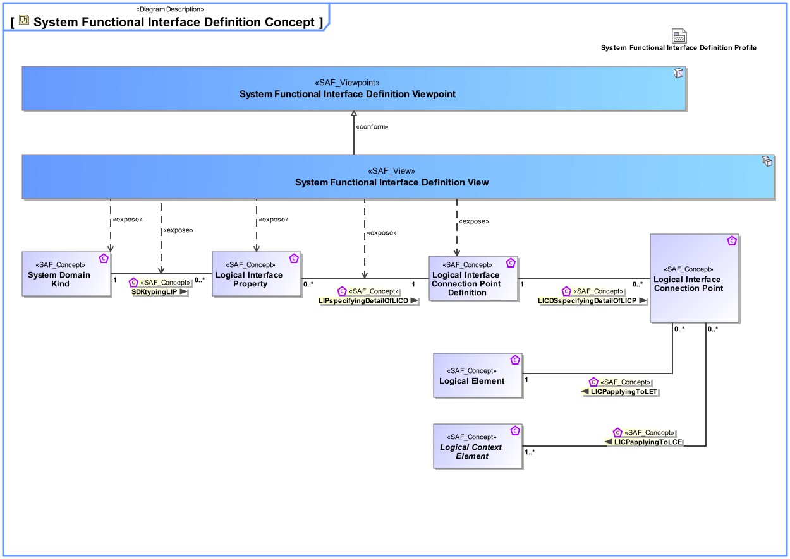
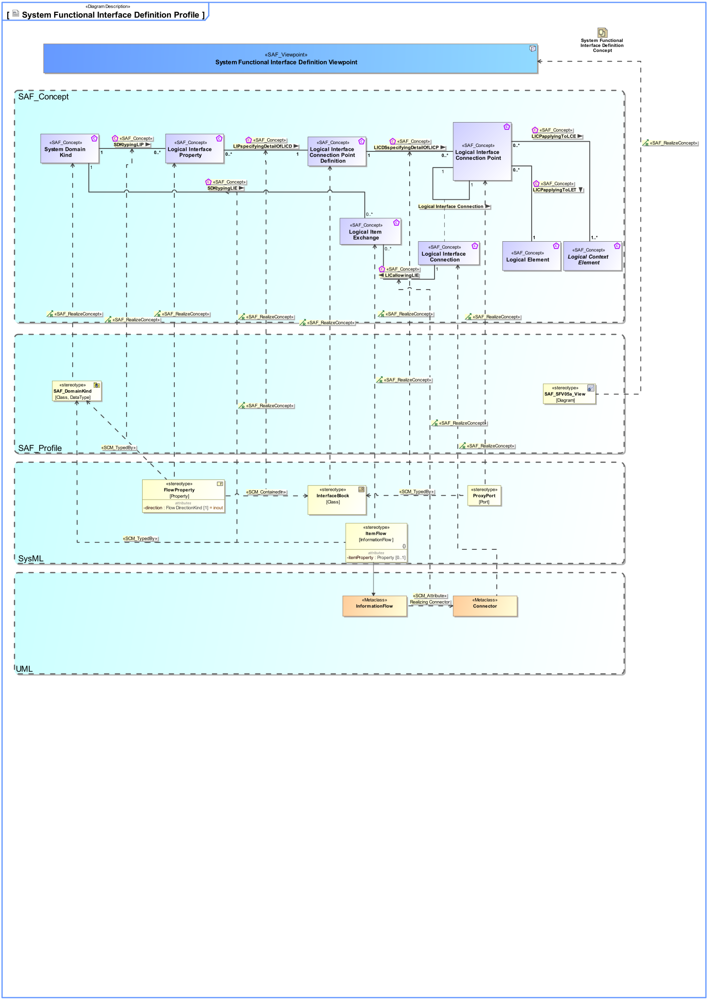

# SAF Development Documentation : System Functional Interface Definition Viewpoint
|**Domain**|**Aspect**|**Maturity**|
| --- | --- | --- |
|[Functional](../../domains.md#Domain-Functional)|[Interface](../../aspects.md#Aspect-Interface)|[released](../../using-saf/maturity.md#released)|
## Example

## Purpose
The System Functional Interface Definition Viewpoint provides definitions used on functional Interfaces used in the system context. It allows to structure interface definitions to improve clarity and manageability.
## Applicability
The System Functional Interface Definition Viewpoint supports The System Context Definition Viewpoint supports the "Prepare for Requirement Definition" activity included in "System Requirements Definition Process" activities of the INCOSE SYSTEMS ENGINEERING HANDBOOK 2015 [§ 4.3] and contributes to the system Functional Interface Identification.
## Stakeholder
## Concern
## Presentation
A BDD featuring Interface Blocks with ports and flow properties. If ports are used they shall be proxy ports, and be typed by interface blocks.

A Table featuringt interface blocks and their ports and flow properties.

## Profile Model Reference
|Stereotype | realized Concept|
|---|---|
|ItemFlow typed by SAF_DomainKind|[SDKtypingLIE](../concept/concepts.md#SDKtypingLIE)|
|FlowProperty contained in InterfaceBlock|[LIPspecifyingDetailOfLICD](../concept/concepts.md#LIPspecifyingDetailOfLICD)|
|ProxyPort typed by InterfaceBlock|[LICDSspecifyingDetailOfLICP](../concept/concepts.md#LICDSspecifyingDetailOfLICP)|
|FlowProperty typed by SAF_DomainKind|[SDKtypingLIP](../concept/concepts.md#SDKtypingLIP)|
|Connector [UML_Standard_Profile]|[Logical Interface Connection](../concept/concepts.md#Logical-Interface-Connection)|
|FlowProperty [SysML Profile]|[Logical Interface Property](../concept/concepts.md#Logical-Interface-Property)|
|InterfaceBlock [SysML Profile]|[Logical Interface Connection Point Definition](../concept/concepts.md#Logical-Interface-Connection-Point-Definition)|
|ItemFlow [SysML Profile]|[Logical Item Exchange](../concept/concepts.md#Logical-Item-Exchange)|
|ProxyPort [SysML Profile]|[Logical Interface Connection Point](../concept/concepts.md#Logical-Interface-Connection-Point)|
|Attribute "Realizing Connector" of InformationFlow referencing Connector|[LICallowingLIE](../concept/concepts.md#LICallowingLIE)|
|[SAF_DomainKind](../../stereotypes.md#SAF_DomainKind)|[System Domain Kind](../concept/concepts.md#System-Domain-Kind)|
|[SAF_SFV05a_View](../../stereotypes.md#SAF_SFV05a_View)|[System Functional Interface Definition Viewpoint](../concept/concepts.md#System-Functional-Interface-Definition-Viewpoint)|
## Input from other Viewpoints
### Required Viewpoints
*none*
### Recommended Viewpoints
*none*
# Viewpoint Concept and Profile Diagrams
## Concept

## Profile

