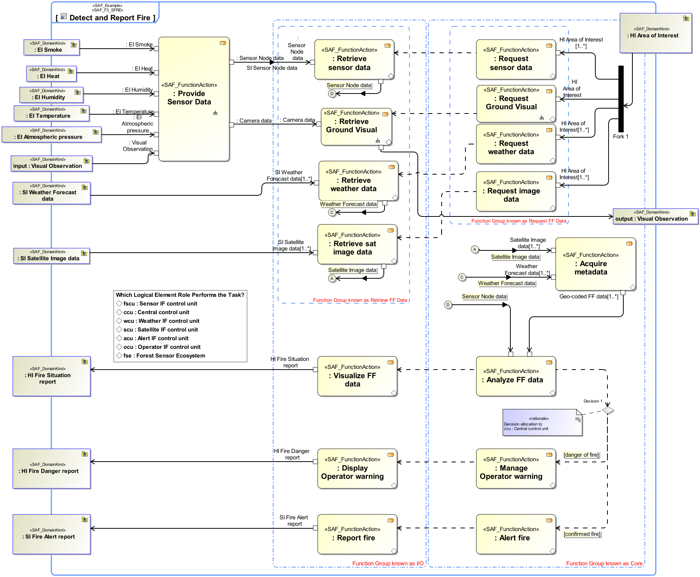

# SAF Development Documentation : **F3_SFRE** System Functional Refinement Viewpoint
|**Domain**|**Aspect**|**Maturity**|
| --- | --- | --- |
|[Functional](../../domains.md#Domain-Functional)|[Process & Behavior](../../aspects.md#Aspect-Process-&-Behavior)|[under construction](../../using-saf/maturity.md#under-construction)|
## Example

## Purpose
The System Functional Refinement Viewpoint analyses decomposition of System Functions into System Partial Functions in order achieve understanding and agreement about the System functions sufficient to derive system  requirements.
## Applicability
The System Functional Refinement Viewpoint supports the "Define System Requirements" activities of the INCOSE SYSTEMS ENGINEERING HANDBOOK 2015 [§4.3]. The System Functional Refinement Viewpoint contributes to the System Function definition.
## Presentation
Activity Diagram featuring System Partial Functions, functional exchange between partial functions. There are explicitely no Swimlanes and no allocations to structure.

## Stakeholder
* [System Architect](../../stakeholders.md#System-Architect)
## Concern
* [How are the system functions decomposed into smaller, and more manageable sub-functions? ](../../concerns.md#_2021x_2_8710274_1674576758790_775644_23272)
* [What is the breakdown of functions into sub-functions?](../../concerns.md#_2021x_2_8710274_1674576758728_463822_23204)
## Profile Model Reference
The following Stereotypes / Model Elements are used in the Viewpoint:
|Stereotype | realized Concept|
|---|---|
|ControlFlow [UML_Standard_Profile]|[GFNcontrolledAFTER](../concept/concepts.md#GFNcontrolledAFTER)|
|ObjectFlow [UML_Standard_Profile]|[General Functional Exchange](../concept/concepts.md#General-Functional-Exchange)|
|Parameter [UML_Standard_Profile]|[General Function Usage Exchange Point](../concept/concepts.md#General-Function-Usage-Exchange-Point)|
|[SAF_F3_SFRE](../../stereotypes.md#saf_f3_sfre)|[System Functional Refinement Viewpoint](../concept/concepts.md#System-Functional-Refinement-Viewpoint)|
|SAF_FunctionAction contained in SAF_SystemFunction|[System Partial Function in System Function](../concept/concepts.md#System-Partial-Function-in-System-Function)|
|[SAF_FunctionAction](../../stereotypes.md#saf_functionaction)|[General Functional Usage](../concept/concepts.md#General-Functional-Usage)|
|[SAF_SystemFunction](../../stereotypes.md#saf_systemfunction)|[System Function](../concept/concepts.md#System-Function)|
## Input from other Viewpoints
### Required Viewpoints
* [System Process Viewpoint](System-Process-Viewpoint.md)
### Recommended Viewpoints
* [Operational Context Definition Viewpoint](Operational-Context-Definition-Viewpoint.md)
* [Operational Domain Item Kind Viewpoint](Operational-Domain-Item-Kind-Viewpoint.md)
* [System Context Definition Viewpoint](System-Context-Definition-Viewpoint.md)
* [System Domain Item Kind Viewpoint](System-Domain-Item-Kind-Viewpoint.md)
# Viewpoint Concept and Profile Diagrams
## Concept

## Profile

