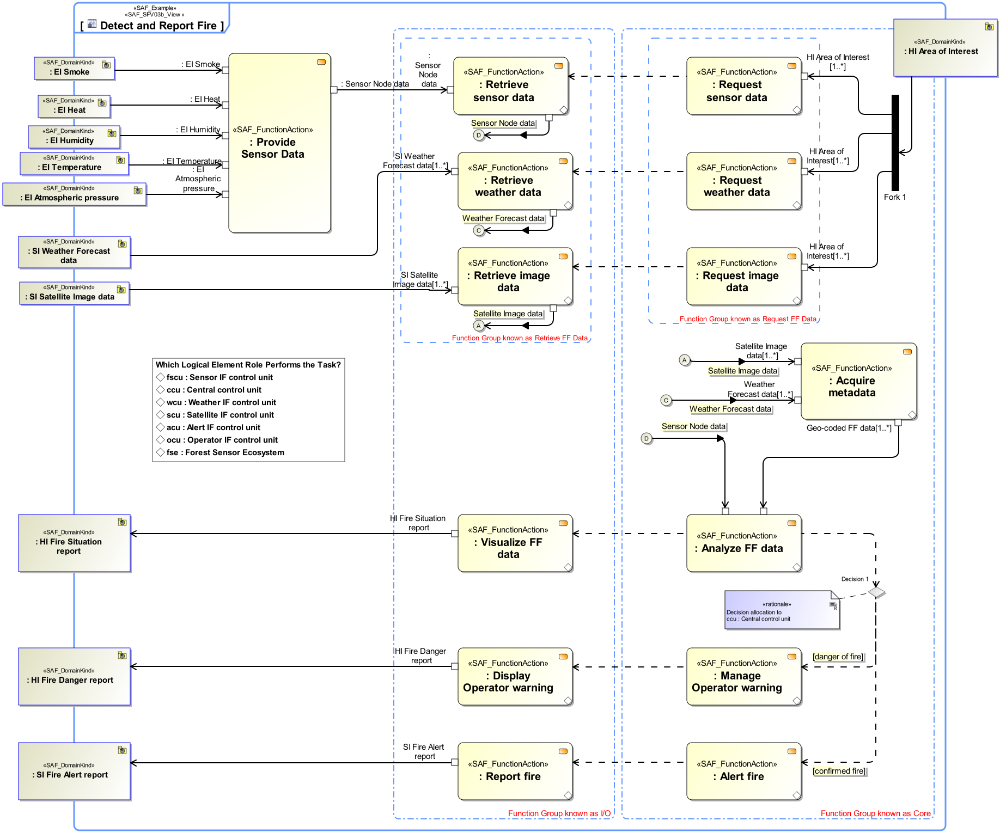
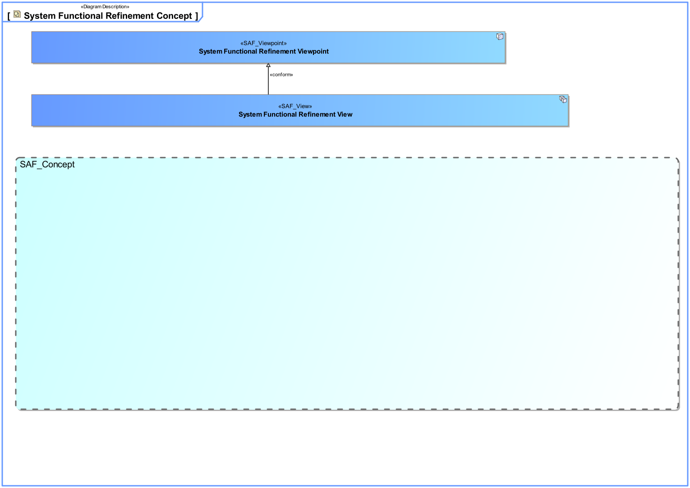
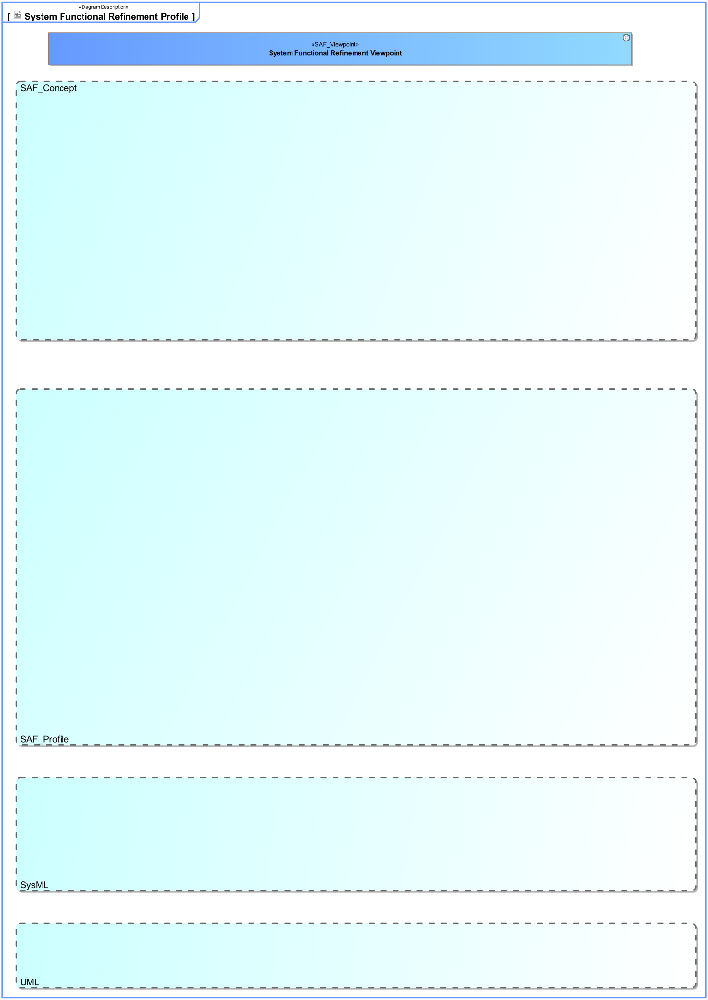

# SAF Development Documentation : System Functional Refinement Viewpoint
|**Domain**|**Aspect**|**Maturity**|
| --- | --- | --- |
|[Functional](../../domains.md#Domain-Functional)|[Process & Behavior](../../aspects.md#Aspect-Process-&-Behavior)|[proposed](../../using-saf/maturity.md#proposed)|
## Example

## Purpose
The System Functional Refinement Viewpoint analyses decomposition of System Functions into System Partial Functions in order achieve understanding and agreement about the System functions sufficient to derive system  requirements.
## Applicability
The System Functional Refinement Viewpoint supports the "Define System Requirements" activities of the INCOSE SYSTEMS ENGINEERING HANDBOOK 2015 [§4.3]. The System Functional Refinement Viewpoint contributes to the System Function definition.
## Presentation
Activity Diagram featuring System Partial Functions, functional exchange between partial functions. There are explicitely no Swimlanes and no allocations to structure.

## Stakeholder
* [System Architect](../../stakeholders.md#System-Architect)
## Concern
* How are the system functions decomposed into sub-functions ? 
* What is the breakdown of functions into sub-functions?
## Profile Model Reference
The following Stereotypes / Model Elements are used in the Viewpoint:
|Stereotype | realized Concept|
|---|---|
## Input from other Viewpoints
### Required Viewpoints
* [System Process Viewpoint](System-Process-Viewpoint.md)
### Recommended Viewpoints
* [Operational Context Definition Viewpoint](Operational-Context-Definition-Viewpoint.md)
* [Operational Domain Item Kind Viewpoint](Operational-Domain-Item-Kind-Viewpoint.md)
* [System Context Definition Viewpoint](System-Context-Definition-Viewpoint.md)
* [System Domain Item Kind Viewpoint](System-Domain-Item-Kind-Viewpoint.md)
# Viewpoint Concept and Profile Diagrams
## Concept

## Profile

