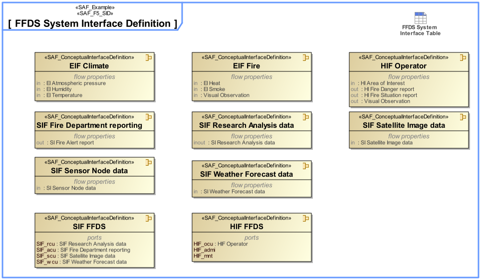

# SAF Development Documentation : System Interface Definition Viewpoint
|**Domain**|**Aspect**|**Maturity**|
| --- | --- | --- |
|[Functional](../../domains.md#Domain-Functional)|[Interface](../../aspects.md#Aspect-Interface)|[released](../../using-saf/maturity.md#released)|
## Example

## Purpose
The System Interface Definition Viewpoint captures system wide concepts defining interfaces. It allows to adopt long-lived standards and to harmonize the interface definitions to improve interchangeability, interoperability, and portability.
## Applicability
The System Interface Definition Viewpoint supports the "Prepare for Interface Requirement Definition" activity included in "System Requirements Definition Process" activities of the INCOSE SYSTEMS ENGINEERING HANDBOOK 2015 [§2.3.5.3] and contributes to the System Interface definition.
## Presentation
A block definition diagram (BDD) featuring System Interface blocks with ports, and flow properties.

A tabular format listing System Interface blocks, their ports, and flow properties.

## Stakeholder
* [Acquirer](../../stakeholders.md#Acquirer)
* [Customer](../../stakeholders.md#Customer)
* [Hardware Developer](../../stakeholders.md#Hardware-Developer)
* [IV&V Engineer](../../stakeholders.md#IV&V-Engineer)
* [Maintainer](../../stakeholders.md#Maintainer)
* [Safety Expert](../../stakeholders.md#Safety-Expert)
* [Security Expert](../../stakeholders.md#Security-Expert)
* [Software Developer](../../stakeholders.md#Software-Developer)
* [System Architect](../../stakeholders.md#System-Architect)
## Concern
* [Which kind of conceptual items (energy, material, information, etc.) are exchanged between the system and external entities?](../../concerns.md#_2021x_2_8710274_1674576759154_22704_23559)
* [Which standards, protocols, and format specifications apply to a physical interface?](../../concerns.md#_2021x_2_8710274_1674576758891_215548_23373)
* [what are the interface definitions for the logical architecture](../../concerns.md#_2021x_2_8710274_1698695260372_8568_48717)
## Profile Model Reference
The following Stereotypes / Model Elements are used in the Viewpoint:
|Stereotype | realized Concept|
|---|---|
|Attribute "realizingConnector" of InformationFlow referencing Connector|[LCNallowingLIE](../concept/concepts.md#LCNallowingLIE)|
|Connector [UML_Standard_Profile]|[Logical Connection](../concept/concepts.md#Logical-Connection)|
|FlowProperty contained in SAF_ConceptualInterfaceDefinition|[LIPPspecifyingDetailOfLIPD](../concept/concepts.md#LIPPspecifyingDetailOfLIPD)|
|FlowProperty typed by SAF_DomainKind|[SDKtypingLIPP](../concept/concepts.md#SDKtypingLIPP)|
|FlowProperty [SysML Profile]|[Logical Interaction Point Property](../concept/concepts.md#Logical-Interaction-Point-Property)|
|ItemFlow typed by SAF_DomainKind|[SDKtypingLIE](../concept/concepts.md#SDKtypingLIE)|
|ItemFlow [SysML Profile]|[Logical Item Exchange](../concept/concepts.md#Logical-Item-Exchange)|
|ProxyPort typed by SAF_ConceptualInterfaceDefinition|[LIPDdefiningDetailOfLIP](../concept/concepts.md#LIPDdefiningDetailOfLIP)|
|ProxyPort [SysML Profile]|[Logical Interaction Point](../concept/concepts.md#Logical-Interaction-Point)|
|[SAF_ConceptualInterfaceDefinition](../../stereotypes.md#SAF_ConceptualInterfaceDefinition)|[Logical Interaction Point Definition](../concept/concepts.md#Logical-Interaction-Point-Definition)|
|[SAF_DomainKind](../../stereotypes.md#SAF_DomainKind)|[System Domain Kind](../concept/concepts.md#System-Domain-Kind)|
|[SAF_SFV05a_View](../../stereotypes.md#SAF_SFV05a_View)|[System Interface Definition Viewpoint](../concept/concepts.md#System-Interface-Definition-Viewpoint)|
## Input from other Viewpoints
### Required Viewpoints
*none*
### Recommended Viewpoints
*none*
# Viewpoint Concept and Profile Diagrams
## Concept

## Profile

