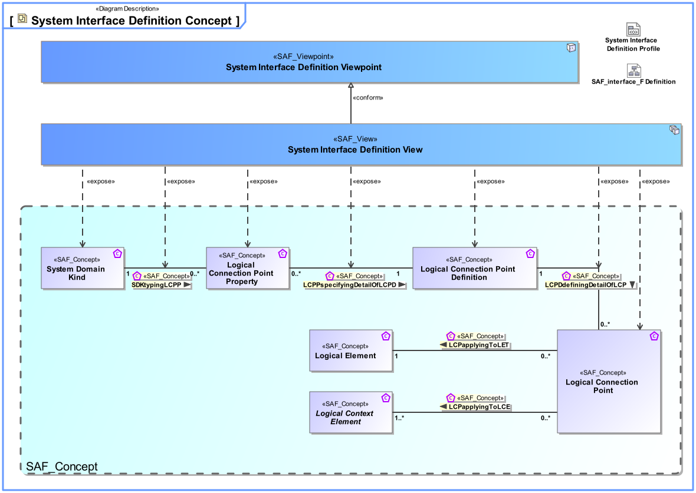
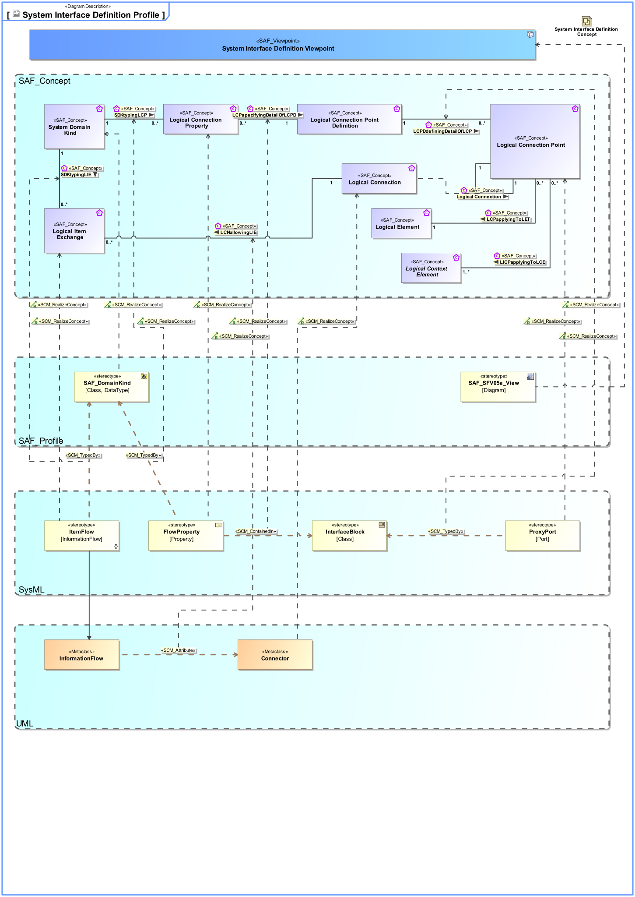

# SAF Development Documentation : System Interface Definition Viewpoint
|**Domain**|**Aspect**|**Maturity**|
| --- | --- | --- |
|[Functional](../../domains.md#Domain-Functional)|[Interface](../../aspects.md#Aspect-Interface)|[released](../../using-saf/maturity.md#released)|
## Example

## Purpose
The System Interface Definition Viewpoint captures system wide concepts defining functional interfaces. It allows to adopt long-lived standards and to harmonize the functional interface definitions to improve interchangeability, interoperability, and portability.
## Applicability
The System Interface Definition Viewpoint supports the "Prepare for Interface Requirement Definition" activity included in "System Requirements Definition Process" activities of the INCOSE SYSTEMS ENGINEERING HANDBOOK 2015 [§ 4.3] and contributes to the System Interface definition.
## Stakeholder
## Concern
## Presentation
A block definition diagram (BDD) featuring System Interface blocks with ports, and flow properties.
Note: When ports are used these shall be proxy ports and be typed by interface blocks.

A tabular format listing System Interface blocks, their ports, and flow properties.

## Profile Model Reference
The following Stereotypes / Model Elements are used in the Viewpoint:
|Stereotype | realized Concept|
|---|---|
|ItemFlow typed by SAF_DomainKind|[SDKtypingLIE](../concept/concepts.md#SDKtypingLIE)|
|FlowProperty typed by SAF_DomainKind|[SDKtypingLCP](../concept/concepts.md#SDKtypingLCP)|
|ProxyPort typed by InterfaceBlock|[LCPDdefiningDetailOfLCP](../concept/concepts.md#LCPDdefiningDetailOfLCP)|
|Attribute "" of InformationFlow referencing Connector|[LCNallowingLIE](../concept/concepts.md#LCNallowingLIE)|
|FlowProperty contained in InterfaceBlock|[LCPspecifyingDetailOfLCPD](../concept/concepts.md#LCPspecifyingDetailOfLCPD)|
|Connector [UML_Standard_Profile]|[Logical Connection](../concept/concepts.md#Logical-Connection)|
|FlowProperty [SysML Profile]|[Logical Connection Property](../concept/concepts.md#Logical-Connection-Property)|
|ItemFlow [SysML Profile]|[Logical Item Exchange](../concept/concepts.md#Logical-Item-Exchange)|
|ProxyPort [SysML Profile]|[Logical Connection Point](../concept/concepts.md#Logical-Connection-Point)|
|[SAF_DomainKind](../../stereotypes.md#SAF_DomainKind)|[System Domain Kind](../concept/concepts.md#System-Domain-Kind)|
|[SAF_SFV05a_View](../../stereotypes.md#SAF_SFV05a_View)|[System Interface Definition Viewpoint](../concept/concepts.md#System-Interface-Definition-Viewpoint)|
## Input from other Viewpoints
### Required Viewpoints
*none*
### Recommended Viewpoints
*none*
# Viewpoint Concept and Profile Diagrams
## Concept

## Profile

