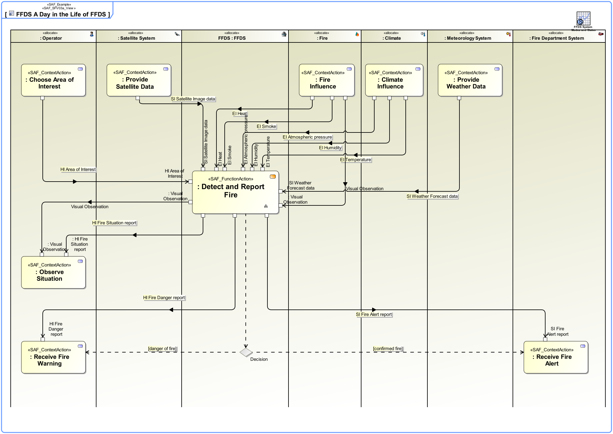

# SAF Development Documentation : **F3_SPRO** System Process Viewpoint
|**Domain**|**Aspect**|**Maturity**|
| --- | --- | --- |
|[Functional](../../domains.md#Domain-Functional)|[Process & Behavior](../../aspects.md#Aspect-Process-&-Behavior)|[released](../../using-saf/maturity.md#released)|
## Example

## Purpose
The System Process Viewpoint provides the functional representation of the system using a black-box approach
* the representation of the SOI and all Context Elements
* the System Functions the SOI shall be able to perform
* the Context Functions the Context Elements are expected to perform
* the exchange between SOI System Functions and Context Functions of Context Elements
* the functional flows crossing the boundary between SOI and Context Elements
## Applicability
The System Process Viewpoint supports the "System Requirements Definition Process" activities of the INCOSE SYSTEMS ENGINEERING HANDBOOK 2015 [§4.3] and contributes to the System Function, and the System Interface definition.
## Presentation
An activity diagram featuring the ordered execution of System Process Actions. The activity diagram swim lanes are typed with Context Element usage and SOI usage from the same System Context. 
Note: In order to improve the clarity of presentation it may be appropriate to use several activity diagrams for one System Process.

A tabular format listing all identified System Functions, the System Processes in which they appear, and the Comtext Exchange with the Context Functions.

## Stakeholder
* [Acquirer](../../stakeholders.md#Acquirer)
* [Customer](../../stakeholders.md#Customer)
* [Hardware Developer](../../stakeholders.md#Hardware-Developer)
* [IV&V Engineer](../../stakeholders.md#IV&V-Engineer)
* [Operator](../../stakeholders.md#Operator)
* [Project Manager](../../stakeholders.md#Project-Manager)
* [Safety Expert](../../stakeholders.md#Safety-Expert)
* [Security Expert](../../stakeholders.md#Security-Expert)
* [Software Developer](../../stakeholders.md#Software-Developer)
* [Supplier](../../stakeholders.md#Supplier)
* [System Architect](../../stakeholders.md#System-Architect)
* [User](../../stakeholders.md#User)
## Concern
* [How does a system function interact with its environment?](../../concerns.md#_2021x_2_8710274_1674576758952_658537_23403)
* [How is the system interacting with the identified external entities?](../../concerns.md#_2021x_2_8710274_1674576758710_799233_23181)
* [What are necessary inputs for operating the system expected to be provided by other external entitys?](../../concerns.md#_2021x_2_8710274_1674576758674_250912_23143)
* [What are the scenarios a system function is utilized in?](../../concerns.md#_2021x_2_8710274_1674576758630_745758_23103)
* [What is the functional scope of the system?](../../concerns.md#_2021x_2_8710274_1674576758960_189958_23415)
* [What services are expected from external entities?](../../concerns.md#_2021x_2_8710274_1674576758798_462644_23290)
* [Which are the conceptual interfaces of the system?](../../concerns.md#_2021x_2_8710274_1674576758808_527146_23298)
* [Which functions are out of scope of the system?](../../concerns.md#_2021x_2_8710274_1674576758924_539039_23390)
* [Which functions will the system provide?](../../concerns.md#_2021x_2_8710274_1674576758649_392764_23120)
## Profile Model Reference
The following Stereotypes / Model Elements are used in the Viewpoint:
|Stereotype | realized Concept|
|---|---|
|Allocate [SysML Profile]|[LCEperformingCFN](../concept/concepts.md#LCEperformingCFN)|
|Allocate [SysML Profile]|[LETperformingSFN](../concept/concepts.md#LETperformingSFN)|
|ControlFlow [UML_Standard_Profile]|[GFNcontrolledAFTER](../concept/concepts.md#GFNcontrolledAFTER)|
|InputPin [UML_Standard_Profile]|[GFEtoGFP](../concept/concepts.md#GFEtoGFP)|
|ObjectFlow [UML_Standard_Profile]|[General Functional Exchange](../concept/concepts.md#General-Functional-Exchange)|
|OutputPin [UML_Standard_Profile]|[GFEfromGFP](../concept/concepts.md#GFEfromGFP)|
|Parameter [UML_Standard_Profile]|[General Functional Parameter](../concept/concepts.md#General-Functional-Parameter)|
|[SAF_ContextFunction](../../stereotypes.md#SAF_ContextFunction)|[Context Function](../concept/concepts.md#Context-Function)|
|[SAF_F3_SPRO](../../stereotypes.md#SAF_F3_SPRO)|[System Process Viewpoint](../concept/concepts.md#System-Process-Viewpoint)|
|SAF_LogicalContextRole contained in SAF_LogicalContext|[Logical Context Element Role](../concept/concepts.md#Logical-Context-Element-Role)|
|SAF_LogicalContextRole contained in SAF_LogicalContext|[Logical SOI Role](../concept/concepts.md#Logical-SOI-Role)|
|[SAF_SystemFunction](../../stereotypes.md#SAF_SystemFunction)|[System Function](../concept/concepts.md#System-Function)|
|[SAF_SystemProcess](../../stereotypes.md#SAF_SystemProcess)|[System Process](../concept/concepts.md#System-Process)|
## Input from other Viewpoints
### Required Viewpoints
*none*
### Recommended Viewpoints
* [Operational Context Definition Viewpoint](Operational-Context-Definition-Viewpoint.md)
* [Operational Domain Item Kind Viewpoint](Operational-Domain-Item-Kind-Viewpoint.md)
* [System Context Definition Viewpoint](System-Context-Definition-Viewpoint.md)
* [System Domain Item Kind Viewpoint](System-Domain-Item-Kind-Viewpoint.md)
# Viewpoint Concept and Profile Diagrams
## Concept

## Profile

