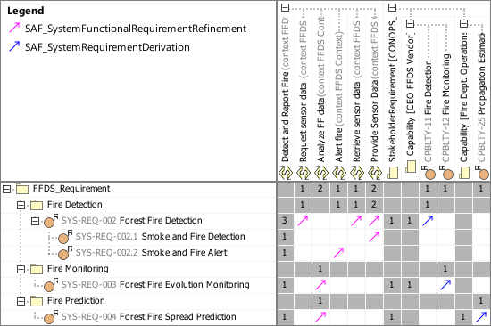

# SAF Development Documentation : **F8_SRQT** System Requirement Traceability Viewpoint
|**Domain**|**Aspect**|**Maturity**|
| --- | --- | --- |
|[Functional](../../domains.md#Domain-Functional)|[Traceability & Mapping](../../aspects.md#Aspect-Traceability-&-Mapping)|[released](../../using-saf/maturity.md#released)|
## Example

## Purpose
The System Requirement Traceability Viewpoint specifies for every System Requirement the traceability to the functional domain level
* System Use Case
* System Capability
* System Context Definition
* System Context Exchange
* System Context Interaction
* System Process
* System State
## Applicability
The System Requirement Traceability Viewpoint supports the "System Requirements Definition Process" activities of the INCOSE SYSTEMS ENGINEERING HANDBOOK 2015 [§4.3] and contributes to the System Requirements Traceability. The System Requirement Traceability Viewpoint also contributes to the System Requirements Verification and Traceability Matrix (RVTM).
## Presentation
A dependency matrix featuring relationships for every System Requirement to the functional domain level
* System Use Case
* System Capability
* System Context Definition
* System Context Exchange
* System Context Interaction
* System Process
* System State

## Stakeholder
* [Project Manager](../../stakeholders.md#Project-Manager)
## Concern
* [What is the rationale for a system requirement?](../../concerns.md#_2021x_2_8710274_1674576758848_939582_23337)
* [Which System Requirements are derived from Stakeholder Requirements?](../../concerns.md#_2021x_2_8710274_1674576758563_692887_23057)
* [Which system interface is addressed by a system requirement?](../../concerns.md#_2021x_2_8710274_1674576758640_156873_23115)
## Profile Model Reference
The following Stereotypes / Model Elements are used in the Viewpoint:
|Stereotype | realized Concept|
|---|---|
|[SAF_F8_SRQT_Matrix](../../stereotypes.md#saf_f8_srqt_matrix)|[System Requirement Traceability Viewpoint](../concept/concepts.md#System-Requirement-Traceability-Viewpoint)|
|[SAF_SystemFunctionalRequirementConstraint](../../stereotypes.md#saf_systemfunctionalrequirementconstraint)|[FRboundedByNFR](../concept/concepts.md#FRboundedByNFR)|
|[SAF_SystemFunctionalRequirement](../../stereotypes.md#saf_systemfunctionalrequirement)|[Functional Requirement](../concept/concepts.md#Functional-Requirement)|
|[SAF_SystemFunctionalRequirementRefinement](../../stereotypes.md#saf_systemfunctionalrequirementrefinement)|[FRrefiningSFN](../concept/concepts.md#FRrefiningSFN)|
|[SAF_SystemNonFunctionalRequirement](../../stereotypes.md#saf_systemnonfunctionalrequirement)|[Non-functional Requirement](../concept/concepts.md#Non-functional-Requirement)|
|[SAF_SystemRequirementDerivation](../../stereotypes.md#saf_systemrequirementderivation)|[SRderivingFromSR](../concept/concepts.md#SRderivingFromSR)|
|[SAF_SystemRequirementDerivation](../../stereotypes.md#saf_systemrequirementderivation)|[SRderivingFromSTKR](../concept/concepts.md#SRderivingFromSTKR)|
|[SAF_SystemRequirementRefinement](../../stereotypes.md#saf_systemrequirementrefinement)|[SRrefiningLICP](../concept/concepts.md#SRrefiningLICP)|
|[SAF_SystemRequirementRefinement](../../stereotypes.md#saf_systemrequirementrefinement)|[SRrefiningSCY](../concept/concepts.md#SRrefiningSCY)|
|[SAF_SystemRequirementRefinement](../../stereotypes.md#saf_systemrequirementrefinement)|[SRrefiningSUC](../concept/concepts.md#SRrefiningSUC)|
|[SAF_SystemRequirement](../../stereotypes.md#saf_systemrequirement)|[System Requirement](../concept/concepts.md#System-Requirement)|
## Input from other Viewpoints
### Required Viewpoints
* [Stakeholder Requirement Definition Viewpoint](Stakeholder-Requirement-Definition-Viewpoint.md)
* [System Requirement Definition Viewpoint](System-Requirement-Definition-Viewpoint.md)
### Recommended Viewpoints
* [System Use Case Viewpoint](System-Use-Case-Viewpoint.md)
* [System Capability Definition Viewpoint](System-Capability-Definition-Viewpoint.md)
* [System Context Exchange Viewpoint](System-Context-Exchange-Viewpoint.md)
* [System Context Interaction Viewpoint](System-Context-Interaction-Viewpoint.md)
* [System Process Viewpoint](System-Process-Viewpoint.md)
* [System Functional Refinement Viewpoint](System-Functional-Refinement-Viewpoint.md)
* [System State Viewpoint](System-State-Viewpoint.md)
# Viewpoint Concept and Profile Diagrams
## Concept

## Profile

