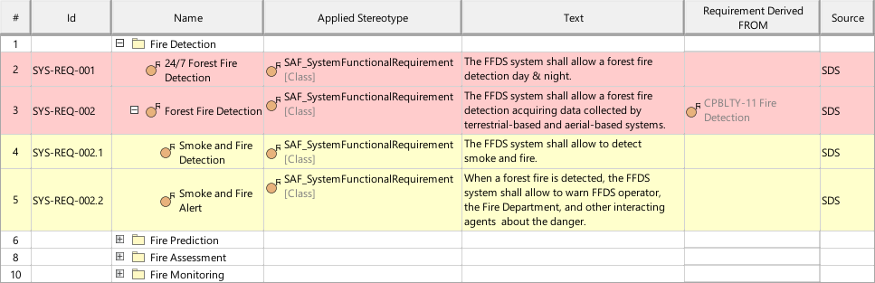
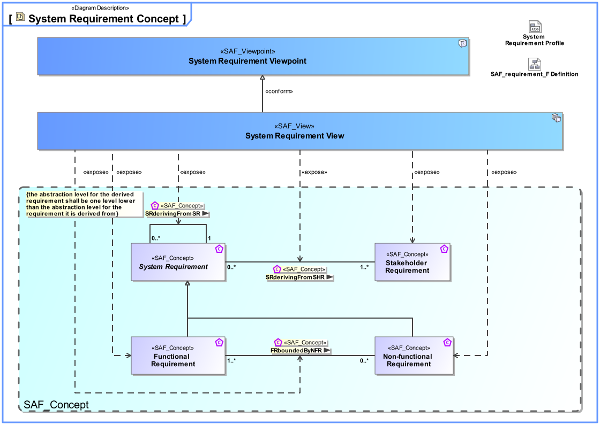
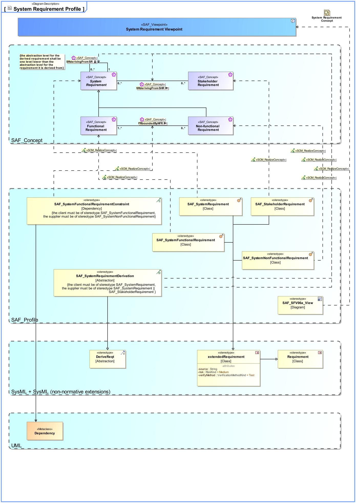

# SAF Development Documentation : System Requirement Viewpoint
|**Domain**|**Aspect**|**Maturity**|
| --- | --- | --- |
|[Functional](../../domains.md#Domain-Functional)|[Requirement](../../aspects.md#Aspect-Requirement)|[released](../../using-saf/maturity.md#released)|
## Example

## Purpose
The System Requirement Viewpoint specifies functions, non-functional properties, or constraints of the System. System Requirements are captured, the interrelationships between Functional and Non-Functional Requirements on the same level of abstraction and the traceability to Stakeholder Requirements are depicted.
## Applicability
The System Requirement Viewpoint supports the "System Requirements Definition Process" activities of the INCOSE SYSTEMS ENGINEERING HANDBOOK 2015 [§4.3] and contributes to the System Requirements Verification and Traceability Matrix (RVTM).
## Stakeholder
* [Hardware Developer](../../stakeholders.md#Hardware-Developer)
* [IV&V Engineer](../../stakeholders.md#IV&V-Engineer)
* [Project Manager](../../stakeholders.md#Project-Manager)
* [Software Developer](../../stakeholders.md#Software-Developer)
* [System Architect](../../stakeholders.md#System-Architect)
## Concern
* What are the Interface Requirements imposed on the system?
* What are the exchange requirements imposed on the system?
* What are the functional requirements imposed on the system?
* What are the non-functional requirements imposed on the system?
* What are the requirements of environmental conditions imposed on the system?
* What is the range of acceptable system performance, i.e. the critical, top-level performance requirements derived from the operational needs?
* Which Stakeholder Requirements are addressed by System Requirements?
## Presentation
A tabular format listing
* unique requirement ID, text, and attributes,
* traceability reference to Stakeholder Requirements,
* traceability reference to depended Requirements on the same level of abstraction.

## Profile Model Reference
The following Stereotypes / Model Elements are used in the Viewpoint:
|Stereotype | realized Concept|
|---|---|
|[SAF_SFV06a_View](../../stereotypes.md#SAF_SFV06a_View)|[System Requirement Viewpoint](../concept/concepts.md#System-Requirement-Viewpoint)|
|[SAF_StakeholderRequirement](../../stereotypes.md#SAF_StakeholderRequirement)|[Stakeholder Requirement](../concept/concepts.md#Stakeholder-Requirement)|
|[SAF_SystemFunctionalRequirement](../../stereotypes.md#SAF_SystemFunctionalRequirement)|[Functional Requirement](../concept/concepts.md#Functional-Requirement)|
|[SAF_SystemFunctionalRequirementConstraint](../../stereotypes.md#SAF_SystemFunctionalRequirementConstraint)|[FRboundedByNFR](../concept/concepts.md#FRboundedByNFR)|
|[SAF_SystemNonFunctionalRequirement](../../stereotypes.md#SAF_SystemNonFunctionalRequirement)|[Non-functional Requirement](../concept/concepts.md#Non-functional-Requirement)|
|[SAF_SystemRequirement](../../stereotypes.md#SAF_SystemRequirement)|[System Requirement](../concept/concepts.md#System-Requirement)|
|[SAF_SystemRequirementDerivation](../../stereotypes.md#SAF_SystemRequirementDerivation)|[SRderivingFromSR](../concept/concepts.md#SRderivingFromSR)|
|[SAF_SystemRequirementDerivation](../../stereotypes.md#SAF_SystemRequirementDerivation)|[SRderivingFromSHR](../concept/concepts.md#SRderivingFromSHR)|
## Input from other Viewpoints
### Required Viewpoints
* [Stakeholder Requirement Viewpoint](Stakeholder-Requirement-Viewpoint.md)
### Recommended Viewpoints
* [Operational Story Viewpoint](Operational-Story-Viewpoint.md)
* [Operational Context Exchange Viewpoint](Operational-Context-Exchange-Viewpoint.md)
* [Operational Capability Viewpoint](Operational-Capability-Viewpoint.md)
* [Operational Process Viewpoint](Operational-Process-Viewpoint.md)
* [Operational Interaction Viewpoint](Operational-Interaction-Viewpoint.md)
* [Operational Capability Mapping Viewpoint](Operational-Capability-Mapping-Viewpoint.md)
* [Operational Process Mapping Viewpoint](Operational-Process-Mapping-Viewpoint.md)
# Viewpoint Concept and Profile Diagrams
## Concept

## Profile

