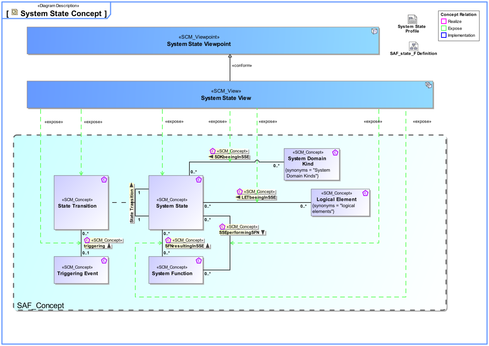

# SAF Development Documentation : System State Viewpoint
|**Domain**|**Aspect**|**Maturity**|
| --- | --- | --- |
|[Functional](../../domains.md#Domain-Functional)|[Process & Behavior](../../aspects.md#Aspect-Process-&-Behavior)|[released](../../using-saf/maturity.md#released)|
## Example

## Purpose
The System State Viewpoint defines the conditions of the SOI or parts of thereof that constrain the execution of System Functions. System States are used as pre- or post-condition of System Use Cases, and as constraints within the definition of System Functions to specifying valid transitions. Valid transitions between System States and the conditions for transitioning are specified in system wide concepts captured in System Requirements.
## Applicability
The System State  Viewpoint supports the "System Requirements Definition Process" activities of the INCOSE SYSTEMS ENGINEERING HANDBOOK 2015 [§4.3] and contributes to the System Function Definition.
## Stakeholder
* [Hardware Developer](../../stakeholders.md#Hardware-Developer)
* [IV&V Engineer](../../stakeholders.md#IV&V-Engineer)
* [Maintainer](../../stakeholders.md#Maintainer)
* [Regulation Authority](../../stakeholders.md#Regulation-Authority)
* [Safety Expert](../../stakeholders.md#Safety-Expert)
* [Security Expert](../../stakeholders.md#Security-Expert)
* [Software Developer](../../stakeholders.md#Software-Developer)
* [System Architect](../../stakeholders.md#System-Architect)
## Concern
* Which modes and states does the system have?
* Which system functions are dependent on a systems mode or state?
## Presentation
A block definition diagram (BDD) featuring states, and state transitions. 
Note: References to model elements that are dependent of states, or transitions shall be shown as callout, or compartment notation.

A tabular format listing states, state transitions, and the conditons to be fullfilled before the transition will occur. References to model elements that are dependent of states (Domain Item Kinds, System Functions, System Use Cases, etc.), or transitions shall be shown in the table.

## Profile Model Reference
The following Stereotypes / Model Elements are used in the Viewpoint:
|Stereotype | realized Concept|
|---|---|
|Event [UML_Standard_Profile]|[Triggering Event](../concept/concepts.md#Triggering-Event)|
|[SAF_DomainKind](../../stereotypes.md#SAF_DomainKind)|[System Domain Kind](../concept/concepts.md#System-Domain-Kind)|
|[SAF_LogicalElement](../../stereotypes.md#SAF_LogicalElement)|[Logical Element](../concept/concepts.md#Logical-Element)|
|[SAF_SFV03c_View](../../stereotypes.md#SAF_SFV03c_View)|[System State Viewpoint](../concept/concepts.md#System-State-Viewpoint)|
|[SAF_SystemFunction](../../stereotypes.md#SAF_SystemFunction)|[System Function](../concept/concepts.md#System-Function)|
|State [UML_Standard_Profile]|[System State](../concept/concepts.md#System-State)|
|StateMachine [UML_Standard_Profile]|[SDKbeeingInSSE](../concept/concepts.md#SDKbeeingInSSE)|
|StateMachine [UML_Standard_Profile]|[LETbeeingInSSE](../concept/concepts.md#LETbeeingInSSE)|
|Transition [UML_Standard_Profile]|[State Transition](../concept/concepts.md#State-Transition)|
## Input from other Viewpoints
### Required Viewpoints
*none*
### Recommended Viewpoints
* [System Context Definition Viewpoint](System-Context-Definition-Viewpoint.md)
* [System Domain Item Kind Viewpoint](System-Domain-Item-Kind-Viewpoint.md)
* [System Process Viewpoint](System-Process-Viewpoint.md)
# Viewpoint Concept and Profile Diagrams
## Concept

## Profile

