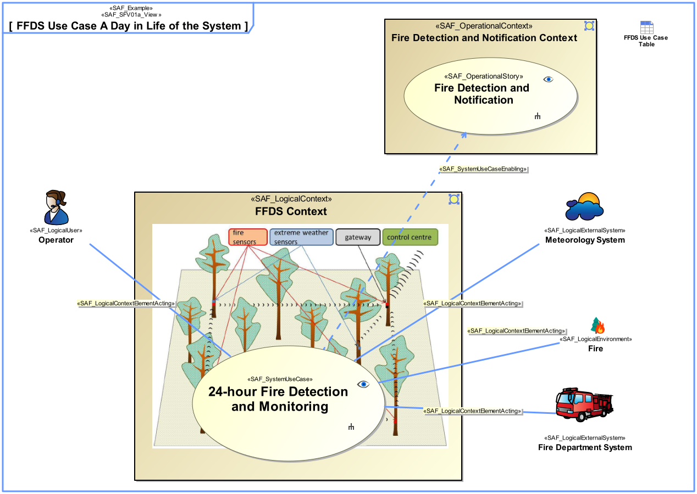
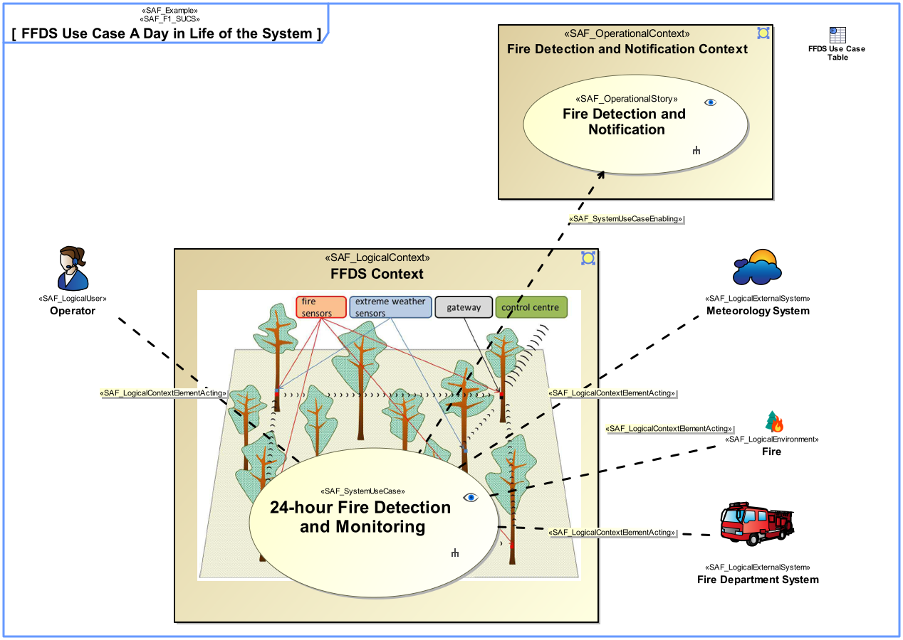
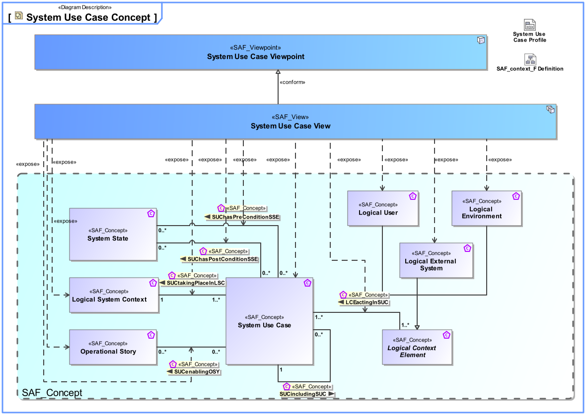
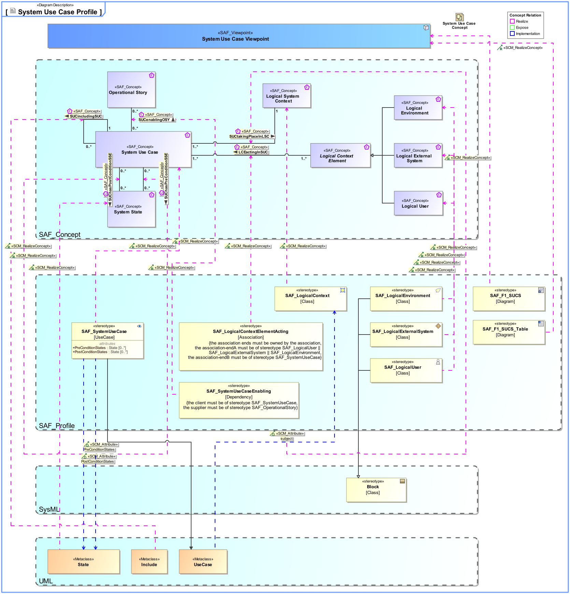

# SAF Development Documentation : **F1_SUCS** System Use Case Viewpoint
|**Domain**|**Aspect**|**Maturity**|
| --- | --- | --- |
|[Functional](../../domains.md#Domain-Functional)|[Context & Exchange](../../aspects.md#Aspect-Context-&-Exchange)|[released](../../using-saf/maturity.md#released)|
## Example

## Purpose
The System Use Case Viewpoint provides an outside view on the system functionality from the perspective of the system users and contributes to the definition of system requirements and system usage. The intended system use may be captured as free-text use case description, as well as storytelling approach on a coarse level of detail. The main system exchange partners participating in the intended system use are identified. System use cases are related to a specific system context. System use cases are derived from operational scenarios elaborated during mission analysis.
## Applicability
The System Use Case Viewpoint supports the "Stakeholder Needs and Requirements Definition Process" and the "System Requirements Definition Process" activities of the INCOSE SYSTEMS ENGINEERING HANDBOOK 2023 [§2.3.5.2, §2.3.5.3] and contributes to the definition of the system boundary and the identification of the expected system function.
## Presentation
A use case diagram featuring model elements representing System Use Cases, System Context, and System Context Elements. The System Context shall be used as subject of the use case. The System Context Elements playing a Role in the Use Case shall be connected to the Use Case by associations.
Note: System Use Case pre- and postconditions shall be represented either by callout or compartment notation.
Relationship to operational stories can be related to the use case in order trace to mission analysis.

A tabular format listing the System Use Cases, the System Use Case pre- and postconditions, the System Context, and the System Context Elements. Additionaly, the relationship to operational stories, if applicable.

## Stakeholder
* [Acquirer](../../stakeholders.md#Acquirer)
* [Customer](../../stakeholders.md#Customer)
* [IV&V Engineer](../../stakeholders.md#IV&V-Engineer)
* [Operator](../../stakeholders.md#Operator)
* [Project Manager](../../stakeholders.md#Project-Manager)
* [System Architect](../../stakeholders.md#System-Architect)
* [User](../../stakeholders.md#User)
## Concern
* [For what purpose is the system developed or adapted?](../../concerns.md#_2021x_2_6d8019d_1674945898325_22078_35809)
* [How is the system being used or utilized and interacting with other external systems to satisfy user needs?](../../concerns.md#_2021x_2_8710274_1674576758841_451500_23327)
* [What has the system to accomplish for its users?](../../concerns.md#_2021x_2_8710274_1697469571914_800497_36599)
* [Which are the system scenarios, i.e., course of action, for the system context in which the system solution will exist?](../../concerns.md#_2021x_2_6d8019d_1674922633861_96675_24986)
* [Which users does the system support? ](../../concerns.md#_2021x_2_6d8019d_1675459822996_961402_23325)
## Profile Model Reference
The following Stereotypes / Model Elements are used in the Viewpoint:
|Stereotype | realized Concept|
|---|---|
|Attribute "PostConditionStates" of SAF_SystemUseCase referencing State|[SUChasPostConditionSSE](../concept/concepts.md#SUChasPostConditionSSE)|
|Attribute "PreConditionStates" of SAF_SystemUseCase referencing State|[SUChasPreConditionSSE](../concept/concepts.md#SUChasPreConditionSSE)|
|Attribute "subject" of UseCase referencing SAF_LogicalContext|[SUCtakingPlaceInLSC](../concept/concepts.md#SUCtakingPlaceInLSC)|
|Include [UML_Standard_Profile]|[SUCincludingSUC](../concept/concepts.md#SUCincludingSUC)|
|[SAF_F1_SUCS](../../stereotypes.md#SAF_F1_SUCS)|[System Use Case Viewpoint](../concept/concepts.md#System-Use-Case-Viewpoint)|
|[SAF_F1_SUCS_Table](../../stereotypes.md#SAF_F1_SUCS_Table)|[System Use Case Viewpoint](../concept/concepts.md#System-Use-Case-Viewpoint)|
|[SAF_LogicalContextElementActing](../../stereotypes.md#SAF_LogicalContextElementActing)|[LCEactingInSUC](../concept/concepts.md#LCEactingInSUC)|
|[SAF_LogicalContext](../../stereotypes.md#SAF_LogicalContext)|[Logical System Context](../concept/concepts.md#Logical-System-Context)|
|[SAF_LogicalEnvironment](../../stereotypes.md#SAF_LogicalEnvironment)|[Logical Environment](../concept/concepts.md#Logical-Environment)|
|[SAF_LogicalExternalSystem](../../stereotypes.md#SAF_LogicalExternalSystem)|[Logical External System](../concept/concepts.md#Logical-External-System)|
|[SAF_LogicalUser](../../stereotypes.md#SAF_LogicalUser)|[Logical User](../concept/concepts.md#Logical-User)|
|[SAF_SystemUseCaseEnabling](../../stereotypes.md#SAF_SystemUseCaseEnabling)|[SUCenablingOSY](../concept/concepts.md#SUCenablingOSY)|
|[SAF_SystemUseCase](../../stereotypes.md#SAF_SystemUseCase)|[System Use Case](../concept/concepts.md#System-Use-Case)|
|State [UML_Standard_Profile]|[System State](../concept/concepts.md#System-State)|
## Input from other Viewpoints
### Required Viewpoints
* [System Context Definition Viewpoint](System-Context-Definition-Viewpoint.md)
### Recommended Viewpoints
* [Operational Context Definition Viewpoint](Operational-Context-Definition-Viewpoint.md)
# Viewpoint Concept and Profile Diagrams
## Concept

## Profile

