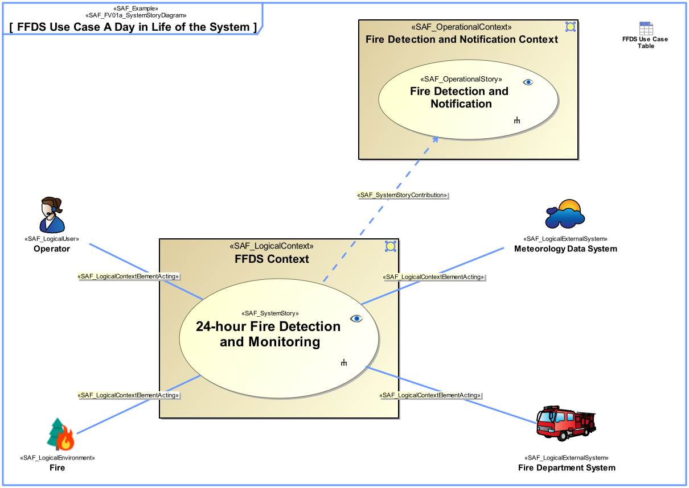

# SAF Development Documentation : System Use Case Viewpoint
|**Domain**|**Aspect**|**Maturity**|
| --- | --- | --- |
|[Functional](../../domains.md#Domain-Functional)|[Context & Exchange](../../aspects.md#Aspect-Context-&-Exchange)|[released](../../using-saf/maturity.md#released)|
## Example

## Purpose
The System Use Case Viewpoint provides an outside view on the system functionality from the perspective of the System Users and contributes to the definition of System Requirements and System Usage. The intended system use may be captured as free text use case description, as well as storytelling approach on a coarse level of detail. The main System Exchange Partners participating in the intended system use are identified. System use cases are related to a specific System Context.
## Applicability
The System Use Case Viewpoint supports the "Stakeholder Needs and Requirements Definition Process", and "System Requirements Definition Process" activities of the INCOSE SYSTEMS ENGINEERING HANDBOOK 2015 [§4.2 & §4.3] and contributes to the identification of both System Function and System Functional Interface.
## Stakeholder
* [Acquirer](../../stakeholders.md#Acquirer)
* [Customer](../../stakeholders.md#Customer)
* [IV&V Engineer](../../stakeholders.md#IV&V-Engineer)
* [Operator](../../stakeholders.md#Operator)
* [Project Manager](../../stakeholders.md#Project-Manager)
* [System Architect](../../stakeholders.md#System-Architect)
* [User](../../stakeholders.md#User)
## Concern
* For what purpose is the system of interest developed or adapted?
* How is the system being used or utilized and interacting with other external systems to satisfy user needs?
* How will the system be used by whom and which contextual elements are involved?
* Which is the system scenario, i.e., course of action, for the context in which the system of interest solution will exist?
* Which users does the system support? What the system has to accomplish for these users?
## Presentation
A use case diagram featuring model elements representing System Use Cases, System Context and System Context Elements.
Note: System Use Case pre- and postconditions shall be represented either by callout or compartment notation.

A tabular format listing the System Use Cases, the System Use Case pre- and postconditions, the System Context, and the System Context Elements.

## Profile Model Reference
The following Stereotypes / Model Elements are used in the Viewpoint:
|Stereotype | realized Concept|
|---|---|
|Include [UML_Standard_Profile]|[SUCincludingSUC](../concept/concepts.md#SUCincludingSUC)|
|[SAF_LogicalContextElementActing](../../stereotypes.md#SAF_LogicalContextElementActing)|[LCEactingInSUC](../concept/concepts.md#LCEactingInSUC)|
|[SAF_LogicalEnvironment](../../stereotypes.md#SAF_LogicalEnvironment)|[Logical Environment](../concept/concepts.md#Logical-Environment)|
|[SAF_LogicalExternalSystem](../../stereotypes.md#SAF_LogicalExternalSystem)|[Logical External System](../concept/concepts.md#Logical-External-System)|
|[SAF_LogicalUser](../../stereotypes.md#SAF_LogicalUser)|[Logical User](../concept/concepts.md#Logical-User)|
|[SAF_SFV01a_View](../../stereotypes.md#SAF_SFV01a_View)|[System Use Case Viewpoint](../concept/concepts.md#System-Use-Case-Viewpoint)|
|[SAF_SystemUseCase](../../stereotypes.md#SAF_SystemUseCase)|[System Use Case](../concept/concepts.md#System-Use-Case)|
|[SAF_SystemUseCase](../../stereotypes.md#SAF_SystemUseCase)|[SUChasPreConditionSSE](../concept/concepts.md#SUChasPreConditionSSE)|
|[SAF_SystemUseCase](../../stereotypes.md#SAF_SystemUseCase)|[SUChasPostConditionSSE](../concept/concepts.md#SUChasPostConditionSSE)|
|[SAF_SystemUseCase](../../stereotypes.md#SAF_SystemUseCase)|[SUCtakingPlaceInLSC](../concept/concepts.md#SUCtakingPlaceInLSC)|
|[SAF_SystemUseCaseEnabling](../../stereotypes.md#SAF_SystemUseCaseEnabling)|[SUCenablingOSY](../concept/concepts.md#SUCenablingOSY)|
## Input from other Viewpoints
### Required Viewpoints
* [System Context Definition Viewpoint](System-Context-Definition-Viewpoint.md)
### Recommended Viewpoints
* [Operational Context Definition Viewpoint](Operational-Context-Definition-Viewpoint.md)
# Viewpoint Concept and Profile Diagrams
## Concept

## Profile

