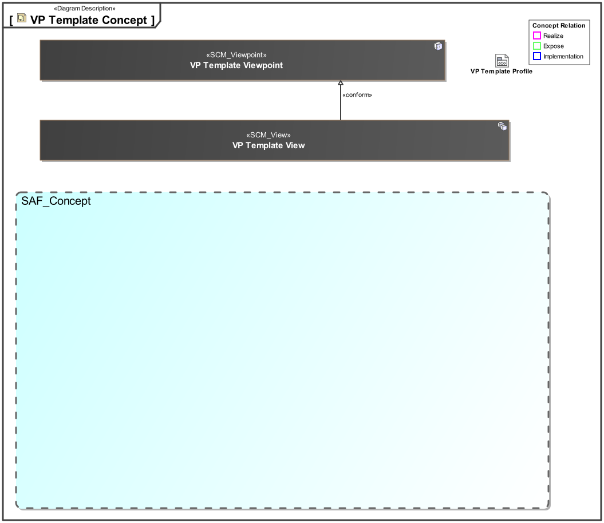
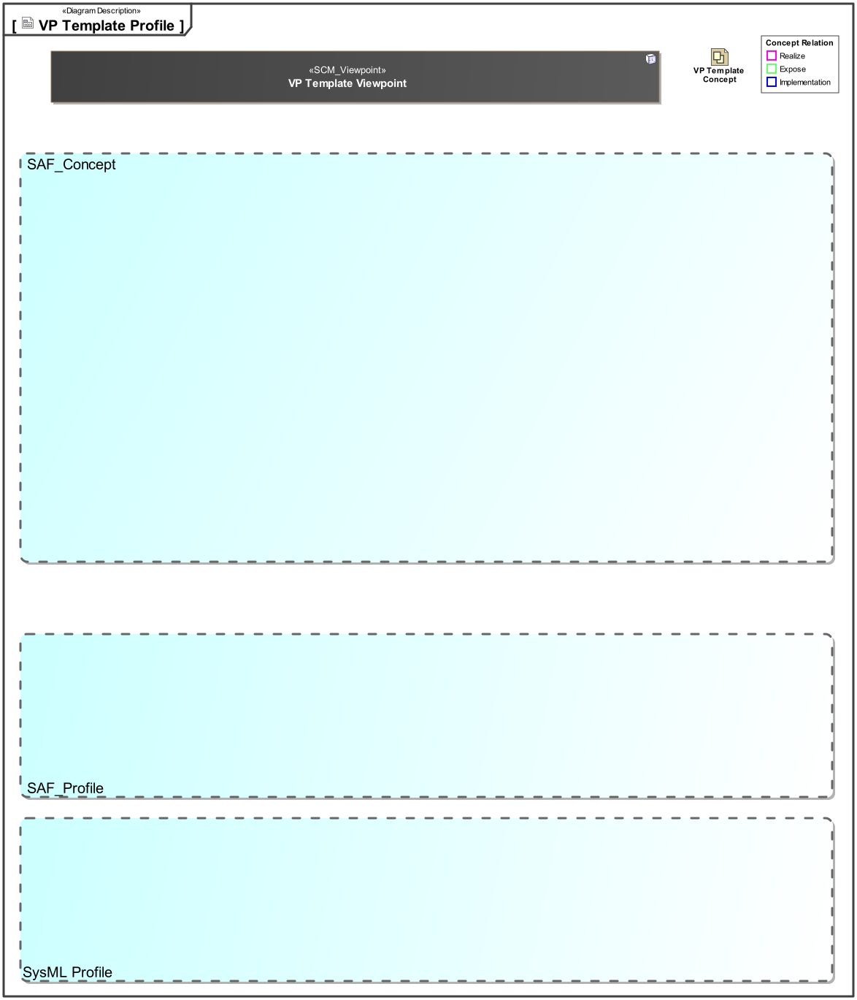

# SAF Development Documentation : **C2_GRID** VP Template Viewpoint
|**Domain**|**Aspect**|**Maturity**|
| --- | --- | --- |
|[Common](../../domains.md#Domain-Common)|[Taxonomy & Structure](../../aspects.md#Aspect-Taxonomy-&-Structure)|[proposed](../../using-saf/maturity.md#proposed)|
## Example
*none*
## Purpose
The ... Viewpoint serves as ..
## Applicability
The ... Viewpoint supports the ...  in INCOSE SYSTEMS ENGINEERING HANDBOOK 2023.
## Presentation
A ... featuring a ...  for .

A table featuring ... 

## Stakeholder
## Concern
## Profile Model Reference
The following Stereotypes / Model Elements are used in the Viewpoint:
|Stereotype | realized Concept|
|---|---|
## Input from other Viewpoints
### Required Viewpoints
*none*
### Recommended Viewpoints
*none*
# Viewpoint Concept and Profile Diagrams
## Concept

## Profile

