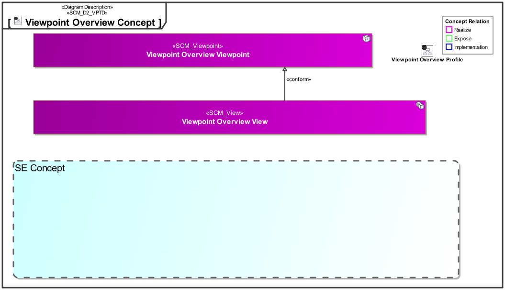
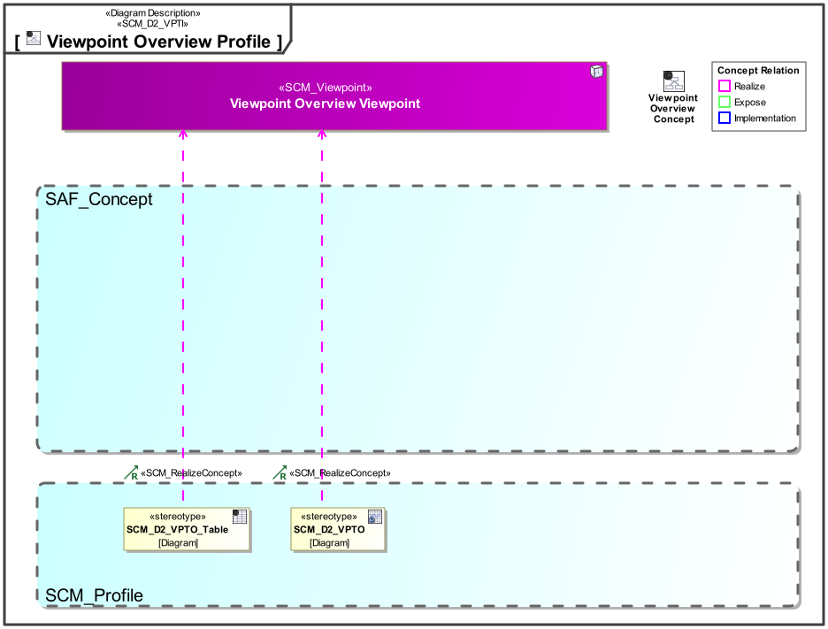

# SAF Development Documentation : **D2_VPTO** Viewpoint Overview Viewpoint
|**Domain**|**Aspect**|**Maturity**|
| --- | --- | --- |
|[SAF Development](../../domains.md#Domain-SAF-Development)|[Taxonomy & Structure](../../aspects.md#Aspect-Taxonomy-&-Structure)|[proposed](../../using-saf/maturity.md#proposed)|
## Example
*none*
## Purpose
The Viewpoint Overview Viewpoint provides an overview about the Viewpoints in SAF from a SAF Developers perspective. It shall specify
* the viewpoints available
* their location in the grid by domain and aspect
* their maturity of development 
## Applicability
The Viewpoint supports the  "Specification of an architecture description framework" as defined in ISO41010:2022
## Presentation
A content diagram  featuring a graphical grid representation containing graphical representations of the aspects, domains, and viewpoints available in the framework.

A table featuring the frameworks viewpoints, the domains, aspects, viewpoint implementation diagrams and maturity.

## Stakeholder
* [SAF Developer](../../stakeholders.md#SAF-Developer)
* [SAF MBSE approch planer](../../stakeholders.md#SAF-MBSE-approch-planer)
* [SAF System model user](../../stakeholders.md#SAF-System-model-user)
## Concern
* [What is the maturity state of viewpoints in the framework?](../../concerns.md#_2024x_26f0132_1719129513706_329066_14708)
* [Where is a viewpoint of the framework located in the frameworks grid?](../../concerns.md#_2024x_26f0132_1719130165383_541840_14769)
* [Which columns and rows does the frameworks grid have? ](../../concerns.md#_2024x_26f0132_1719130222689_69494_14774)
* [Which viewpoints are available in the framework](../../concerns.md#_2024x_26f0132_1719129141456_206905_14250)
## Profile Model Reference
The following Stereotypes / Model Elements are used in the Viewpoint:
|Stereotype | realized Concept|
|---|---|
## Input from other Viewpoints
### Required Viewpoints
*none*
### Recommended Viewpoints
*none*
# Viewpoint Concept and Profile Diagrams
## Concept

## Profile

