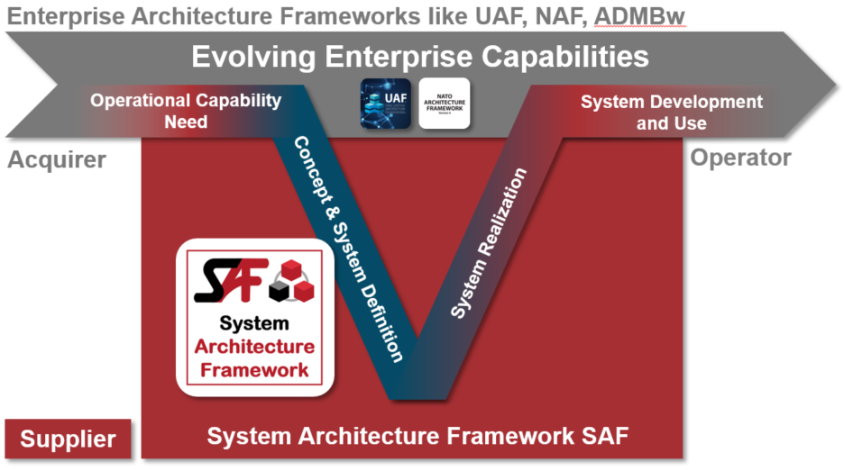

**This is a Test of an alternative Document generation Method and not the SAF Specification !**

# Introduction
Inspired by the various enterprise architecture frameworks the System Architecture Framework (SAF) is a common, domain independent system architecture framework dedicated to support Model Based Systems Engineering (MBSE) of technical systems. 

The SAF can be used stand-alone and also complementary to enterprise architecture frameworks. SAF starts where an enterprise architecture framework stops.

# What is SAF? 
* SAF is an architecture framework intended to support the Model Based Systems Engineering (MBSE) of technical systems.
* SAF is an open toolbox.
* SAF is based on a Systems Engineering Ontology and structured by viewpoint definitions.
* SAF starts where enterprise architecture frameworks end.

# SAF Documentation

This site contains both documentation for users of SAF and developers of SAF. To understand how to use SAF, head over to **[Using SAF](using.md)**. To understand how we develop SAF, see **[Development Documentation](devdoc.md)**. We always welcome contributions from our MBSE community to improve SAF, see [how to contribute to SAF](contributing.md).

# Example
The System Architecture Framework Specification application is demonstrated using the **Fire Forest Detection System (FFDS)** example, courtesy of Tim Weilkiens. The Fire Forest Detection System example is based on the publication **SYSMOD - The Systems Modeling Toolbox, 3rd edition Pragmatic MBSE with SysML, Tim Weilkiens**

# Releases
This documentation is for the main branch of SAF that reflects the current state of development and it is updated as required. See the [change report](CHANGES.md) for an information about major changes.

The following SAF releases are available, each of which is managed in a separate branch:
* [Initial Release](https://github.com/GfSE/SAF-Specification/tree/Initial-Release/README.md)
* [TdSE2022](https://github.com/GfSE/SAF-Specification/tree/TdSE2022/README.md)
* [TdSE2023](https://github.com/GfSE/SAF-Specification/tree/TdSE2023/README.md)

# Tool Implementations
The SAF specification is implemented by 3 tool specific profiles which are available in separate github repositories:

* [Cameo Systems Modeler (by Dassault Systèmes)](https://github.com/GfSE/SAF-Cameo-Profile)
* [Engineering Systems Design Rhapsody (by IBM)](https://github.com/GfSE/SAF-Rhapsody-Profile)
* [Enterprise Architect (by Sparx Systems)](https://github.com/GfSE/SAF-EA-Profile)

