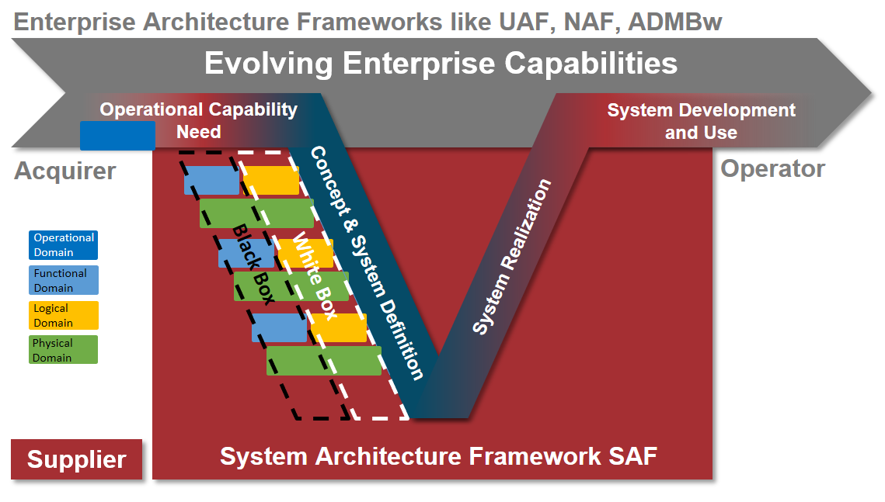

## Getting Started
 * Please download and install one of the [supported tool implementations](../index.md#tool-implementations)
 * Head over to [typical engineering workflow](#typical-engineering-workflow) to get an idea about possible viewpoints
 * if you need help, feel free to ask !

## Recursive Application of the Framework due to System decomposition
Typically, a system consists of subsystems in multiple [hierarchy or decomposition](./faq.md#system-hierarchy) levels. 

The Functional, Logical and Physical Domain are applied recursively for system and subsystems.

Since the Mission Analysis and Stakeholder Requirements definition Processes cover the whole system, they are typically executed with the top level system scope. (These processes may require iterations when something new is learned, e.g. new stakeholders might be discovered during the selection of solutions for a subsystem, requiring the content of operational domain viewpoints to be updated)

The same applies to the Common Domain, it is also valid for all decomposition levels.

## Application to System of Systems
A System of Systems(SoS)[^1] approach might take advantage from separate operational domain descriptions for each system, while sharing some overarcing elements. 

The MBSE work on system of systems could share a common model supporting a common concept of operations (ConOps), in a common model library, and have individual operational domain descriptions supporting the OpsCon of the individual systems.

The approach should be selected according to the constraints of the SoS scenario; the degree of involvement of different organization cooperation in an SoS MBSE effort, especially the stakeholders having an interest in the SoS model.

## Typical Engineering Workflow

A typical workflow, developing a system from scratch could start in the SAF Functional Domain, omitting the SAF Operational Domain.[^2] : 

### Define the System Boundary
 * Start by defining the System Of Interest(SOI) and then, users, environmental influences, and other systems to which the SOI will interface, using the [System Context Definition Viewpoint](./Functional%20Domain/System%20Context%20Definition%20Viewpoint.md)
   
   The goal here is, to dissect what is within the system from what is outside. 

 * Define one or more system contexts, and bind the system and the abovementioned external elements to that context as appropriate. Multiple contexts allow to have different sets of context elements, and later different sets of use cases happening within these contexts.
 
   This allows an early divide and conquer approach. Examples for contexts could be: factory test, shipping, operational, or workshop maintainance. 

### Tell Stories about System Usage
  * Using the contexts and context elements defined earlier, create system use cases, using the [System Use Case Viewpoint](./Functional%20Domain/System%20Use%20Case%20Viewpoint.md)

    The goal is, to tell the most important stories about the system happening in the contexts, and which key interactions with users, other systems or the environment happen during these stories. There is no need to use formal language, or a structured text approach - SAF has a specific [System Process Viewpoint](./Functional%20Domain/System%20Process%20Viewpoint.md)  to refine Use Cases formally. 

    However, if there are important system states as a precondition or as a result (postcondition) of a Use Case, they should be defined on the fly using the [System State Viewpoint](./Functional%20Domain/System%20State%20Viewpoint.md) and recorded in the Use Case.
  
    Please note, that it should be avoided to put information items on the associations. Overly complex relationships among use cases should also be avoided.

### Refine Use Cases, identify need for System Functions, define need for exchange at the system boundary

 * For each Use Case create a system process using the  [System Process Viewpoint](./Functional%20Domain/System%20Process%20Viewpoint.md).

   The system process translates the use case text into a formal model covering the paths through the Use Case. The exchanges of the system with external elements are covered and the expectations what external elements do and what the system shall do are identified. 

   The goal is to first identify the need for System Functions and the need for exchange with external elements, and then define the System Functions from the consolidated needs. Since multiple System Processes from multiple contexts might (and usually will) call for the same or similar system functions, the necessity for a consolidation of system function definitions and usage on the level of system processes is given.

   The consolidation of System Functions is assisted by the [System Functional Breakdown Structure Viewpoint](./Functional%20Domain/System%20Functional%20Breakdown%20Structure%20Viewpoint.md). This viewpoint also gives an overview about the functional tree of the system and the usages of System Functions in System Processes.

   For the definition of exchanged items, use the [System Domain Item Kind Viewpoint](./Functional%20Domain/System%20Domain%20Item%20Kind%20Viewpoint.md).

   If system states are preconditions for the execution of System Functions use the [System State Viewpoint](./Functional%20Domain/System%20State%20Viewpoint.md) to define them.

   If necessary to explain the System Functions in more detail, use the [System Functional Refinement Viewpoint](./Functional%20Domain/System%20Functional%20Refinement%20Viewpoint.md)

{: .todo }
to be continued !

{: .todo }
Here an image of the Vee should be placed with domains showing where on the vee, or a workflow with the gates. a detail view should show flow through the viewpoints, perhaps with key concerns they address.
Details should possibly go to multiple sub pages, possibly organized by SEHB phases. There are also different usage scenarios of SAF

[^1]:Note, that SoS is not just a decomposition - the term should only be used for scenarios which add complexity by independently developed and or operated systems with independent lifecycles, lacking overarcing planning or even agreement.
[^2]:Assuming there are valid stakeholder requirements, defining what the system should achieve under which constraints. One of motivations for the operational domain is to produce and validate this information.
